## The AI Moment Is Here

:::: {.columns}

::: {.column width="42%"}
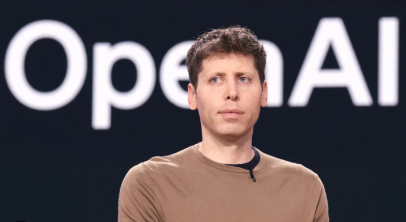{fig-alt="Sam Altman" width="78%"}

Sam Altman, CEO of OpenAI
:::

::: {.column width="58%"}
> AI will create "a new kind of society."

. . .

### What is your reaction to that quote?
:::

::::

::: {.notes}
Open with the quote rather than a definition. Ask students for instinctive reactions before moving to course framing.
:::

## The Digital Economy: Foundations and Transformations

**Session Goals**

::: {.incremental}
- Explore AI as a transformative force in business and society.
- Understand key AI milestones and breakthroughs.
- Explore AI's mechanics, including machine learning and LLMs.
- Evaluate AI's capabilities and weaknesses through class activities.
:::

## AI Is Transformational

:::: {.columns}

::: {.column width="58%"}
{fig-alt="Artificial intelligence graphic" width="92%"}
:::

::: {.column width="42%"}
::: {.incremental}
- AI redefines how managers make decisions and how firms create value.
- Businesses will increase scale and scope, automate processes, and offer personalized products.
:::
:::

::::

## This Course {.center}

<div style="font-size: 2.2rem; line-height: 1.35; text-align: center; margin-top: 12%;">
<strong>AI, a general-purpose technology, is altering business processes, introducing new societal risks, and fragmenting global economic relations. How should individuals and society respond?</strong>
</div>

## The Societal Impact {.visual-stage}

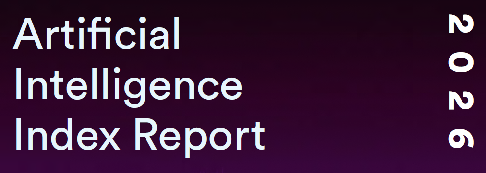{fig-alt="Stanford HAI graphic on AI's societal impact" .r-stretch}


## AI Investment {.visual-stage}

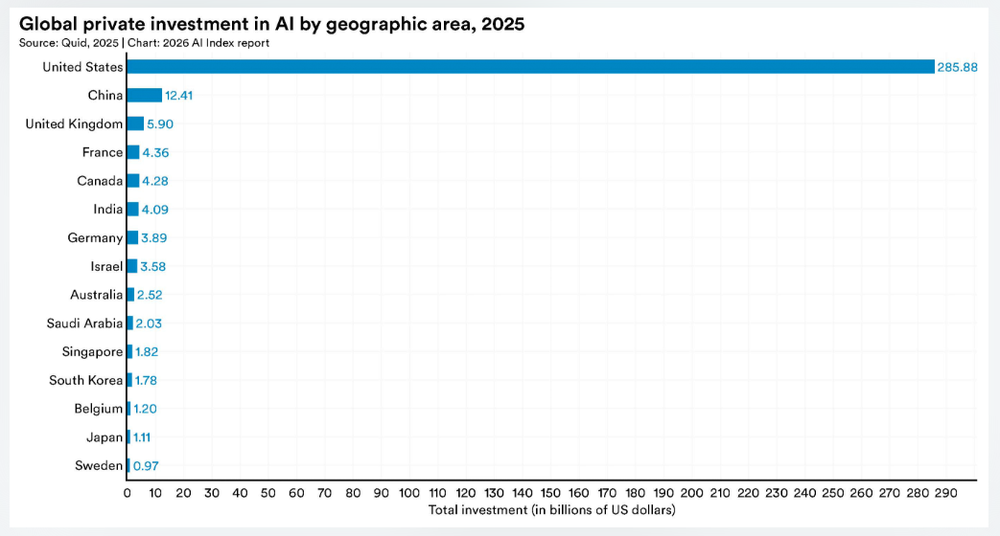{fig-alt="Investment data" .r-stretch}


## AI and Jobs {.visual-stage}

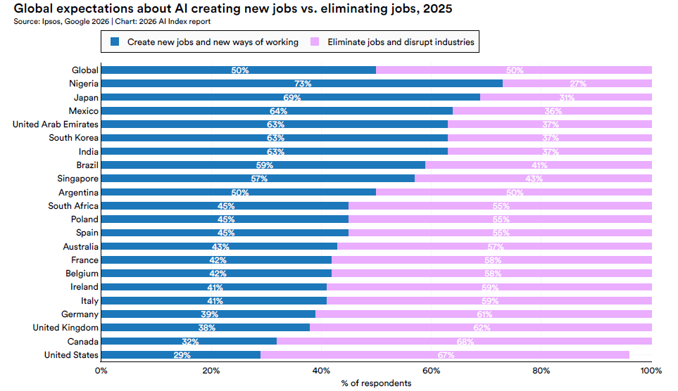{fig-alt="Survey on AI" .r-stretch}

## AI and Energy {.visual-stage}

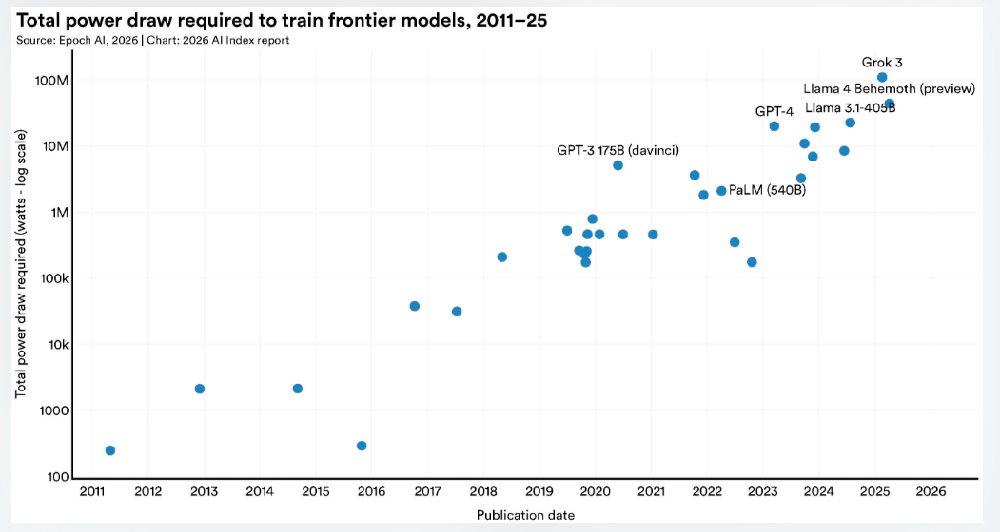{fig-alt="Survey on AI" .r-stretch}


## What We Won't Do {.visual-stage}

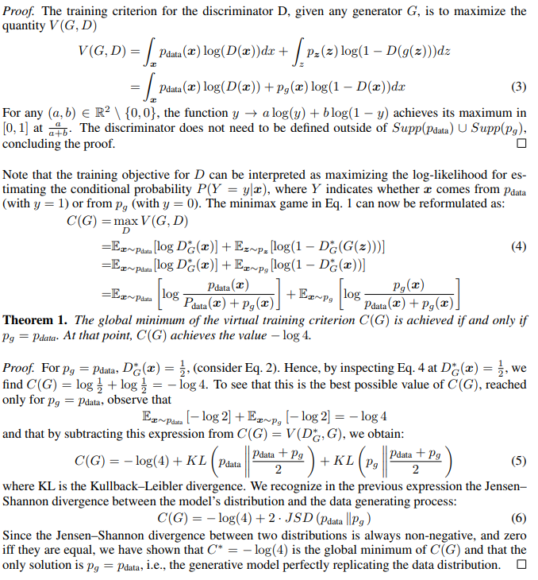{fig-alt="Equation from Goodfellow et al. 2014" .r-stretch}

<div style="text-align:center;">Source: Goodfellow et al. 2014</div>

## What We Won't Do {.visual-stage}

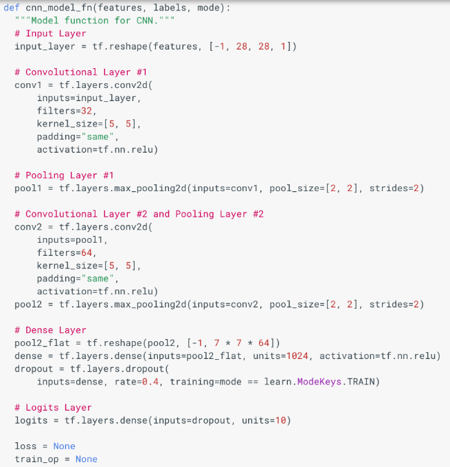{fig-alt="Python code for AI" .r-stretch}

<div style="text-align:center;">Python code for AI</div>

## Recent Milestones in Computing Intelligence {.center}

<div style="font-size: 2.2rem; line-height: 1.35; text-align: center; margin-top: 16%;">
Let's begin by reviewing some recent milestones in computing intelligence.
</div>

# Milestones in Computing Intelligence {background-color="#041e42"}

## Alan Turing's Challenge {.photo-title background-image="../../assets/turing_bbc_greatest.jpg" background-size="cover" background-position="center"}

## Turing Test and Artificial Intelligence

:::: {.columns}

::: {.column width="42%"}
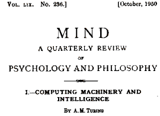{fig-alt="Turing's 1950 paper" width="82%"}
:::

::: {.column width="58%"}
{fig-alt="Diagram of the Turing Test" width="94%"}
:::

::::

. . .

<div style="text-align:center; font-size:1.35rem;">
The test evaluates observable behavior rather than the machine's internal process.
</div>

## Big Blue Beats Garry Kasparov (1997) {.photo-title background-image="../../assets/big_blue.jpg" background-size="cover" background-position="center"}

## IBM Watson Wins Jeopardy (2014) {.photo-title background-image="../../assets/watson.jpg" background-size="cover" background-position="center"}

## The "Holy Cow" Moment

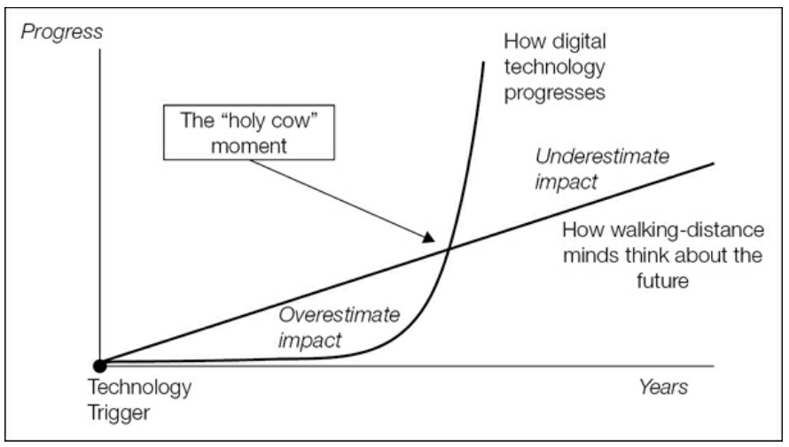{fig-alt="Holy Cow moment" .r-stretch}

## AlphaGo Beats 18-Time Champ Lee Sedol (2016) {.visual-stage}

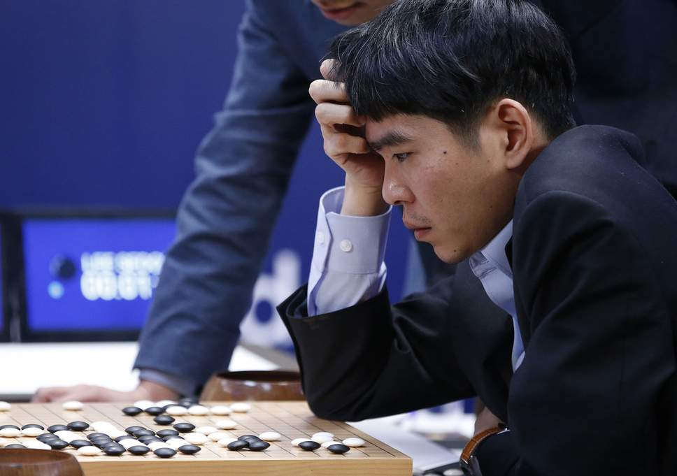{fig-alt="Lee Sedol playing AlphaGo" .r-stretch}

## OpenAI Releases ChatGPT-4 (2023)

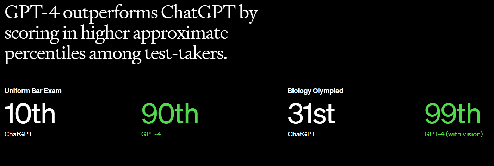{fig-alt="GPT-4 advances" width="82%"}

## Why Are the Breakthroughs Happening Now?

::: {.incremental}
- Big data.
- Exponential growth in computational capacity, or "compute": processing power provided by CPUs, GPUs, or specialized hardware such as TPUs.
:::

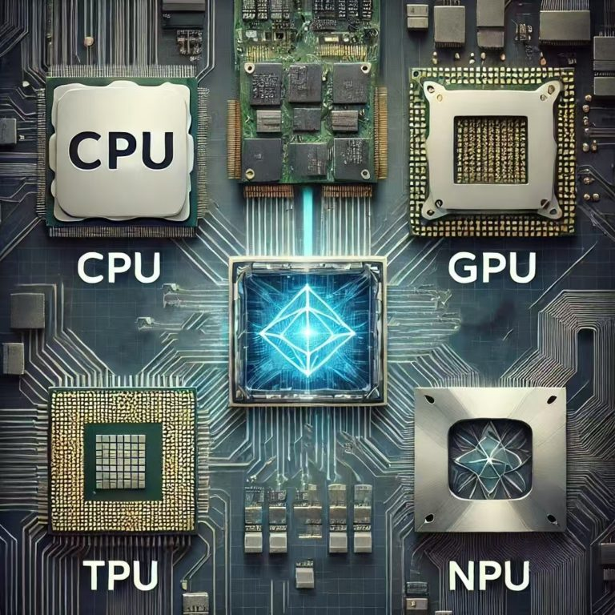{fig-alt="Compute growth" width="60%"}

## Comparing Processing Units {.visual-stage}

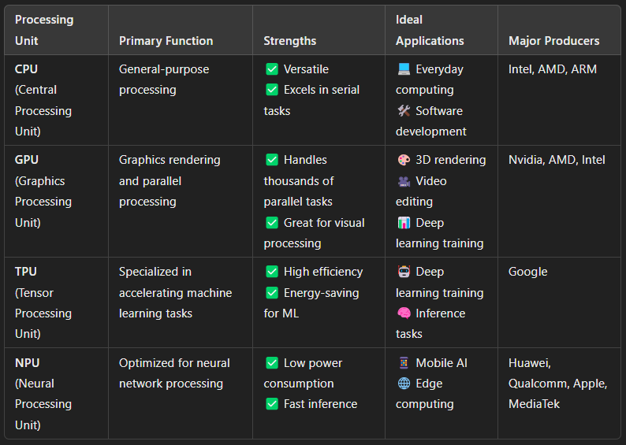{fig-alt="Comparison of processing units" .r-stretch}

## Exponential Growth in Computing Power

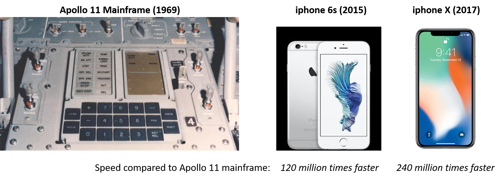{fig-alt="iPhone and Apollo computing comparison" .r-stretch}

. . .

<div style="text-align:center; font-size:1.55rem;">
2x as much progress in two years as in the previous 46.
</div>

## Moore's Law {.visual-stage}

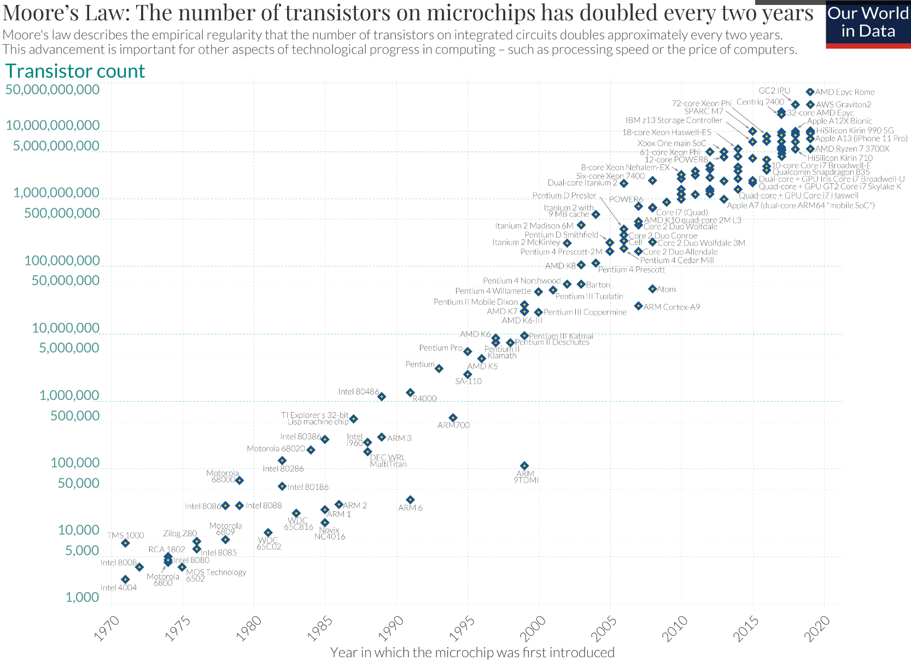{fig-alt="Moore's Law" .r-stretch}

# What Is AI and How Does It Work? {background-color="#041e42"}

## What Is AI?

:::: {.columns}

::: {.column width="38%"}
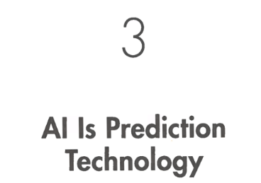{fig-alt="Prediction graphic" width="78%"}
:::

::: {.column width="62%"}
::: {.incremental}
- Why is prediction important and valuable?
- How is image recognition a type of prediction?
- How is AlphaGo's victory attributable to prediction?
- What does Amazon predict?
:::
:::

::::

## Machine Learning

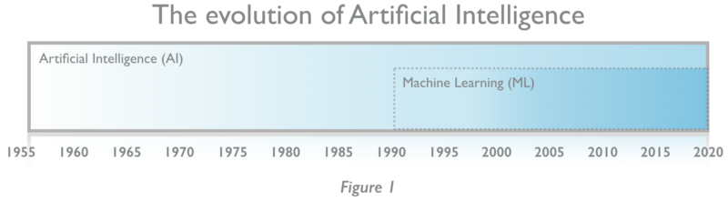{fig-alt="Evolution of AI" .r-stretch}

> "The field of study that gives computers the ability to learn without being explicitly programmed."

Arthur Samuel

## What Explains Advances in Machine Learning?

Complicated real-world tasks like image recognition were too difficult to program using rules-based programming.

. . .

For example: **If it has a tail, then it's a dog?**

{fig-alt="Dog tail example" width="55%"}

## Understanding AI

:::: {.columns}

::: {.column width="42%"}
{fig-alt="Ginni Rometty" width="78%"}

Ginni Rometty, former IBM CEO
:::

::: {.column width="58%"}
> "Everything you know until today is programmable---an entire era for decades has been programmable. [AI] would be the beginning of a new era where you didn't program. Machines would look at data, understand, reason over it, and they continue to learn: understand, reason and learn, not program, in my simple definition."
:::

::::

## Why ML Is Transformational

Machine learning is a **general-purpose technology** like the steam engine or electricity.

. . .

General-purpose technologies:

::: {.incremental}
- drive innovation and spawn new capabilities;
- restructure value chains in industries;
- redistribute income and create economic shifts.
:::

# How Does Machine Learning Work? {background-color="#041e42"}

# Example: Reinforcement Learning {background-color="#041e42"}

## Learning to Play **Go** (1)

:::: {.columns}

::: {.column width="42%"}
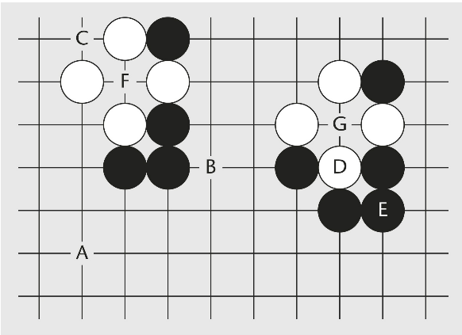{fig-alt="Go board" width="82%"}
:::

::: {.column width="58%"}
It's Black's turn. AlphaGo begins with an initial assumption:

```text
for all time steps t, and for all locations l, 
    it is legal to play a stone at location l 
    at time t.
```

- The algorithm tries A: that's allowed---as are B and C. Then it tries D: that's illegal---as is E.
- Through self-play, AlphaGo tests its hypothesis by attempting moves and observing outcomes.
:::

::::

## Learning to Play **Go** (2)

:::: {.columns}

::: {.column width="42%"}
{fig-alt="Go board" width="82%"}
:::

::: {.column width="58%"}
Based on feedback from the environment, AlphaGo adjusts its hypothesis:

```text
for all time steps t, and for all locations l, 
    if l is unoccupied at time t, 
    then it is legal to play a stone at location l 
    at time t.
```

This iterative refinement aligns with reinforcement learning principles.
:::

::::

## Learning to Play **Go** (3)

:::: {.columns}

::: {.column width="42%"}
{fig-alt="Go board" width="82%"}
:::

::: {.column width="58%"}
Then it tries F: illegal. After repeated trials, AlphaGo formulates more sophisticated hypotheses:

```text
for all time steps t, and for all locations l, 
    if l is unoccupied at time t 
        and l is not surrounded by opponent stones, 
    then it is legal to play a stone at location l 
    at time t.
```
:::

::::

## Learning to Play **Go** (4)

:::: {.columns}

::: {.column width="42%"}
{fig-alt="Go board" width="82%"}
:::

::: {.column width="58%"}
- Next, it tries G: legal. "Hmmm," it says.
- After more experiments, it settles on the hypothesis that G is OK, even though it is surrounded, because it captures the white stone at D and becomes un-surrounded immediately.
- Reinforcement learning refines hypotheses about capturing opponent stones and optimizing long-term board advantage.
:::

::::

# Example: Supervised Learning {background-color="#041e42"}

## AI for Image Recognition {.photo-title background-image="../../assets/tesla.jpg" background-size="cover" background-position="center"}

::: {.photo-caption}
Imagine you want a machine to identify car images from a selection of pictures that include cars and non-cars.

. . .

**What features do you write into the algorithm?**
:::

## It Can Be Quite Complicated {.visual-stage}

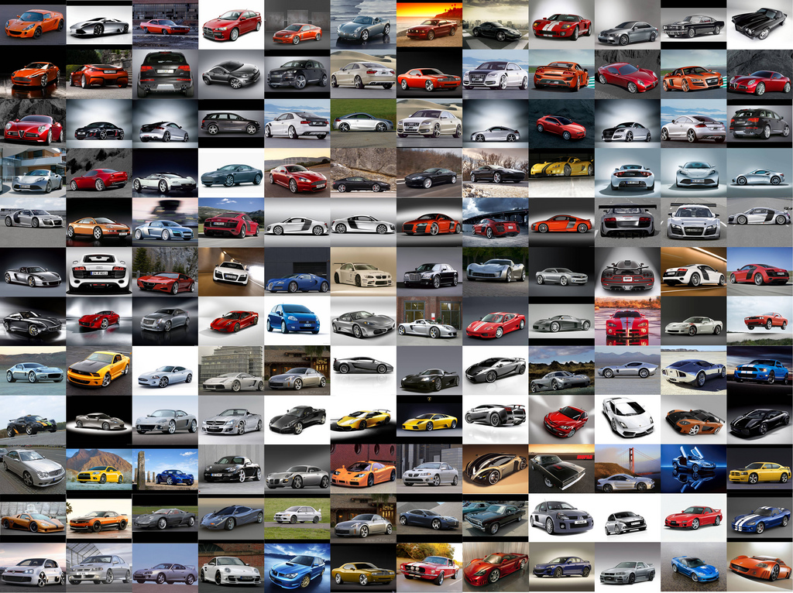{fig-alt="Car collage" .r-stretch}

Too many variations to write one set of rules. Also, the approach is not scalable to other objects: you would have to write a completely new set of rules.

## Deep Learning Neural Networks

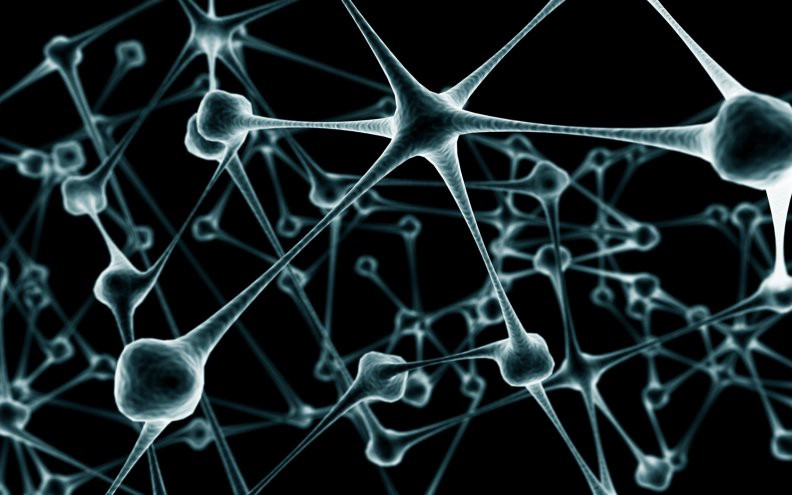{fig-alt="Deep learning neural network" width="70%"}

- Model the brain: recognition not through rules, but by practice and feedback.

## What Is **Deep Learning**?

::: {.incremental}
- Learning means **improving performance based on experience**.
- A deep learning system is self-teaching: it trains itself to process and learn from data.
:::

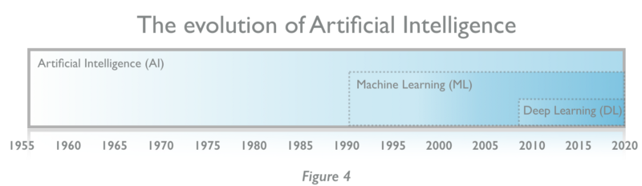{fig-alt="Deep learning subset diagram" width="70%"}

## Example: Deep Learning for Picture Recognition

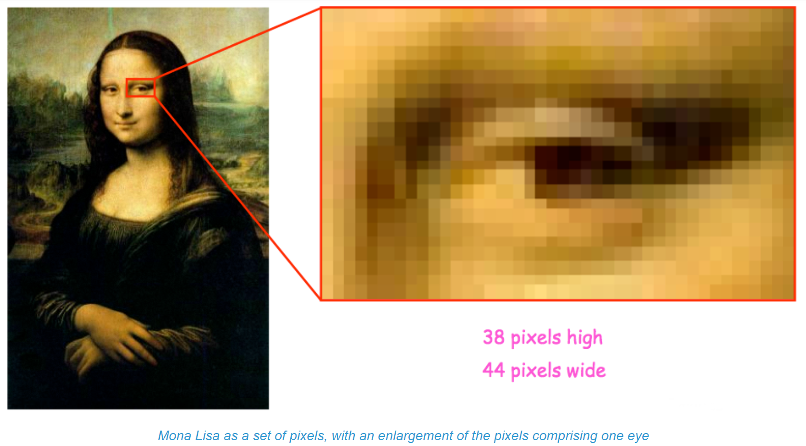{fig-alt="Pixels and RGB values" width="70%"}

- From the computer's point of view, an image is a large table of numbers.
- Each number corresponds to one of three RGB values for one pixel of the image.
- The algorithm generates a hypothesis that takes a table of numbers as input and predicts an output.

## Deep Learning Relies on Neural Networks

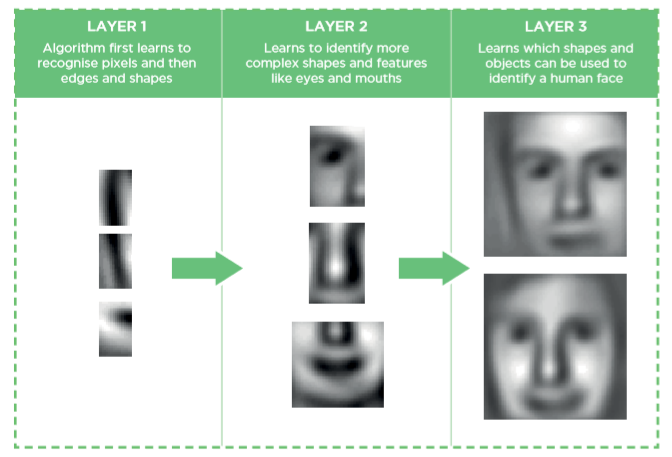{fig-alt="Deep learning face recognition" width="70%"}

- The input layer receives information the network will process, such as pixels of a picture.
- Early layers identify patterns of contrast such as edges; deeper layers extract higher-level features.
- The output layer provides predicted results, such as human face: 98%; balloon: 2%.

## Neural Networks {.visual-stage}

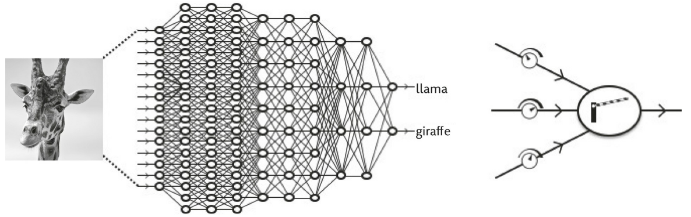{fig-alt="Neural network diagram" .r-stretch}

Each node is given a weight that represents the strength of its relationship with the output.

## First Training, Then Prediction

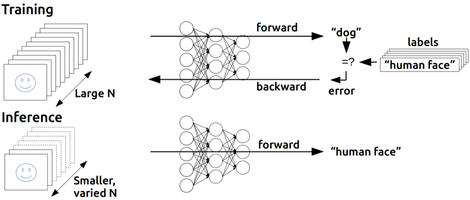{fig-alt="Neural network training" width="85%"}

**Learning** takes place in the network by adjusting weights to reduce the prediction error on the *labeled* examples.

## Key Question {.center .question-slide}

<div style="font-size: 2.6rem; text-align: center; margin-top: 18%;">
What is the key input for supervised learning algorithms?
</div>

## Key Input for Deep Learning: **Big Data**

:::: {.columns}

::: {.column width="42%"}
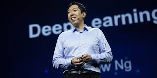{fig-alt="Andrew Ng" width="78%"}

Andrew Ng, former chief scientist of Baidu and one of the leaders of the Google Brain Project
:::

::: {.column width="58%"}
> "The rocket engine is the deep learning models and the fuel is the huge amounts of data we can feed to these algorithms."
:::

::::

## Labelled Data Is Vital for Supervised ML {.photo-title background-image="../../assets/china_label.jpg" background-size="cover" background-position="center"}

<div class="photo-caption">Data labeling in China</div>

# How Large Language Models Work {background-color="#041e42"}

## The Basic Mechanism

During pretraining, a large language model learns to predict tokens from context. When generating text, it repeats that prediction one token at a time.

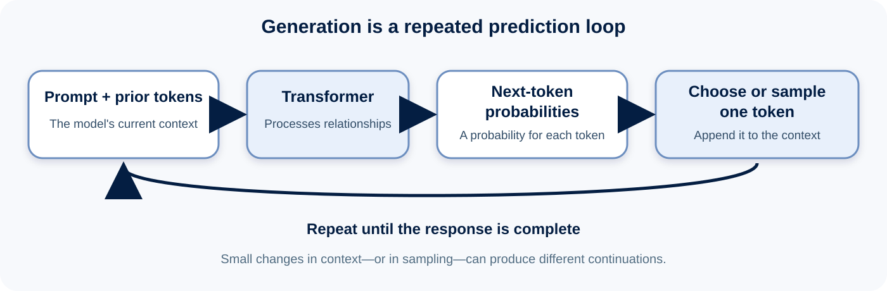{
  fig-alt="Four-step loop showing a prompt and prior tokens passing through a Transformer to next-token probabilities and token selection"
  width="94%"
}

- **Tokens** are words, parts of words, punctuation, or symbols.
- The selected token is added to the context, and the process repeats.
- Sampling choices can produce different—but still plausible—continuations.

::: {.callout-note}
This is **self-supervised learning**: the text itself supplies the target token.
:::

## How Transformers Use Context

:::: {.columns}

::: {.column width="64%"}

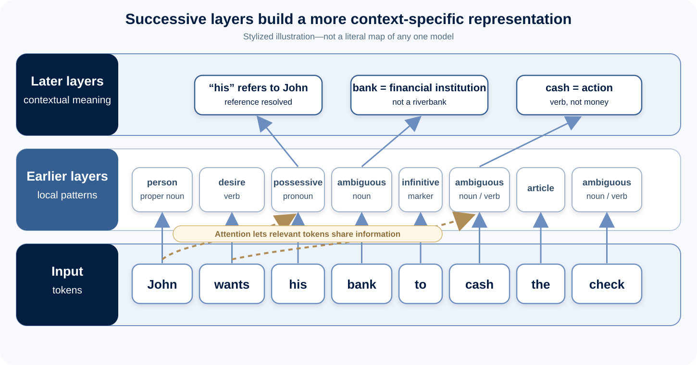{
  fig-alt="Stylized diagram showing Transformer layers refining the contextual meaning of tokens in the sentence John wants his bank to cash the check"
  width="100%"
}

<div style="font-size:0.55em; text-align:center; margin-top:-0.4em;">
Concept inspired by Lee and Trott, “Large Language Models, Explained with a Minimum of Math and Jargon” (Understanding AI, 2023). Original course diagram.
</div>

:::

::: {.column width="36%"}

### Context Changes Meaning

Successive layers refine the representation of each token.

- Is **bank** a riverbank or a financial institution?
- Who does **his** refer to?
- Is **cash** a noun or a verb?
- Which earlier words matter for the next prediction?

**Attention** is a learned numerical weighting process that lets the model weigh which other tokens are most relevant when interpreting each token

:::

::::

## Two Kinds of LLM Tasks

:::: {.columns}

::: {.column width="50%"}

### Open-Ended Generation

**Prompt:** “Write a poem about AI.”

- Many responses could be appropriate.
- Style, tone, and content can vary.
- Randomness produces different outputs.

:::

::: {.column width="50%"}

### Context-Bound Generation

**Prompt:** “Summarize this article.”

- The supplied text becomes part of the context.
- The response should be grounded in that text.
- The model still decides what matters most.

:::

::::

### Key Takeaway

LLMs are powerful because they turn many tasks into language prediction.

But the same mechanism helps explain why they can be fluent, plausible, and wrong.


## Discussion

- How does randomness affect the variety of responses you observed across multiple runs of the same prompt?
- When you modified the input, how did the tone, focus, or phrasing of the responses change?
- How does the model decide which details to prioritize in its response?
- What does this tell us about how specific words or instructions guide the model's focus?
- What are the implications of this behavior for real-world business applications? 

## Frontier Technology: AI Agents

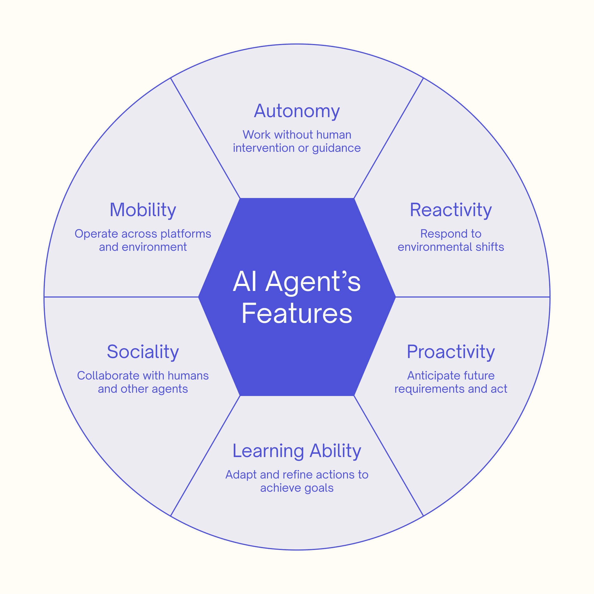{fig-alt="AI agents" width="70%"}

- Diverse potential applications, from assisting in academic research and scheduling meetings to facilitating online shopping and vacation planning.

## The Coming Wave

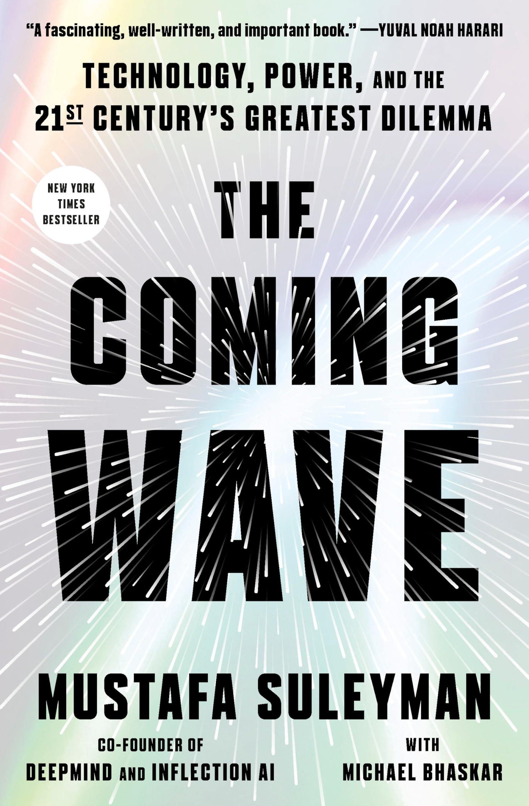{fig-alt="Cover of The Coming Wave" width="62%"}

## Turn-and-Talk Activity

In pairs, discuss Suleyman's central claim about why AI and synthetic biology cannot be contained.

::: {.incremental}
- Is containment truly impossible, or is Suleyman overstating the challenge?
- Draft a one-sentence response to Suleyman: should we aim to contain the "coming wave," or adapt to it?
:::

. . .

**In this class, be prepared to engage, debate, and think critically.**

# Group Project Selection {background-color="#041e42"}

## Group Projects

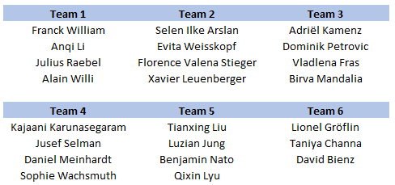{fig-alt="Basel 2025 teams" .r-stretch}

- As noted in the syllabus, the group project is a focus of the course.
- Groups will develop a simulation on a policy issue related to AI.
- Meet with your teams to discuss a topic for your group project.
- In 20 minutes, we will reconvene to record the selections.
