# Welcome to The AI Economy! {background-color="#041e42"}

## I Teach and Write about Globalization

:::: {.columns}

::: {.column width="40%"}
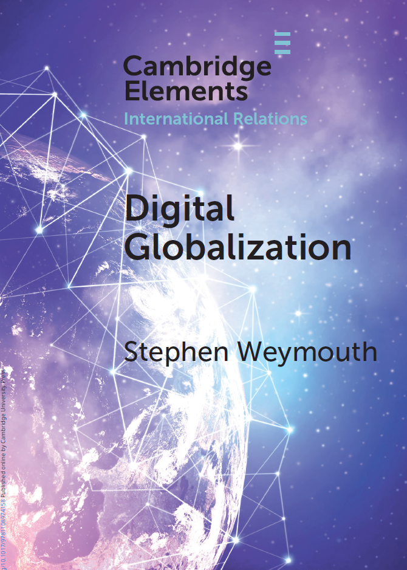{fig-alt="Cover of Digital Globalization" width="82%"}
:::

::: {.column width="60%"}
- Joined Georgetown faculty in 2010
- PhD, University of California, San Diego
- Expertise on the political environment of business
- Focus on how globalization impacts firms, governments, and individuals
- Special Sworn Employee, US Bureau of Economic Analysis (2012–2022)
:::

::::

# A Brief Review of Technology and the Global Economy {background-color="#041e42"}

## How did we get from this...
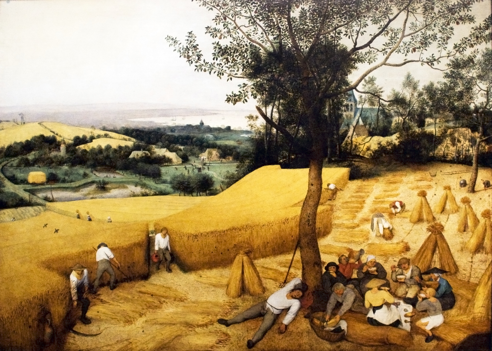{fig-alt="Preindustrial consumption" .r-stretch}

## ...to this type of trade?
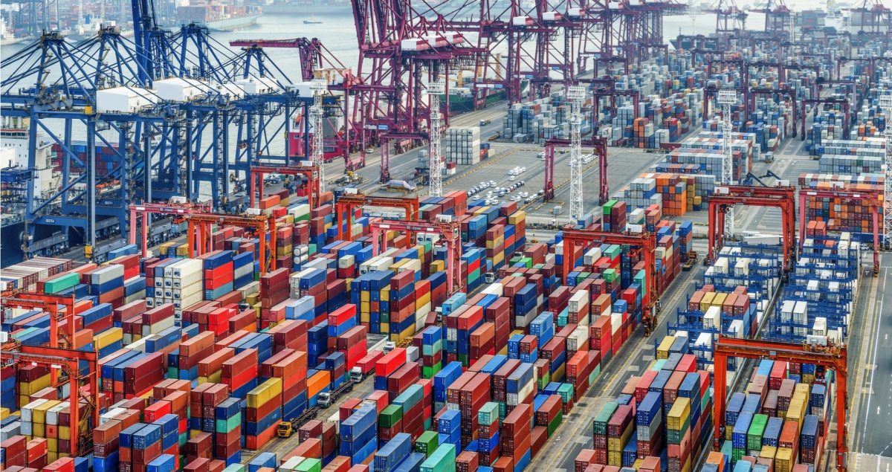{fig-alt="trade" .r-stretch}

## The First Unbundling {.visual-stage}

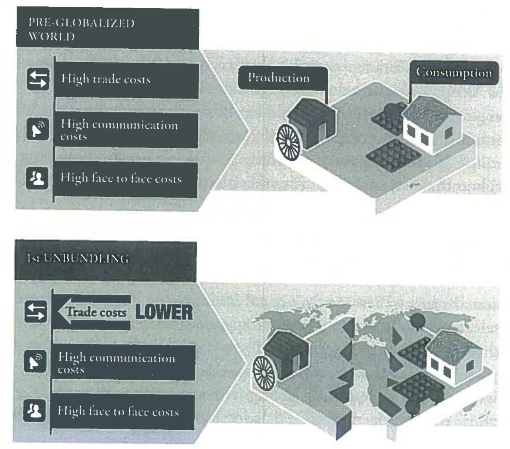{fig-alt="The first unbundling of production and consumption" .r-stretch}

## History Changing Technology: Steam Engine {.photo-title background-image="../../assets/steamboat.png" background-size="cover" background-position="center"}

## History Changing Technology: Steam Engine {.photo-title background-image="../../assets/train2.jpg" background-size="cover" background-position="center"}

## History Changing Technology: Internet {.photo-title background-image="../../assets/ict1.jpg" background-size="contain" background-position="center" background-color="#ffffff"}

## ICT Lowers the Cost of Moving *Ideas* {.visual-stage}

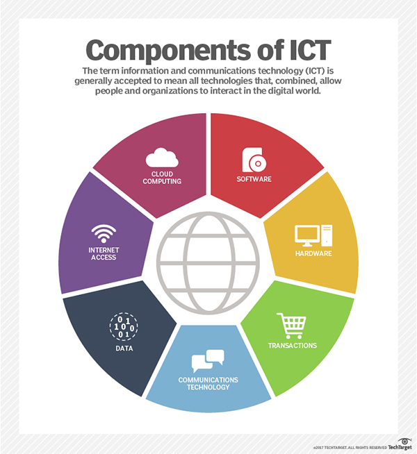{fig-alt="Information and communications technology lowers the cost of moving ideas" .r-stretch}

## Second Unbundling: The GVC Revolution {.visual-stage}

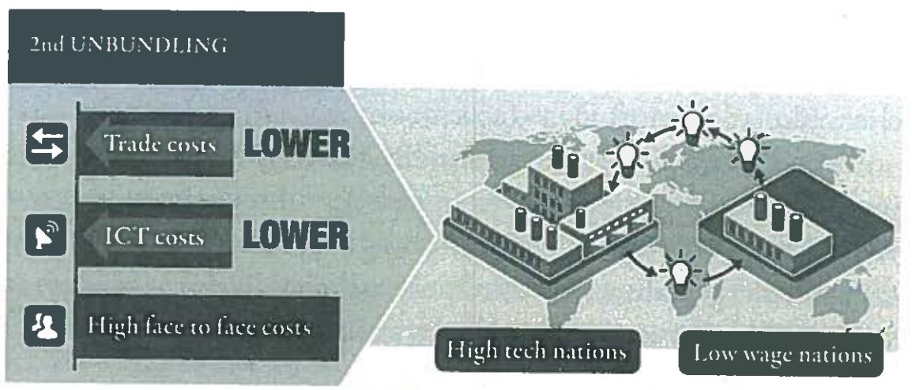{fig-alt="The second unbundling and global value chains" .r-stretch}

## Second Unbundling: The GVC Revolution {.visual-stage}

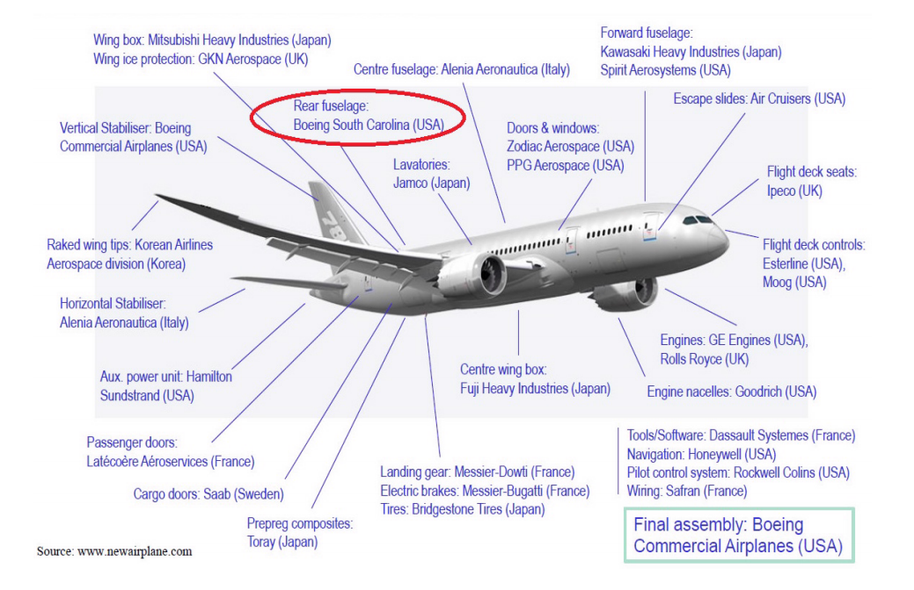{fig-alt="Boeing Dreamliner global value chain" .r-stretch}

## Technology Altered Global Income Distribution

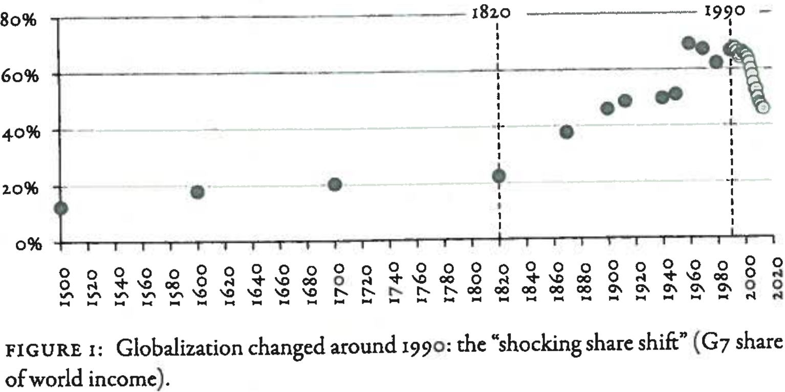{fig-alt="Shift in global income shares between the G7 and I6" width="88%"}

Source: Baldwin (2016)

- **G7:** US, Germany, Japan, France, Britain, Canada, Italy
- **I6:** China, Korea, India, Poland, Indonesia, Thailand

## Technology Altered Global Production

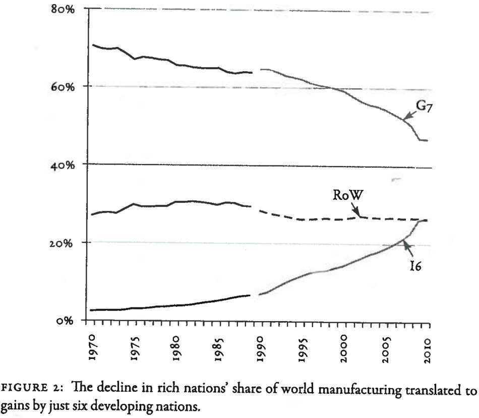{fig-alt="Change in the G7 share of global production" width="64%"}

Source: Baldwin (2016)

- **G7:** US, Germany, Japan, France, Britain, Canada, Italy
- **I6:** China, Korea, India, Poland, Indonesia, Thailand

## Technology Changed US Employment

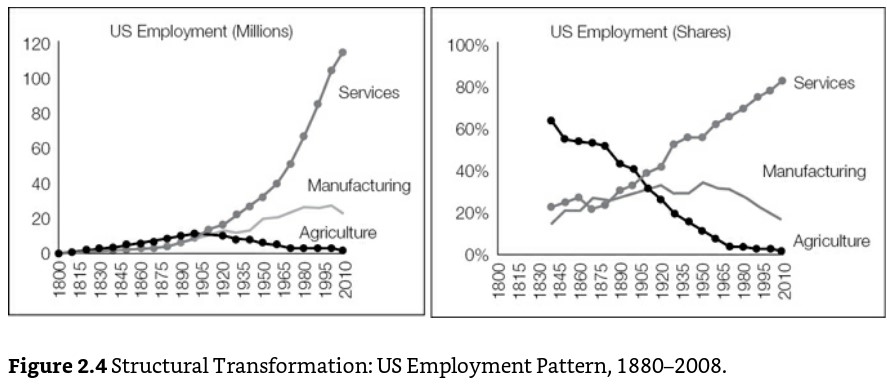{fig-alt="Changes in United States employment shares" width="82%"}

- 8 million manufacturing jobs and 43,000 establishments disappeared.

## Politics (Policy) Implications

To understand the politics, we need to understand who has won and who has lost.

::: {.incremental}
- Who are the winners of the First Unbundling? Who are the losers?
- Who are the winners of the Second Unbundling? Who are the losers?
:::

## Trade Implications {.visual-stage}

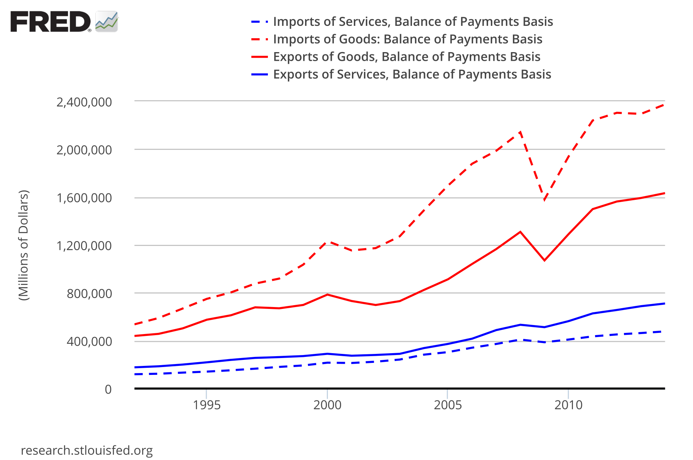{fig-alt="United States trade balance in goods and services" .r-stretch}

## China's Export Dominance {.visual-stage}

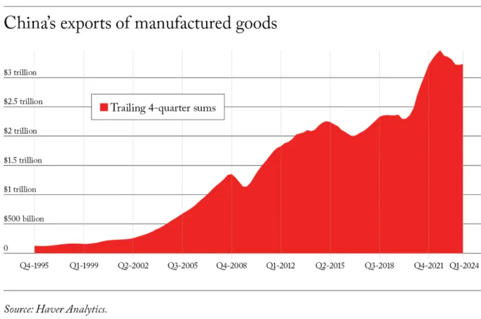{fig-alt="China's dominance in global exports" .r-stretch}

## US Deindustrialization {.visual-stage}

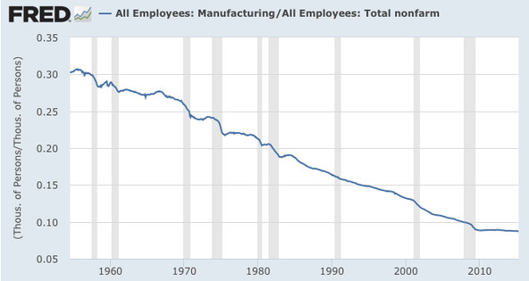{fig-alt="United States deindustrialization" .r-stretch}

## Former US Manufacturing Towns {.photo-title background-image="../../assets/mckeesport.jpg" background-size="cover" background-position="center"}

McKeesport, Pennsylvania

## Manufacturing Employment in 1970 {.visual-stage}

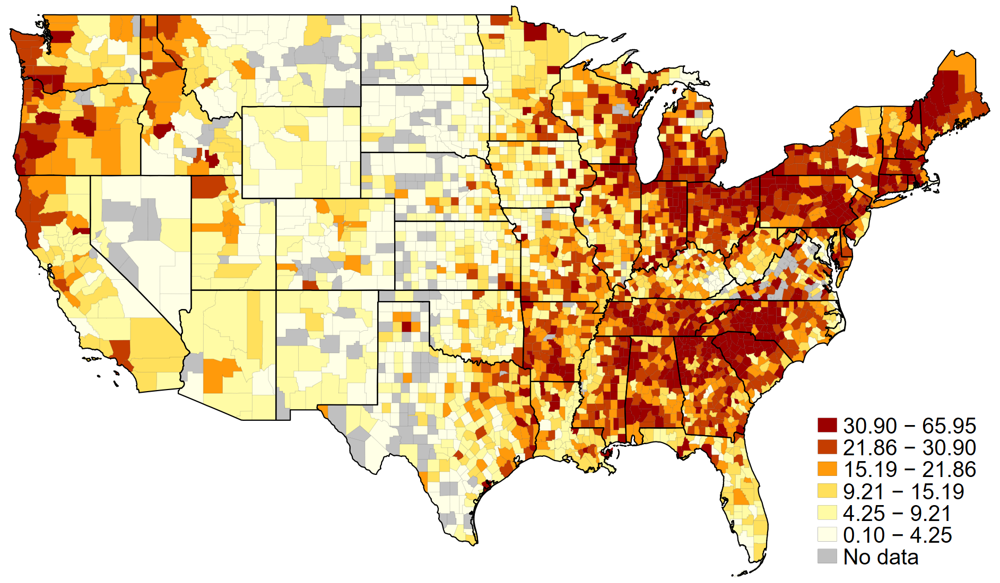{fig-alt="Manufacturing employment across the United States in 1970" .r-stretch}

## Populism in the US {.visual-stage}

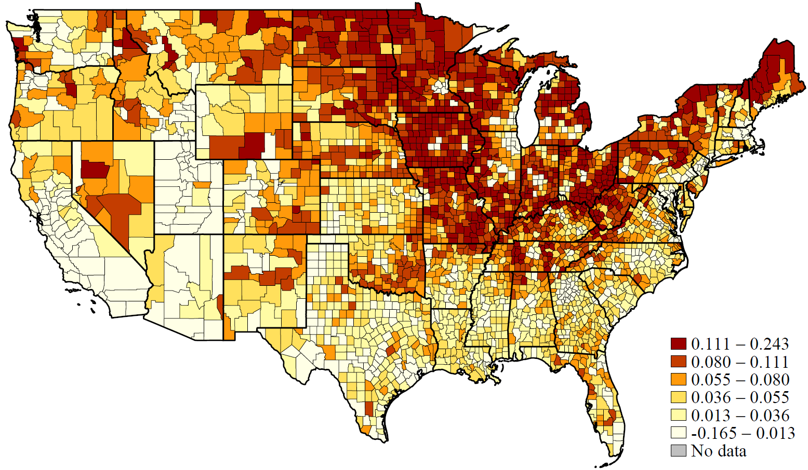{fig-alt="Trump's 2016 performance compared with Romney's 2012 performance" .r-stretch}

Trump (2016) compared with Romney (2012)

# Why Does Trump Do So Well in Former Manufacturing Areas? {background-color="#041e42"}

## Trump's Protectionism {.photo-title background-image="../../assets/Trump_protectionism1.png" background-size="contain" background-position="center" background-color="#ffffff"}

## AI Another GPT?

:::: {.columns}

::: {.column width="55%"}
{fig-alt="Artificial intelligence graphic" width="90%"}
:::

::: {.column width="45%"}
- AI is redefining how managers make decisions and how firms create value.
- Businesses increasingly using AI (data analysis for prediction and decision-making) to increase scale and scope, and to offer personalized products.
:::

::::

## What Costs Does AI Lower? {.question-slide}

- Steam engines lowered the cost of moving goods.
- ICT lowered the cost of moving ideas.
- **What costs does AI lower?**

## What Does AI Potentially Unbundle? {.question-slide}

- Steam engines lowered the cost of moving goods.
- ICT lowered the cost of moving ideas.
- What costs does AI lower?
- **What does AI potentially unbundle?**

## Wrap Up

- General-purpose technologies change systems of production and exchange.
- Previous technological shocks fundamentally altered the economy and the global distribution of income.
- The economic effects of previous shocks reverberated politically.
- We are entering an era of profound political and economic change, driven by AI.
