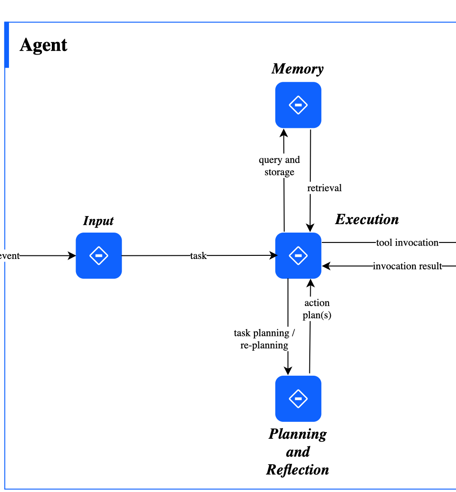
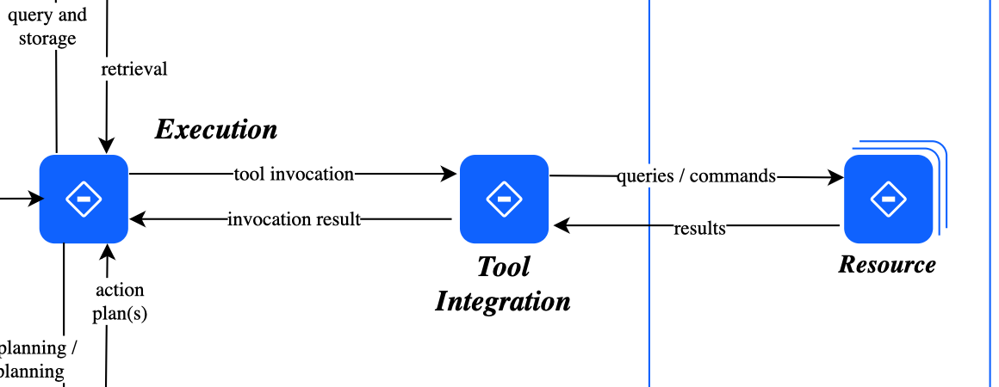

## Today’s Questions

:::: {.columns}

::: {.column width="33%"}
```{=html}
<div style="text-align:center; margin-top:18%;">
  <div style="font-size:3em; color:#041e42; font-weight:650;">1</div>
  <div style="font-size:1.25em;">How do companies build AI into their main work?</div>
</div>
```
:::

::: {.column width="33%"}
```{=html}
<div style="text-align:center; margin-top:18%;">
  <div style="font-size:3em; color:#365f91; font-weight:650;">2</div>
  <div style="font-size:1.25em;">What changes when software can take action?</div>
</div>
```
:::

::: {.column width="33%"}
```{=html}
<div style="text-align:center; margin-top:18%;">
  <div style="font-size:3em; color:#9cadc4; font-weight:650;">3</div>
  <div style="font-size:1.25em;">Why does employee use not always improve company results?</div>
</div>
```
:::

::::

::: {.notes}
The first session explains how a company changes when data and AI become part of its main work. It then asks how AI agents may change business software. The second session asks why giving employees AI tools does not always improve the company’s costs, speed, or revenue.

[Sources]
Marco Iansiti and Karim R. Lakhani, Competing in the Age of AI, 2020.
Deep Nishar and Nitin Nohria, “How Gen AI Could Disrupt SaaS—and Change the Companies That Use It,” Harvard Business Review, May 21, 2025.
Ethan Mollick, “Making AI Work: Leadership, Lab, and Crowd,” May 22, 2025.
McKinsey & Company, “The State of AI in 2025,” November 5, 2025.
:::

# Companies Built Around Data and AI {background-color="#041e42"}

## Business Model and Operating Model

{
  fig-alt="Business model based on value creation and value capture connected to an operating model based on scale, scope, and learning"
  width="91%"
}

::: {.notes}
Define the two main terms before discussing the details in the figure. A **business model** explains how a company helps customers and earns money. An **operating model** explains how its people, data, technology, and work processes deliver the product or service.

On the left, **value creation** means giving customers a reason to choose the company. **Value capture** means turning some of that customer benefit into revenue for the company.

On the right, **scale** concerns how much the company can produce or serve. **Scope** concerns the range of products, services, or customers it can support. **Learning** concerns how the company improves through research, experience, and information from use.

Use the two-way arrow as the main teaching point: the way a company earns money and the way it delivers must support each other.

[Sources]
Iansiti and Lakhani, Competing in the Age of AI, 2020.
:::

## Some Companies Build AI into Their Main Work

```{=html}
<div style="font-size:1.22em; line-height:1.75; color:#041e42; margin:4% auto 0; width:86%;">
  <div><strong>1.</strong> Everyday work produces data.</div>
  <div><strong>2.</strong> Software uses the data to support decisions.</div>
  <div><strong>3.</strong> The company tests whether those decisions improve the result.</div>
  <div><strong>4.</strong> What the company learns changes the next decision.</div>
</div>
<div style="text-align:center; margin:2.5em auto 0; width:82%; font-size:1.15em; color:#365f91;">
A company that builds this cycle into its main work is often called <strong>AI-native</strong>.
</div>
```

::: {.notes}
Define **AI-native company** in ordinary language: a company that builds data and AI into its main way of working, rather than adding one AI tool to an unchanged process.

Walk through the four steps. The important idea is repetition. Daily work creates data; software uses the data; the firm tests the result; and what it learns changes later decisions.

Ask: “What could stop this cycle?” Possible answers include data stored in separate places, manual transfers between teams, no clear measure of success, or long delays before software can be updated.

[Sources]
Iansiti and Lakhani, Competing in the Age of AI, 2020.
:::

## AI Can Change How a Company Grows

:::: {.columns}

::: {.column width="33%"}
```{=html}
<div style="text-align:center; margin-top:25%;">
  <div style="font-size:1.45em; color:#041e42; font-weight:650;">Serve more customers</div>
  <div style="margin-top:0.5em;">without hiring people at the same rate</div>
</div>
```
:::

::: {.column width="33%"}
```{=html}
<div style="text-align:center; margin-top:25%;">
  <div style="font-size:1.45em; color:#365f91; font-weight:650;">Support more products</div>
  <div style="margin-top:0.5em;">with shared data and technology</div>
</div>
```
:::

::: {.column width="33%"}
```{=html}
<div style="text-align:center; margin-top:25%;">
  <div style="font-size:1.45em; color:#71839b; font-weight:650;">Improve through use</div>
  <div style="margin-top:0.5em;">when information from use improves later decisions</div>
</div>
```
:::

::::

::: {.notes}
Explain each column with an example.

First, software may allow a company to serve more customers without hiring people at the same rate. Second, the same data and technology may support several products. Third, information from use may improve later decisions.

None of this happens automatically. Computing costs can rise, using one system for many products can create complexity, and more data helps only when it is accurate and relevant. Ask students to look for these three effects in the Amazon example.

[Sources]
Iansiti and Lakhani, Competing in the Age of AI, 2020.
:::

## Amazon Connects Its Main Businesses

{
  fig-alt="Amazon fulfillment center using the Sequoia robotic system to store and move inventory"
  width="92%"
}

::: {.notes}
Use Amazon to make the idea concrete. Product recommendations, demand forecasts, prices, advertising, sellers, warehouses, delivery, and cloud services share data and technology instead of operating as separate projects.

[Sources]
Iansiti and Lakhani, Competing in the Age of AI, 2020.
Amazon annual reports.
Amazon, "Amazon announces 2 new ways it’s using robots to assist employees and deliver for customers," October 18, 2023. Image courtesy of Amazon.
:::

## Amazon Uses Shared Systems to Improve Service and Earn Money

:::: {.columns}

::: {.column width="50%"}
### How customers benefit

**Discover** relevant products<br>
**Buy** with less friction<br>
**Receive** orders reliably
:::

::: {.column width="50%"}
### How Amazon earns money

**Retail and seller fees**<br>
**Prime and advertising**<br>
**Delivery services and cloud computing (AWS)**
:::

::::

```{=html}
<div style="text-align:center; margin-top:2.2em; font-size:1.25em; color:#365f91;">
The same data and technology support both sides.
</div>
```

::: {.notes}
Start on the left. Recommendations help customers find products. Search, reviews, prices, and easy payment make buying simpler. Forecasting and logistics improve delivery. Each interaction also creates information that may improve the next one.

Then move to the right. Amazon earns money from retail sales, seller fees, Prime, advertising, delivery services, and AWS. The main point is not simply that Amazon has many businesses. The same data and technology support several ways of earning money.

Ask: “Which side would weaken first if Amazon lost access to customer and operating data?”

[Sources]
Amazon annual reports.
Iansiti and Lakhani, Competing in the Age of AI, 2020.
:::

## More Use Can Improve the Service and Attract More Use

{
  fig-alt="Circular diagram in which more usage produces more data, better algorithms, better service, and then more usage"
  width="54%"
}

::: {.notes}
Explain the loop in one pass: more use generates more data; usable data may improve algorithms; better performance improves the service; a better service attracts more use.

Then add two cautions. More data does not guarantee improvement if the data are inaccurate, one-sided, or unrelated to the question. The same cycle can also make large firms harder to challenge because new firms have less data and fewer customers.

[Sources]
Iansiti and Lakhani, Competing in the Age of AI, 2020.
:::

# Software That Can Take Action {background-color="#041e42"}

## Growth of Online Subscription Software Had Slowed Before 2026

```{=html}

```

::: {.notes}
Define SaaS before discussing the chart: **software as a service** is software sold as an online subscription. Use the chart as background, not as proof that AI caused the decline. Typical revenue growth for public SaaS companies had already fallen from 36 percent in early 2022 to 15 percent in early 2025.

Separate two questions. Why had growth slowed before 2026? Possible reasons include the end of unusually high pandemic-era demand, higher interest rates, customers controlling spending, and a market becoming more mature. Why did AI increase concern in 2026? Investors began to ask whether agents would reduce the number of paid users or allow customers to avoid working directly inside existing software products.

The chart establishes vulnerability; it does not prove that AI caused the decline.

[Sources]
User-provided figure; original source and methodology should be confirmed before public distribution.
S&P Global Market Intelligence, “Software sell-off may be overdone, yet exposes deeper concerns,” February 2026.
:::

## Software Stocks Split Sharply in 2025

:::: {.columns}

::: {.column width="50%"}
### Firms whose shares rose

{
  fig-alt="Upper half of a chart showing strong 2025 stock performance among firms including Palantir, Cloudflare, MongoDB, Shopify, and CrowdStrike"
  width="100%"
}
:::

::: {.column width="50%"}
### Firms whose shares fell

{
  fig-alt="Lower half of a chart showing weak 2025 stock performance among firms including ServiceNow, Salesforce, Atlassian, Adobe, Monday.com, and HubSpot"
  width="100%"
}
:::

::::

::: {.notes}
The second figure shows that software shares were no longer moving together by the end of 2025. Some firms linked to AI computing, data, or security rose sharply, while several familiar business-software companies fell.

Do not ask students to explain every company. Ask what investors may have liked: strong growth, useful data, computing services, security, or a clear role in the AI market. Then ask what investors may have worried about: slow growth, prices based on the number of users, or software screens that an agent could avoid.

This leads to the question in the HBR reading: when software can act for the user, which parts of the subscription-software business become less important, and which advantages of existing companies remain useful?

[Sources]
SaaStr, “The Great B2B Bifurcation of 2025,” December 2025. Figure supplied by the instructor.
:::

## An AI Agent Can Choose Steps and Use Other Software

:::: {.columns}

::: {.column width="48%"}
### The agent chooses the steps

```{=html}

```
:::

::: {.column width="52%"}
### The agent uses other software to act

```{=html}

```
:::

::::

::: {.notes}
Begin with traditional business software. It provides screens, forms, rules, and a fixed order of steps. People understand the process and move each case from one step to the next.

Nishar and Nohria argue that an AI agent may allow a person to state a goal instead. The agent can collect information, choose steps, use other software, request approval, and complete several parts of the task.

Use the two enlarged parts of IBM’s diagram from left to right. An event or user request becomes an input. The agent uses memory and planning to decide what to do. Execution then calls a tool, and that tool sends queries or commands to an external resource. The important change is the final link: the system can do more than produce text—it can alter another system.

Do not imply that the existing systems disappear. The agent still needs company records, rules, permission to act, and software that records payments or other changes. The business question is who earns the money when users no longer work directly through every screen.

[Sources]
Nishar and Nohr, “How Gen AI Could Disrupt SaaS,” 2025.
IBM, “An IBM Guide to Agentic AI Systems,” conceptual agent architecture, 2025.
:::

## Example: Repaying an Employee’s Travel Expenses

:::: {.columns}

::: {.column width="58%"}
### Traditional process

```{=html}
<div style="font-size:1.15em; line-height:2.2; color:#041e42;">
Upload receipt → Enter details → Choose category → Approve → Pay
</div>
```
:::

::: {.column width="42%"}
### Process supported by an AI agent

```{=html}
<div style="font-size:1.65em; color:#365f91; font-weight:650; margin-top:0.9em;">
“Reimburse my Basel trip.”
</div>
```
:::

::::

```{=html}
<div style="text-align:center; margin-top:2.6em; font-size:1.15em; color:#365f91; font-weight:600;">
The agent collects evidence, applies policy, prepares the payment, and sends unusual cases to a person.
</div>
```

::: {.notes}
Walk through the example from the employee’s perspective. Instead of locating forms and selecting codes, the employee states the outcome: “Reimburse my Basel trip.”

The agent observes the available evidence, plans the required steps, acts in the relevant systems, checks its work, and escalates exceptions. It could locate receipts, identify the trip, apply policy, code the expense, and prepare payment.

Ask students where a person must approve the work. A person might approve unusually high expenses, cases outside the normal rules, missing documents, or final payment. Sending an unusual case to a person is part of a well-designed system, not evidence that the agent failed.

[Sources]
Nishar and Nohr, “How Gen AI Could Disrupt SaaS,” 2025.
:::

## AI Agents Change Which Parts of Business Software Matter

:::: {.columns}

::: {.column width="50%"}
### May matter less

- Screens and forms
- Fees based on the number of users
- Processes with fixed steps
:::

::: {.column width="50%"}
### May matter more

- Company data that competitors cannot access
- Permission to act and a record of every action
- Connections to business systems and customers
:::

::::

```{=html}
<div style="text-align:center; margin-top:3em; font-size:1.35em; color:#365f91;">
A useful agent still depends on the data and systems behind the screen.
</div>
```

::: {.notes}
Explain the left side first. If an agent can work across several applications, users may spend less time inside each product. A company may need fewer paid user accounts, and software based on fixed steps may become less useful.

Then turn to the right side. The agent still needs reliable records, permission to act, connections to company systems, and access to customers. These assets may become more important as the visible screen becomes less important.

The point is not that subscription software disappears. The important part of the product may shift from the screen to the data, permission, and system connections needed to complete the work.

[Sources]
Nishar and Nohr, “How Gen AI Could Disrupt SaaS,” 2025.
:::

## What Existing Software Companies Can Do

```{=html}
<div style="display:grid; grid-template-columns:1fr 1fr; column-gap:3.8em; row-gap:2.3em; width:86%; margin:7% auto 0; color:#041e42;">
  <div>
    <div style="font-size:1.25em; font-weight:650;">Build agents into the existing product</div>
    <div style="font-size:0.95em; margin-top:0.35em;">Help customers complete work without leaving the product.</div>
  </div>
  <div>
    <div style="font-size:1.25em; font-weight:650;">Let outside agents connect</div>
    <div style="font-size:0.95em; margin-top:0.35em;">Provide secure access to the product’s data and actions.</div>
  </div>
  <div>
    <div style="font-size:1.25em; font-weight:650; color:#365f91;">Charge for completed work</div>
    <div style="font-size:0.95em; margin-top:0.35em;">Rely less on fees based on the number of users.</div>
  </div>
  <div>
    <div style="font-size:1.25em; font-weight:650; color:#365f91;">Remain the trusted source of company records</div>
    <div style="font-size:0.95em; margin-top:0.35em;">Keep the data, permissions, and record of past actions that agents need.</div>
  </div>
</div>
```

::: {.notes}
Explain the four choices in the words shown on the slide. A company can put its own agent inside the product, allow outside agents to connect safely, charge for completed work instead of each user, or remain the trusted place where company records and permissions are stored.

A company can use more than one choice. Salesforce, for example, can offer its own agents and also allow approved outside agents to use customer records. Ask which choice changes the current business the least and which changes it the most.

[Sources]
Nishar and Nohr, “How Gen AI Could Disrupt SaaS,” 2025.
:::

## Existing Software Companies May Benefit from Trusted Data and Clear Rules

```{=html}
<div style="display:grid; grid-template-columns:1fr 1fr; gap:4em; width:82%; margin:9% auto 0;">
  <div>
    <div style="font-size:1.35em; color:#365f91; font-weight:650;">Rules customers need</div>
    <div style="font-size:1.05em; margin-top:0.7em;">Clear approval rules, a record of each action, and a way for people to stop or correct the agent</div>
  </div>
  <div>
    <div style="font-size:1.35em; color:#365f91; font-weight:650;">Advantages existing companies may have</div>
    <div style="font-size:1.05em; margin-top:0.7em;">Reliable company data, links to daily work, customer trust, and access to existing customers</div>
  </div>
</div>
```

```{=html}
<div style="text-align:center; margin:3.5em auto 0; width:82%; font-size:1.25em; color:#365f91;">
Before an agent acts, the company must decide what it may do, when a person must approve, and how mistakes will be corrected.
</div>
```

::: {.notes}
An agent needs clear access rights, approval rules, a record of its actions, rules for unusual cases, and a person who is responsible. Customers may prefer an agent that works inside a system they already trust and control.

Connect the two sides. Company data helps the agent understand the case. Links to daily business systems let it act. Trust and permissions limit what it may do. Existing customer relationships make it easier for an established company to sell the service.

Ask: which advantage would remain useful even if the software screen changed completely? The activity asks teams whether the existing software company would become weaker, remain an essential supplier, or become stronger.

[Sources]
Nishar and Nohr, “How Gen AI Could Disrupt SaaS,” 2025.
Day 2A activity, “Rebuilding SaaS for an Agentic Era.”
:::

## Activity: Redesign Software Around a Customer Goal

```{=html}
<div style="font-size:1.3em; line-height:1.8; color:#041e42; margin:5% auto 0; width:82%;">
  <div><strong>1.</strong> State the customer’s goal.</div>
  <div><strong>2.</strong> Identify the information and actions the agent needs.</div>
  <div><strong>3.</strong> Decide where a person must approve or correct the work.</div>
  <div><strong>4.</strong> Explain what the existing software company would still do better than a new competitor.</div>
</div>
```

::: {.notes}
Allow about 25 minutes: 3 minutes to choose the customer goal, 12 minutes to design the system, 5 minutes to judge the software company’s remaining advantage, and 5 minutes to prepare a short report.

Teams redesign one familiar business-software product around a customer goal. Tell them not to begin with “add a chatbot.” Begin with what the customer is trying to accomplish. Then identify what the agent must know, decide, and do; where a person must approve; which unusual cases go to a person; and what information would help the system improve.

Teams should also decide whether the existing software company becomes weaker, remains necessary, or becomes stronger. They must name the one advantage—such as data, trust, or customer access—that best explains their answer.

[Sources]
Day 2A activity, “Rebuilding SaaS for an Agentic Era.”
:::

## Activity Debrief

```{=html}
<div style="font-size:1.55em; line-height:2.25; color:#041e42; margin-top:5%;">
  <div>Which screens or steps were no longer needed?</div>
  <div>Where must a person decide?</div>
  <div>Which existing advantage became more important?</div>
</div>
```

::: {.notes}
Use these three questions to compare team designs. Ask only two or three teams to report, then invite short contrasts from the room.

Press for a specific answer rather than a general claim that “people remain involved.” Where exactly is approval required? What information reaches that person? What happens if no one responds? Ask which screens, transfers between teams, paid user accounts, or complete applications are no longer needed. Close by identifying which existing advantage remained useful.
:::

# When Employee AI Use Does Not Improve Company Results {background-color="#041e42"}

## Some Companies Now Expect Employees to Use AI

{
  fig-alt="Company communications from Shopify and Duolingo announcing AI-first workplace expectations"
  width="96%"
}

::: {.notes}
Mollick uses these company messages to show that some employers now expect workers to use AI. But an instruction to “use AI” does not change the company’s data, work process, rewards, responsibilities, or measures of success.

[Sources]
Mollick, “Making AI Work,” 2025. Figure reproduced from the assigned reading.
:::

## Most Companies Have Not Moved Beyond Small AI Tests

{
  fig-alt="McKinsey Exhibit 1 showing 88 percent of organizations use AI in at least one business function, while most remain in experimentation or piloting"
  width="91%"
}

::: {.notes}
McKinsey surveyed 1,993 participants in 105 nations. Regular use is widespread, but nearly two-thirds of organizations remain in experimentation or pilot phases.

Emphasize that “use” is a low standard. It may mean only that someone in one department regularly uses an AI tool. Wider use requires a repeatable process, reliable data, links to other systems, clear rules, responsibility, and measurement. Large firms are more likely to move beyond small tests because they can invest more in these supporting changes.

[Sources]
McKinsey & Company, “The State of AI in 2025,” Exhibits 1 and 5 and accompanying text, 2025.
:::

## Few Companies Use AI Agents Widely

{
  fig-alt="McKinsey Exhibit 2 comparing experimentation and scaling of AI agents across business functions"
  width="88%"
}

::: {.notes}
Most organizations that use agents beyond small tests do so in only one or two departments. In every department shown, no more than 10 percent of respondents report wide use of agents.

[Sources]
McKinsey & Company, “The State of AI in 2025,” Exhibit 2 and accompanying text, 2025.
:::

## Few Companies Report a Large Effect on Profit

:::: {.columns}

::: {.column width="50%"}
```{=html}
  <div style="text-align:center; margin-top:17%;">
  <div style="font-size:3.3em; color:#041e42; font-weight:650;">39%</div>
  <div style="font-size:1.15em;">report any effect on company profit</div>
</div>
```
:::

::: {.column width="50%"}
```{=html}
  <div style="text-align:center; margin-top:17%;">
  <div style="font-size:3.3em; color:#365f91; font-weight:650;">≈ 6%</div>
  <div style="font-size:1.15em;">report that AI adds at least 5% to company profit</div>
</div>
```
:::

::::

::: {.notes}
Explain that the source uses **EBIT**, a measure of profit from normal business activities before interest and tax. AI use is common, but only 39 percent of respondents report any effect on this measure for the company as a whole. Most of those companies report an effect below 5 percent. About 6 percent of the full sample report both a profit effect of at least 5 percent and significant benefits from AI.

Do not say that AI therefore has little value. Some benefits may appear first in new products, customer experience, or employee satisfaction. The point is that improvements to one task do not automatically create a measurable result for the whole company.

Ask: what must happen between an employee saving one hour and the company earning more profit? This introduces the need to change the full process, involve all connected roles, and measure an operational result.

[Sources]
McKinsey & Company, “The State of AI in 2025,” 2025.
:::

## Companies Often Report Benefits Before a Large Profit Effect

{
  fig-alt="McKinsey Exhibit 6 showing reported organization-wide benefits from AI, led by innovation and employee satisfaction"
  width="91%"
}

::: {.notes}
Organizations often report benefits in new products, employee satisfaction, customer satisfaction, and competitive position before they report a large effect on profit. These may be early signs of progress, but firms must still measure costs, revenue, and profit.

[Sources]
McKinsey & Company, “The State of AI in 2025,” Exhibit 6, 2025.
:::

## Companies Reporting Larger Gains More Often Redesign the Full Process

{
  fig-alt="McKinsey Exhibit 11 showing that AI high performers are nearly three times as likely to fundamentally redesign workflows"
  width="91%"
}

::: {.callout-note}
55% of the companies reporting larger gains redesigned the full process, compared with 20% of other companies. This does not prove that redesign caused the gains.
:::

::: {.notes}
The firms reporting the largest financial gains are also more likely to seek growth and new products, use agents in more parts of the company, place a senior leader in charge, and state when a person must check the AI’s work.

[Sources]
McKinsey & Company, “The State of AI in 2025,” Exhibits 9–14, 2025.
:::

## Why Can Employees Save Time While Company Results Stay Flat?

:::: {.columns}

::: {.column width="50%"}
### Employees

- Use AI more often
- Finish some tasks faster
:::

::: {.column width="50%"}
### The company

- Costs may not fall
- Full processes may not become faster
- Customer results may not improve
:::

::::

::: {.notes}
Mollick’s puzzle is that AI improves many tasks and employees already use it, yet company results may remain unchanged. An improvement to one person’s task does not automatically improve the complete process.

Distinguish a task from a process. AI may help an employee draft a proposal faster, but the proposal still moves through pricing, legal review, approval, and customer follow-up. If those steps do not change, the total time needed to make a sale may remain the same. The employee experiences a gain while the company sees little effect.

Ask students for examples from work or university: where has AI made one step faster without changing the total time or result? Listen for a later step becoming the new delay, saved time being filled with more work, or AI output requiring extra checking.

[Sources]
Mollick, “Making AI Work,” 2025.
:::

## Three Groups Must Work Together

{
  fig-alt="Ethan Mollick's Venn diagram showing organizational leadership, the lab, and the crowd as overlapping parts of AI transformation"
  width="52%"
}

```{=html}
<div style="text-align:center; margin-top:1em; font-size:1.05em; color:#365f91;">
Leaders set direction. A central AI team tests and builds. Employees identify useful ways to apply AI and practical problems.
</div>
```

::: {.notes}
Use this one diagram to explain all three roles.

Leaders choose the problems to solve, decide which risks are acceptable, assign responsibility, and provide money and staff. Without leadership, experiments remain separate and no one is responsible for results across the company.

The “lab” is a central AI team. It explores new possibilities, tests ideas, and turns useful experiments into tools and methods that other teams can reuse.

The “crowd” means employees who know the daily work. They understand unusual cases, shortcuts, customer needs, and practical problems that a central team may miss. Their private experiments may contain useful knowledge, but unclear rules or fear of job loss may stop them from sharing it.

The three groups must work together. Employees find useful applications, the central team tests and improves them, and leaders decide which ones to expand. No group has enough information alone.

[Sources]
Mollick, “Making AI Work,” 2025.
Figure reproduced from the assigned reading.
:::

## A Faster Task Does Not Guarantee a Faster Process

:::: {.columns}

::: {.column width="50%"}
### Add AI to one task

Same process, faster step
:::

::: {.column width="50%"}
### Redesign the full process

Change the order of steps, who does them, and who approves them
:::

::::

```{=html}
<div style="display:flex; justify-content:center; align-items:center; gap:0.55em; margin-top:3.4em; font-size:1.35em; font-weight:650;">
  <span style="color:#041e42;">Time for one task</span>
  <span style="color:#9cadc4;">→</span>
  <span style="color:#365f91;">Time and quality of the full process</span>
  <span style="color:#9cadc4;">→</span>
  <span style="color:#041e42;">Cost or sales</span>
</div>
```

::: {.notes}
If one task becomes faster but later approvals, data entry, or decisions do not change, the result of the full process may not improve. The delay often moves to a later step. Improving the whole process may require changing the order of work, responsibilities, data, and approval rules.

Measure three levels. For the task, measure minutes saved. For the full process, measure total time, number of cases completed, or sales success. For the business result, measure cost, revenue, or profit. Also track a risk measure such as quality, errors, or rule violations.

Time saved is useful evidence, but it is not the final result. Ask what the employee does with the saved time and whether the rest of the process can handle more work.

[Sources]
Mollick, “Making AI Work,” 2025.
McKinsey & Company, “The State of AI in 2025,” 2025.
Day 2B activity, “From Adoption to Enterprise Value.”
:::

## Activity Case: High AI Use, No Change in Company Results

:::: {.columns}

::: {.column width="50%"}
```{=html}
<div style="text-align:center; margin-top:18%;">
  <div style="font-size:3.3em; color:#041e42; font-weight:650;">75%</div>
  <div style="font-size:1.2em;">weekly employee use</div>
</div>
```
:::

::: {.column width="50%"}
```{=html}
  <div style="text-align:center; margin-top:18%;">
  <div style="font-size:3.3em; color:#9cadc4; font-weight:650;">≈ 0</div>
  <div style="font-size:1.2em;">change in profit, total work time, or customer results</div>
</div>
```
:::

::::

::: {.notes}
This is the fictional case from the Day 2B activity. Employees report saving time, but profit, total completion time, and customer results have barely changed.

Give students the puzzle before the instructions: how can both numbers be true? Invite two or three explanations. Possible answers include employees filling the saved time with other work, later steps remaining slow, some connected roles not using AI, extra checking, weak links to other systems, or measures that count use instead of results.

Do not resolve the puzzle on this slide. The activity asks teams to choose one complete process and find where the expected benefit disappears.

[Sources]
Day 2B activity, “From Adoption to Enterprise Value.” The case is fictional.
:::

## Activity: Connect AI Use to a Company Result

```{=html}
<div style="font-size:1.3em; line-height:1.8; color:#041e42; margin:6% auto 0; width:82%;">
  <div><strong>1.</strong> Choose one complete work process.</div>
  <div><strong>2.</strong> Find the main step that limits speed or quality.</div>
  <div><strong>3.</strong> Change the roles, data, and approval rules around that step.</div>
  <div><strong>4.</strong> Name one person responsible and choose one measure for speed or quality, one for money, and one for risk.</div>
</div>
```

::: {.notes}
Allow about 20 minutes: 4 minutes to find the largest problem, 10 minutes to redesign one complete process, and 6 minutes to name who is responsible, choose measures, and set a six-month target.

Keep the scope narrow. Each team chooses one complete process rather than proposing an AI plan for the whole company. Teams identify the main problems, change the process, divide work between people and the agent, identify required data and approval rules, name one responsible person, and choose measures for operations, money, and risk.

The six-month target must be observable. “Use AI more” is too vague. “Reduce the time needed to prepare and approve a proposal from ten days to seven without increasing pricing errors” can be tested.

[Sources]
Day 2B activity, “From Adoption to Enterprise Value.”
:::

## Activity Debrief

```{=html}
<div style="font-size:1.55em; line-height:2.25; color:#041e42; margin-top:5%;">
  <div>Which step limited the result?</div>
  <div>Who was responsible for the full process?</div>
  <div>What result would show that the change worked?</div>
</div>
```

::: {.notes}
Use these questions to compare the redesigns. Ask each reporting team to state which step caused the delay, who is responsible for the full process, and one measure that would show whether the change worked.

Ask teams to connect the AI change to a result for the process and then to cost or revenue. If they say time savings reduce cost, ask how staffing or workload will actually change. If they expect more sales, ask which step previously limited the number of customers served. End with risk: what result would cause the firm to pause or change the system?
:::

## Day 2 Takeaways

```{=html}
<div style="font-size:1.35em; line-height:1.85; color:#041e42; margin:4% auto 0; width:88%;">
  <div><strong>Some companies build AI into their main work</strong> so that data from everyday use can improve later decisions.</div>
  <div><strong>AI agents can choose steps and use other software,</strong> which may change how business software is used and priced.</div>
  <div><strong>Company results usually improve only when the full work process changes,</strong> including responsibilities and approval rules.</div>
</div>
```

```{=html}
<div style="text-align:center; margin-top:2.3em; font-size:1.25em; color:#365f91;">
Providing AI tools is only the first step.
</div>
```

::: {.notes}
Close by reconnecting the three sections. Companies built around data and AI show how technology can change daily work. AI agents may change how business software is used and sold. Companies see measurable results only when they also change complete work processes, responsibilities, data, approval rules, and measurement.
:::
