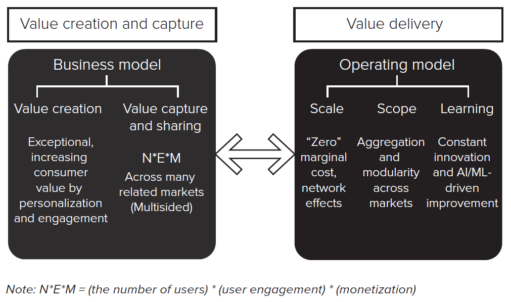
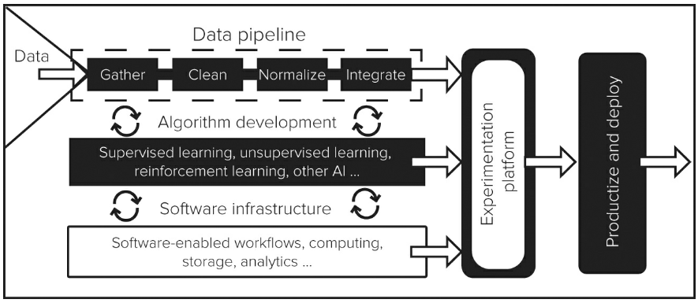
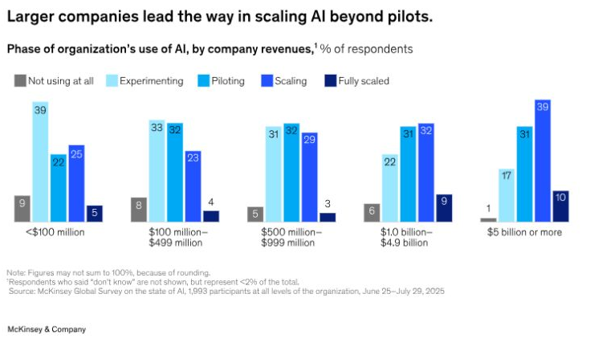

## Today's Roadmap

:::: {.columns}

::: {.column width="33%"}
```{=html}
<div style="text-align:center; margin-top:18%;">
  <div style="font-size:3em; color:#041e42; font-weight:650;">1</div>
  <div style="font-size:1.25em;">AI-native firms</div>
</div>
```
:::

::: {.column width="33%"}
```{=html}
<div style="text-align:center; margin-top:18%;">
  <div style="font-size:3em; color:#365f91; font-weight:650;">2</div>
  <div style="font-size:1.25em;">Agentic software</div>
</div>
```
:::

::: {.column width="33%"}
```{=html}
<div style="text-align:center; margin-top:18%;">
  <div style="font-size:3em; color:#9cadc4; font-weight:650;">3</div>
  <div style="font-size:1.25em;">Enterprise value</div>
</div>
```
:::

::::

::: {.notes}
The first session begins with the operating logic of AI-native firms and then asks how agents may change enterprise software. The second session asks why adoption alone rarely produces firm-level value.

[Sources]
Marco Iansiti and Karim R. Lakhani, Competing in the Age of AI, 2020.
Deep Nishar and Nitin Nohria, “How Gen AI Could Disrupt SaaS—and Change the Companies That Use It,” Harvard Business Review, May 21, 2025.
Ethan Mollick, “Making AI Work: Leadership, Lab, and Crowd,” May 22, 2025.
McKinsey & Company, “The State of AI in 2025,” November 5, 2025.
:::

# AI-Native Firms {background-color="#041e42"}

## Business Model + Operating Model

{
  fig-alt="Business model based on value creation and value capture connected to an operating model based on scale, scope, and learning"
  width="91%"
}

::: {.notes}
A business model explains how the firm creates and captures value. An operating model explains how it delivers that value. Sustainable advantage requires the two to reinforce one another.

[Sources]
Iansiti and Lakhani, Competing in the Age of AI, 2020.
:::

## Create Value. Capture Value.

{
  fig-alt="Framework showing how firms create value for customers and capture part of that value"
  width="86%"
}

::: {.notes}
Ask students to distinguish customer value from firm revenue. AI matters economically only when it changes one or both sides.

[Sources]
Iansiti and Lakhani, Competing in the Age of AI, 2020.
:::

## What Makes a Firm AI-Native?

```{=html}
<div style="text-align:center; margin-top:11%;">
  <div style="font-size:2.6em; color:#041e42; font-weight:650;">AI is not an add-on.</div>
  <div style="font-size:1.55em; color:#365f91; margin-top:0.5em;">It is part of the operating model.</div>
</div>
```

::: {.notes}
An AI-native firm organizes core processes around data, algorithms, software, and continuous learning. The definition is about how the company works—not whether employees have access to an AI tool.

[Sources]
Iansiti and Lakhani, Competing in the Age of AI, 2020.
:::

## The “AI Factory”

{
  fig-alt="AI factory connecting a data pipeline, algorithm development, software infrastructure, experimentation, and deployment"
  width="96%"
}

::: {.notes}
The AI factory repeatedly turns operating data into predictions, decisions, and improved services. The important feature is the repeated loop, not any single model.

[Sources]
Iansiti and Lakhani, Competing in the Age of AI, 2020.
:::

## A Different Operating Logic

:::: {.columns}

::: {.column width="33%"}
```{=html}
<div style="text-align:center; margin-top:25%;">
  <div style="font-size:2.25em; color:#041e42; font-weight:650;">Scale</div>
  <div>Serve more users</div>
</div>
```
:::

::: {.column width="33%"}
```{=html}
<div style="text-align:center; margin-top:25%;">
  <div style="font-size:2.25em; color:#365f91; font-weight:650;">Scope</div>
  <div>Support more products</div>
</div>
```
:::

::: {.column width="33%"}
```{=html}
<div style="text-align:center; margin-top:25%;">
  <div style="font-size:2.25em; color:#9cadc4; font-weight:650;">Learning</div>
  <div>Improve through use</div>
</div>
```
:::

::::

::: {.notes}
Digital processes may expand with lower marginal cost than labor-intensive processes. Shared data and infrastructure can support several products. Feedback from use may improve prediction and decision quality.

[Sources]
Iansiti and Lakhani, Competing in the Age of AI, 2020.
:::

## Amazon: One Connected Operating System

{
  fig-alt="Amazon fulfillment center using the Sequoia robotic system to store and move inventory"
  width="92%"
}

::: {.notes}
Use Amazon to make the operating model concrete. Recommendations, forecasting, pricing, advertising, marketplace activity, logistics, and cloud infrastructure are connected rather than isolated applications.

[Sources]
Iansiti and Lakhani, Competing in the Age of AI, 2020.
Amazon annual reports.
Amazon, "Amazon announces 2 new ways it’s using robots to assist employees and deliver for customers," October 18, 2023. Image courtesy of Amazon.
:::

## Amazon Creates Value Across the Journey

:::: {.columns}

::: {.column width="33%"}
### Discover

Relevant products
:::

::: {.column width="33%"}
### Buy

Low-friction choice
:::

::: {.column width="33%"}
### Receive

Fast, reliable delivery
:::

::::

```{=html}
<div style="text-align:center; margin-top:2.2em; font-size:1.35em; color:#365f91;">
Every interaction produces new information.
</div>
```

::: {.notes}
Recommendations improve discovery. Search, reviews, pricing, and convenience reduce transaction costs. Forecasting and logistics improve delivery. Each interaction also produces data that can improve the next interaction.

[Sources]
Iansiti and Lakhani, Competing in the Age of AI, 2020.
:::

## Amazon Captures Value Many Ways

```{=html}
<div style="display:flex; justify-content:space-around; align-items:center; margin-top:16%; font-size:1.35em; font-weight:600; color:#041e42;">
  <span>Retail</span>
  <span>Prime</span>
  <span>Advertising</span>
  <span>Logistics</span>
  <span>AWS</span>
</div>
```

```{=html}
<div style="text-align:center; margin-top:3em; font-size:1.25em; color:#365f91;">
Shared data and infrastructure support several businesses.
</div>
```

::: {.notes}
Value capture includes retail margins, seller fees, subscriptions, advertising, fulfillment services, and cloud revenue. The same operating infrastructure supports several revenue streams.

[Sources]
Amazon annual reports.
Iansiti and Lakhani, Competing in the Age of AI, 2020.
:::

## The AI-Powered Flywheel

{
  fig-alt="Circular diagram in which more usage produces more data, better algorithms, better service, and then more usage"
  width="54%"
}

::: {.notes}
The cycle is: more use generates more data; data may improve algorithms; better performance improves the service; a better service attracts more use.

[Sources]
Iansiti and Lakhani, Competing in the Age of AI, 2020.
:::

## Efficiency—or Market Power?

:::: {.columns}

::: {.column width="50%"}
```{=html}
<div style="text-align:center; margin-top:22%;">
  <div style="font-size:2.3em; color:#041e42; font-weight:650;">Better service</div>
  <div style="font-size:1.15em;">from learning and scale</div>
</div>
```
:::

::: {.column width="50%"}
```{=html}
<div style="text-align:center; margin-top:22%;">
  <div style="font-size:2.3em; color:#365f91; font-weight:650;">Harder entry</div>
  <div style="font-size:1.15em;">for firms without data or reach</div>
</div>
```
:::

::::

::: {.notes}
The same feedback loop can produce genuine efficiency and protect incumbent market power. Ask when data-driven learning is replicable and when it becomes a barrier to entry.

[Sources]
Iansiti and Lakhani, Competing in the Age of AI, 2020.
:::

## The AI-Native Benchmark

```{=html}
<div style="text-align:center; margin-top:9%;">
  <div style="font-size:2.25em; color:#041e42; font-weight:650;">Integrated data</div>
  <div style="font-size:2.25em; color:#365f91; font-weight:650; margin-top:0.45em;">Automated decisions</div>
  <div style="font-size:2.25em; color:#9cadc4; font-weight:650; margin-top:0.45em;">Continuous learning</div>
</div>
```

::: {.notes}
This is the benchmark facing incumbent firms. Most incumbents begin with fragmented data, inherited software, and workflows designed around human coordination.

[Sources]
Iansiti and Lakhani, Competing in the Age of AI, 2020.
:::

# Agentic Software {background-color="#041e42"}

## Enterprise Software Encodes Work

```{=html}
<div style="display:flex; justify-content:center; align-items:center; gap:0.55em; margin-top:15%; font-size:1.65em; font-weight:600; color:#041e42;">
  <span>Screens</span><span style="color:#9cadc4;">→</span>
  <span>Fields</span><span style="color:#9cadc4;">→</span>
  <span>Rules</span><span style="color:#9cadc4;">→</span>
  <span>Handoffs</span>
</div>
```

```{=html}
<div style="text-align:center; margin-top:2.4em; font-size:1.35em; color:#365f91;">
People move the work through the system.
</div>
```

::: {.notes}
Traditional enterprise platforms structure work through predefined screens, data fields, rules, and handoffs. Users need to understand the workflow and move the work through it.

[Sources]
Nishar and Nohria, “How Gen AI Could Disrupt SaaS,” 2025.
:::

## What Changes When Software Can Act?

{
  fig-alt="Abstract waveform used by Harvard Business Review to illustrate how generative AI could disrupt software as a service"
  width="92%"
}

::: {.notes}
The interface shifts from navigating a prescribed workflow toward stating a goal. The agent may gather context, make intermediate decisions, use tools, request approvals, and complete several steps.

[Sources]
Nishar and Nohr, “How Gen AI Could Disrupt SaaS,” 2025.
Image: Beachmite Photography/Getty Images, via Harvard Business Review.
:::

## From Systems of Workflow to Systems of Work

:::: {.columns}

::: {.column width="50%"}
### Workflow

“Follow these steps.”
:::

::: {.column width="50%"}
### Work

“Achieve this outcome.”
:::

::::

```{=html}
<div style="text-align:center; margin-top:3.5em; font-size:1.4em; color:#365f91;">
The goal stays fixed. The path can adapt.
</div>
```

::: {.notes}
Nishar and Nohr distinguish systems that encode workflows from systems that pursue work. An agentic system can adapt its path to the situation rather than forcing every case through identical steps.

[Sources]
Nishar and Nohr, “How Gen AI Could Disrupt SaaS,” 2025.
:::

## Example: Expense Reimbursement

:::: {.columns}

::: {.column width="58%"}
### Today

```{=html}
<div style="font-size:1.15em; line-height:2.2; color:#041e42;">
Receipt → Form → Code → Route → Approve → Pay
</div>
```
:::

::: {.column width="42%"}
### Agentic

```{=html}
<div style="font-size:1.65em; color:#365f91; font-weight:650; margin-top:0.9em;">
“Reimburse my Basel trip.”
</div>
```
:::

::::

::: {.notes}
The agent could locate receipts, identify the trip, apply policy, code the expense, route exceptions, and prepare payment. Human approval remains where policy or risk requires it.

[Sources]
Nishar and Nohr, “How Gen AI Could Disrupt SaaS,” 2025.
:::

## The Agent Loop

```{=html}
<div style="display:flex; justify-content:center; align-items:center; gap:0.45em; margin-top:16%; font-size:1.45em; font-weight:600;">
  <span style="color:#041e42;">Observe</span>
  <span style="color:#9cadc4;">→</span>
  <span style="color:#041e42;">Plan</span>
  <span style="color:#9cadc4;">→</span>
  <span style="color:#365f91;">Act</span>
  <span style="color:#9cadc4;">→</span>
  <span style="color:#365f91;">Check</span>
  <span style="color:#9cadc4;">→</span>
  <span style="color:#9cadc4;">Escalate</span>
</div>
```

::: {.notes}
Agents need context, goals, tools, feedback, and stopping rules. Escalation is part of the design rather than evidence that the system failed.

[Sources]
Nishar and Nohr, “How Gen AI Could Disrupt SaaS,” 2025.
:::

## Why SaaS Is Vulnerable

:::: {.columns}

::: {.column width="33%"}
### Interfaces

May disappear
:::

::: {.column width="33%"}
### Seats

May decline
:::

::: {.column width="33%"}
### Workflows

May become dynamic
:::

::::

```{=html}
<div style="text-align:center; margin-top:3em; font-size:1.35em; color:#365f91;">
Value can move from the screen to the outcome.
</div>
```

::: {.notes}
If agents interact directly with software, firms may need fewer user seats and less interface complexity. Predefined workflows may become a commodity layer beneath an agent.

[Sources]
Nishar and Nohr, “How Gen AI Could Disrupt SaaS,” 2025.
:::

## What May Become More Valuable

```{=html}
<div style="display:flex; justify-content:space-around; align-items:center; margin-top:17%; font-size:1.65em; font-weight:650;">
  <span style="color:#041e42;">Data</span>
  <span style="color:#365f91;">Permissions</span>
  <span style="color:#041e42;">Trust</span>
  <span style="color:#365f91;">Distribution</span>
</div>
```

::: {.notes}
Incumbents may retain advantages through proprietary data, system-of-record status, integrations, permissions, compliance, customer trust, distribution, and switching costs.

[Sources]
Nishar and Nohr, “How Gen AI Could Disrupt SaaS,” 2025.
:::

## Four Incumbent Responses

```{=html}
<div style="display:grid; grid-template-columns:1fr 1fr; column-gap:3.5em; row-gap:2.2em; width:72%; margin:13% auto 0; font-size:1.55em; font-weight:650; color:#041e42; text-align:center;">
  <div>Embed agents</div>
  <div>Open the platform</div>
  <div style="color:#365f91;">Move to outcomes</div>
  <div style="color:#365f91;">Defend the record</div>
</div>
```

::: {.notes}
Incumbents can embed agents into the existing product, open their platforms to outside agents, redesign pricing around outcomes, or reinforce their role as the trusted system of record. These strategies can be combined.

[Sources]
Nishar and Nohr, “How Gen AI Could Disrupt SaaS,” 2025.
:::

## Governance Is Part of the Product

```{=html}
<div style="display:flex; justify-content:center; align-items:center; gap:0.7em; margin-top:15%; font-size:1.65em; font-weight:650;">
  <span style="color:#041e42;">Approve</span>
  <span style="color:#9cadc4;">→</span>
  <span style="color:#365f91;">Monitor</span>
  <span style="color:#9cadc4;">→</span>
  <span style="color:#041e42;">Override</span>
</div>
```

```{=html}
<div style="text-align:center; margin-top:2.5em; font-size:1.3em; color:#365f91;">
Authority must be designed—not assumed.
</div>
```

::: {.notes}
An agent needs explicit access rights, approval boundaries, logs, exception rules, and a clear human owner. More capable action increases the importance of control design.

[Sources]
Nishar and Nohr, “How Gen AI Could Disrupt SaaS,” 2025.
:::

## Where Is the Moat?

```{=html}
<div style="display:flex; justify-content:space-around; align-items:center; margin-top:16%; font-size:1.75em; font-weight:650;">
  <span style="color:#041e42;">Data</span>
  <span style="color:#365f91;">Workflow</span>
  <span style="color:#041e42;">Trust</span>
  <span style="color:#365f91;">Reach</span>
</div>
```

```{=html}
<div style="text-align:center; margin-top:4em; font-size:1.4em; color:#365f91;">
Which advantage survives when the interface changes?
</div>
```

::: {.notes}
The activity handout contains a fuller moat list. On the slide, focus students on four broad categories: proprietary data; workflow and system integration; trust, permissions, and compliance; and distribution plus switching costs.

[Sources]
Day 2A activity, “Rebuilding SaaS for an Agentic Era.”
:::

## Activity: Rebuild SaaS Around an Outcome

```{=html}
<div style="text-align:center; margin-top:8%;">
  <div style="font-size:2.4em; color:#041e42; font-weight:650;">Start with the customer’s goal.</div>
  <div style="font-size:1.55em; color:#365f91; margin-top:0.7em;">Not the product’s current features.</div>
</div>
```

```{=html}
<div style="display:flex; justify-content:center; gap:2.5em; margin-top:3.5em; font-size:1.15em;">
  <span>Outcome</span><span>Agent</span><span>Controls</span><span>Moat</span>
</div>
```

::: {.notes}
Teams redesign one familiar enterprise-software product around an end-to-end customer outcome. They specify inputs, decisions, actions, approval points, exceptions, and learning. They then judge whether the incumbent is displaced, commoditized, or strengthened.

[Sources]
Day 2A activity, “Rebuilding SaaS for an Agentic Era.”
:::

## Activity Debrief

```{=html}
<div style="font-size:1.55em; line-height:2.25; color:#041e42; margin-top:5%;">
  <div>What disappeared?</div>
  <div>Where must a person decide?</div>
  <div>Which moat became stronger?</div>
</div>
```

::: {.notes}
Use these three questions to compare team designs. Press for a specific answer rather than a general claim that “humans remain involved.”
:::

# From Adoption to Enterprise Value {background-color="#041e42"}

## AI Use Is Becoming a Baseline Expectation

{
  fig-alt="Company communications from Shopify and Duolingo announcing AI-first workplace expectations"
  width="96%"
}

::: {.notes}
Mollick uses these company communications to show that AI use is becoming a workplace expectation. But telling employees to use AI does not itself redesign data, incentives, workflows, ownership, or measurement.

[Sources]
Mollick, “Making AI Work,” 2025. Figure reproduced from the assigned reading.
:::

## Use Is Broad. Scaling Is Not.

{
  fig-alt="McKinsey Exhibit 1 showing 88 percent of organizations use AI in at least one business function, while most remain in experimentation or piloting"
  width="91%"
}

::: {.notes}
McKinsey surveyed 1,993 participants in 105 nations. Regular use is widespread, but nearly two-thirds of organizations remain in experimentation or pilot phases.

[Sources]
McKinsey & Company, “The State of AI in 2025,” Exhibit 1 and accompanying text, 2025.
:::

## Agent Interest Is Ahead of Agent Scale

{
  fig-alt="McKinsey Exhibit 2 comparing experimentation and scaling of AI agents across business functions"
  width="88%"
}

::: {.notes}
Most organizations scaling agents do so in only one or two functions. In no individual function do more than 10 percent of respondents report agent scaling.

[Sources]
McKinsey & Company, “The State of AI in 2025,” Exhibit 2 and accompanying text, 2025.
:::

## Scale Favors Larger Firms

{
  fig-alt="McKinsey Exhibit 5 showing that larger companies are more likely to have moved AI programs beyond pilots"
  width="91%"
}

::: {.notes}
Larger firms are more likely to report having reached the scaling phase, consistent with their greater capacity to invest in data, integration, governance, and change management.

[Sources]
McKinsey & Company, “The State of AI in 2025,” Exhibit 5 and accompanying text, 2025.
:::

## Enterprise-Level Value Is Still Rare

:::: {.columns}

::: {.column width="50%"}
```{=html}
<div style="text-align:center; margin-top:17%;">
  <div style="font-size:3.3em; color:#041e42; font-weight:650;">39%</div>
  <div style="font-size:1.15em;">report any EBIT impact</div>
</div>
```
:::

::: {.column width="50%"}
```{=html}
<div style="text-align:center; margin-top:17%;">
  <div style="font-size:3.3em; color:#365f91; font-weight:650;">≈ 6%</div>
  <div style="font-size:1.15em;">qualify as high performers</div>
</div>
```
:::

::::

::: {.notes}
Most respondents reporting EBIT impact attribute less than 5 percent of EBIT to AI. McKinsey defines high performers as organizations reporting at least 5 percent of EBIT attributable to AI and significant value from AI.

[Sources]
McKinsey & Company, “The State of AI in 2025,” 2025.
:::

## Benefits Appear Before Enterprise Profit

{
  fig-alt="McKinsey Exhibit 6 showing reported organization-wide benefits from AI, led by innovation and employee satisfaction"
  width="91%"
}

::: {.notes}
Organizations often report benefits in innovation, employee satisfaction, customer satisfaction, and competitive differentiation before they report a large enterprise-wide profit effect. These outcomes may be leading indicators, but they are not substitutes for measuring economic value.

[Sources]
McKinsey & Company, “The State of AI in 2025,” Exhibit 6, 2025.
:::

## High Performers Redesign Work

{
  fig-alt="McKinsey Exhibit 11 showing that AI high performers are nearly three times as likely to fundamentally redesign workflows"
  width="91%"
}

::: {.callout-note}
This is an association—not proof of causation.
:::

::: {.notes}
High performers are also more likely to pursue growth and innovation, scale agents, have senior-leadership ownership, and define when humans must validate outputs.

[Sources]
McKinsey & Company, “The State of AI in 2025,” Exhibits 9–14, 2025.
:::

## The Organizational Puzzle

```{=html}
<div style="text-align:center; margin-top:9%;">
  <div style="font-size:2.2em; color:#041e42; font-weight:650;">Individual performance ↑</div>
  <div style="font-size:2.2em; color:#365f91; font-weight:650; margin-top:0.7em;">Employee use ↑</div>
  <div style="font-size:2.2em; color:#9cadc4; font-weight:650; margin-top:0.7em;">Firm performance ↔</div>
</div>
```

::: {.notes}
Mollick’s puzzle is that AI improves many tasks and employees are already using it, yet organizational performance may remain unchanged. Individual gains do not automatically cross process boundaries.

[Sources]
Mollick, “Making AI Work,” 2025.
:::

## Leadership + Lab + Crowd

{
  fig-alt="Ethan Mollick's Venn diagram showing organizational leadership, the lab, and the crowd as overlapping parts of AI transformation"
  width="57%"
}

::: {.notes}
Leadership sets priorities and rules. A central lab builds reusable systems and experiments. The crowd—employees close to the work—discovers valuable uses and practical failure modes.

[Sources]
Mollick, “Making AI Work,” 2025.
Figure reproduced from the assigned reading.
:::

## Leadership Sets Direction

```{=html}
<div style="display:flex; justify-content:space-around; margin-top:18%; font-size:1.75em; font-weight:650;">
  <span style="color:#041e42;">Priorities</span>
  <span style="color:#365f91;">Rules</span>
  <span style="color:#041e42;">Resources</span>
</div>
```

::: {.notes}
Leadership identifies the problems worth solving, sets acceptable risk, changes incentives, assigns ownership, and funds integration rather than only purchasing tools.

[Sources]
Mollick, “Making AI Work,” 2025.
:::

## The Lab Builds Systems

```{=html}
<div style="display:flex; justify-content:center; align-items:center; gap:0.7em; margin-top:16%; font-size:1.65em; font-weight:650;">
  <span style="color:#041e42;">Explore</span>
  <span style="color:#9cadc4;">→</span>
  <span style="color:#365f91;">Test</span>
  <span style="color:#9cadc4;">→</span>
  <span style="color:#041e42;">Deploy</span>
</div>
```

::: {.notes}
Mollick describes an ambidextrous lab: it explores what may become possible while steadily deploying useful methods, products, evaluations, and infrastructure.

[Sources]
Mollick, “Making AI Work,” 2025.
:::

## The Crowd Knows the Work

```{=html}
<div style="text-align:center; margin-top:10%;">
  <div style="font-size:2.5em; color:#041e42; font-weight:650;">Hidden experiments</div>
  <div style="font-size:1.6em; color:#365f91; margin-top:0.7em;">contain hidden expertise.</div>
</div>
```

::: {.notes}
Employees often experiment privately because rules are unclear or because they fear that sharing gains will lead to more work or job loss. Firms need safe channels for discovering and sharing uses.

[Sources]
Mollick, “Making AI Work,” 2025.
:::

## The Learning Loop

```{=html}
<div style="display:flex; justify-content:center; align-items:center; gap:0.55em; margin-top:15%; font-size:1.55em; font-weight:650;">
  <span style="color:#041e42;">Crowd discovers</span>
  <span style="color:#9cadc4;">→</span>
  <span style="color:#365f91;">Lab validates</span>
  <span style="color:#9cadc4;">→</span>
  <span style="color:#041e42;">Leadership scales</span>
</div>
```

```{=html}
<div style="text-align:center; margin-top:2.5em; font-size:1.25em; color:#365f91;">
Then the cycle repeats.
</div>
```

::: {.notes}
No group has enough information alone. The crowd surfaces use cases, the lab turns them into reliable systems, and leadership decides what to scale and how to reorganize around it.

[Sources]
Mollick, “Making AI Work,” 2025.
:::

## Automating a Task Is Not Redesigning Work

:::: {.columns}

::: {.column width="50%"}
### Add AI

Same process, faster step
:::

::: {.column width="50%"}
### Redesign

New sequence, roles, and controls
:::

::::

```{=html}
<div style="text-align:center; margin-top:3.7em; font-size:1.35em; color:#365f91;">
The bottleneck often moves.
</div>
```

::: {.notes}
If one task becomes faster but downstream approvals, data entry, or decisions do not change, the process outcome may not improve. Workflow redesign follows the work end to end.

[Sources]
Mollick, “Making AI Work,” 2025.
McKinsey & Company, “The State of AI in 2025,” 2025.
:::

## Measure the Chain

```{=html}
<div style="display:flex; justify-content:center; align-items:center; gap:0.55em; margin-top:15%; font-size:1.55em; font-weight:650;">
  <span style="color:#041e42;">Task</span>
  <span style="color:#9cadc4;">→</span>
  <span style="color:#365f91;">Process</span>
  <span style="color:#9cadc4;">→</span>
  <span style="color:#041e42;">Financial result</span>
</div>
```

```{=html}
<div style="text-align:center; margin-top:2.8em; font-size:1.3em; color:#365f91;">
Time saved is evidence—not the final outcome.
</div>
```

::: {.notes}
Track an operational KPI, a financial KPI, and a risk guardrail. Examples include cycle time, conversion or throughput, margin or cost, and quality or compliance.

[Sources]
McKinsey & Company, “The State of AI in 2025,” 2025.
Day 2B activity, “From Adoption to Enterprise Value.”
:::

## Activity Case: High Use, Little Value

:::: {.columns}

::: {.column width="50%"}
```{=html}
<div style="text-align:center; margin-top:18%;">
  <div style="font-size:3.3em; color:#041e42; font-weight:650;">75%</div>
  <div style="font-size:1.2em;">weekly employee use</div>
</div>
```
:::

::: {.column width="50%"}
```{=html}
<div style="text-align:center; margin-top:18%;">
  <div style="font-size:3.3em; color:#9cadc4; font-weight:650;">≈ 0</div>
  <div style="font-size:1.2em;">change in firm performance</div>
</div>
```
:::

::::

::: {.notes}
This is the fictional case from the Day 2B activity. Employees report saving time, but margins, cycle times, and customer outcomes have barely changed.

[Sources]
Day 2B activity, “From Adoption to Enterprise Value.” The case is fictional.
:::

## Activity: Turn Adoption into Value

```{=html}
<div style="display:flex; justify-content:center; align-items:center; gap:0.5em; margin-top:15%; font-size:1.45em; font-weight:650;">
  <span style="color:#041e42;">Diagnose</span>
  <span style="color:#9cadc4;">→</span>
  <span style="color:#365f91;">Redesign</span>
  <span style="color:#9cadc4;">→</span>
  <span style="color:#041e42;">Own</span>
  <span style="color:#9cadc4;">→</span>
  <span style="color:#365f91;">Measure</span>
</div>
```

```{=html}
<div style="text-align:center; margin-top:2.8em; font-size:1.25em; color:#365f91;">
Choose one end-to-end workflow.
</div>
```

::: {.notes}
Teams rank the barriers, redesign one workflow, divide human and agent responsibilities, identify data and controls, assign a process owner, select metrics, and define a six-month milestone.

[Sources]
Day 2B activity, “From Adoption to Enterprise Value.”
:::

## Activity Debrief

```{=html}
<div style="font-size:1.55em; line-height:2.25; color:#041e42; margin-top:5%;">
  <div>Where was the bottleneck?</div>
  <div>Who owned the outcome?</div>
  <div>What would prove value?</div>
</div>
```

::: {.notes}
Use these questions to compare the redesigns. Insist that teams connect the proposed AI change to a process measure and then to an economic result.
:::

## Day 2 Takeaways

```{=html}
<div style="font-size:1.55em; line-height:2.1; color:#041e42; margin-top:4%;">
  <div><strong>AI-native firms</strong> redesign the operating model.</div>
  <div><strong>Agentic software</strong> shifts value toward outcomes.</div>
  <div><strong>Enterprise value</strong> requires organizational change.</div>
</div>
```

```{=html}
<div style="text-align:center; margin-top:2.3em; font-size:1.35em; color:#365f91; font-weight:600;">
The question is not whether a firm uses AI.<br>It is whether AI changes how the firm works.
</div>
```

::: {.notes}
Close by reconnecting the three sections. AI-native firms show what an AI-centered operating model can look like. Agents may change the structure of enterprise software. Incumbents capture value only when they redesign workflows, ownership, data, controls, and measurement.
:::
