## Today’s Questions {.center}

:::: {.columns}

::: {.column width="33%"}
::: {.metric}
1
:::

::: {.metric-label}
Which tasks can AI perform?
:::
:::

::: {.column width="33%"}
::: {.metric .secondary}
2
:::

::: {.metric-label}
How are firms and workers using it?
:::
:::

::: {.column width="33%"}
::: {.metric .muted}
3
:::

::: {.metric-label}
What is happening to hiring, employment, and wages?
:::
:::

::::

::: {.notes}
Explain that these are different questions. A system may be able to perform a task without firms adopting it. Firms may adopt it without reducing employment. Employment can also change for reasons unrelated to AI.
:::

## Different Studies Answer Different Questions

:::: {.columns}

::: {.column width="20%"}
### 1. Capability

What can the technology do?
:::

::: {.column width="20%"}
### 2. Exposure

Which tasks could be affected?
:::

::: {.column width="20%"}
### 3. Adoption

Who is actually using AI?
:::

::: {.column width="20%"}
### 4. Work

How do tasks and productivity change?
:::

::: {.column width="20%"}
### 5. Outcomes

What happens to jobs, wages, and hours?
:::

::::

::: {.callout-important}
Evidence at one step does not prove what happens at the next step.
:::

::: {.notes}
Use this sequence throughout the day. Ask students to identify which step each reading observes directly and which steps it only assumes.
:::

# Aggregate Labor Market Effects of AI {background-color="#041e42"}

## Technology Changes Where People Work

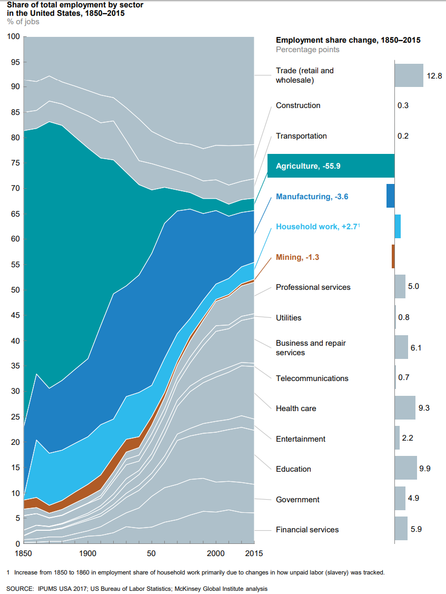{fig-alt="Share of United States employment by sector from 1850 to 2015" .r-stretch}

::: {.notes}
Agriculture’s share of US employment fell by almost 56 percentage points between 1850 and 2015. Employment expanded in services such as health care, education, finance, and professional services.

The figure shows large reallocation across sectors. It does not show that technological change had no costs. Workers, regions, and generations experienced the transition differently.

[Sources]
IPUMS USA; US Bureau of Labor Statistics; McKinsey Global Institute analysis.
:::

## Some Professions Will Be Lost
### Most common job by U.S. state
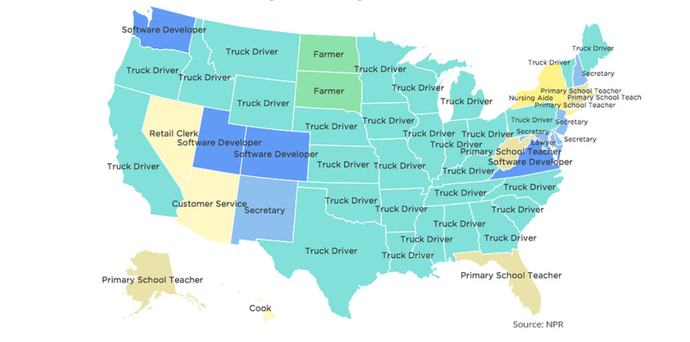{fig-alt="trucking employment" .r-stretch}

## Automation Can Reduce or Increase Labor Demand

:::: {.columns}

::: {.column width="33%"}
### Displacement

Machines perform tasks that people previously performed.
:::

::: {.column width="33%"}
### Productivity

Lower costs can increase output and demand.
:::

::: {.column width="33%"}
### New Tasks (Reinstatement)

Technology creates work that people perform.
:::

::::

::: {.callout-note}
The final employment effect depends on all three forces.
:::

::: {.notes}
Avoid presenting automation as a simple count of tasks lost. A technology can reduce labor needed per unit while increasing the number of units produced. It can also create new tasks in supervision, integration, sales, safety, and service.

[Sources]
Daron Acemoglu and Pascual Restrepo, “Automation and New Tasks,” Journal of Economic Perspectives 33, no. 2, 2019.
David H. Autor, “Why Are There Still So Many Jobs?” Journal of Economic Perspectives 29, no. 3, 2015.
:::

## Aggregate Employment Effects of AI
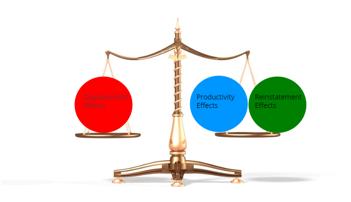{fig-alt="Share of United States employment by sector from 1850 to 2015" .r-stretch}

All else equal, if:

- Displacement $>$ (Productivity + Reinstatment) $\rightarrow$ decreased demand for human labor

- Displacement $<$ (Productivity + Reinstatment) $\rightarrow$ increased demand for human labor

# Measuring Job Exposure to AI Displacement {background-color="#041e42"}

## An Occupation Is a Group of Tasks
- consider the tasks of a **management analyst**
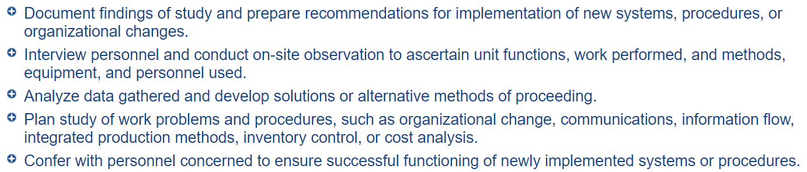{fig-alt="Five tasks performed by management analysts" .r-stretch}

- **Discussion**: which of these tasks is most easily done by AI? Rank from most to least AI automatable?

::: {.callout-important appearance="simple" title="Key takeaway"}
AI may affect some tasks without replacing the occupation.
:::

::: {.notes}
This image lists five tasks for management analysts from O*NET. Some tasks involve writing or analyzing information. Others require interviews, observation, judgment, and organizational knowledge.

An occupation is not one task. The effect on employment depends on which tasks change, how important those tasks are, and whether demand for the occupation changes.

[Sources]
O*NET Online, “Management Analysts,” task listing.
:::

## Exposure Measures Possibility, Not Guaranteed Job Loss

:::: {.columns}

::: {.column width="48%"}
### Exposure Measures

- How much of an occupation includes tasks that AI could help perform
- How strongly those tasks may be affected
:::

::: {.column width="48%"}
### Exposure Does Not Measure

- Whether firms adopt AI
- Whether output and demand increase
- Whether hiring, wages, or hours change
:::

::::

::: {.callout-important}
A highly exposed job may be transformed, expanded, or reduced.
:::

::: {.notes}
Define exposure carefully before showing the ILO results. Exposure is a measure of technological possibility based on tasks. It is not a forecast of how many jobs will disappear.

[Sources]
International Labour Organization, “Generative AI and Jobs: A Refined Global Index of Occupational Exposure,” 2025.
:::

## The ILO Measures Exposure Across an Occupation’s Tasks

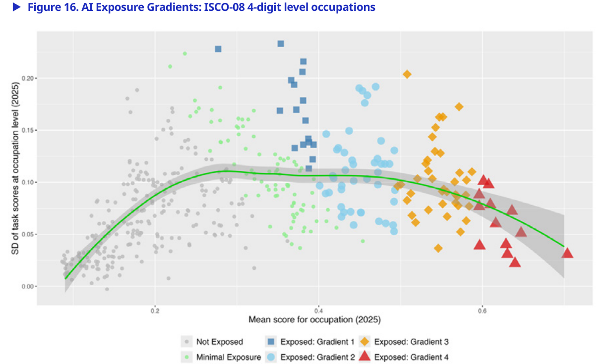{fig-alt="ILO chart classifying occupations into four levels of potential exposure to generative AI" .r-stretch}

::: {.notes}
The ILO evaluates tasks within occupations and places exposed occupations into four gradients. Gradient 1 includes occupations where AI may assist with some tasks. Gradient 4 includes occupations where many tasks have high potential exposure.

The distribution shows that exposure is not simply yes or no. Occupations differ in both average exposure and variation across their tasks.

[Sources]
International Labour Organization, “Generative AI and Jobs: A Refined Global Index of Occupational Exposure,” Working Paper 140, 2025, Figure 16.
:::

## Exposure Is Higher in Wealthier Economies and Among Women

:::: {.columns}

::: {.column width="50%"}
### High Income Economies

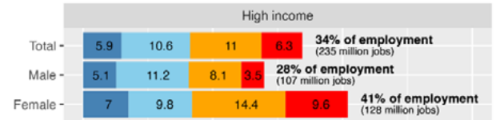{fig-alt="ILO estimates of generative AI exposure in high income economies" width="100%"}

- **34%** of employment has some exposure
- **41%** among women
:::

::: {.column width="50%"}
### Low Income Economies

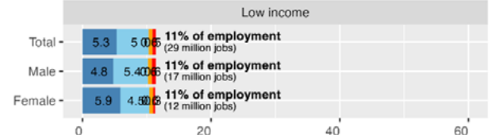{fig-alt="ILO estimates of generative AI exposure in low income economies" width="100%"}

**11%** of employment has some exposure
:::

::::

::: {.callout-note}
The global estimate is 24% of employment.
:::

::: {.notes}
The ILO estimates that about one quarter of global employment has some exposure to generative AI. Exposure is higher in high-income economies because they have more clerical and professional jobs.

Women have higher estimated exposure than men in many regions, especially in high-income economies. This is a distributional concern, but exposure still does not tell us whether employment will rise or fall.

[Sources]
International Labour Organization, “Generative AI and Jobs: A Refined Global Index of Occupational Exposure,” Working Paper 140, 2025, Figure 20.
:::

## A Famous Forecast Put 47% of US Employment at High Risk

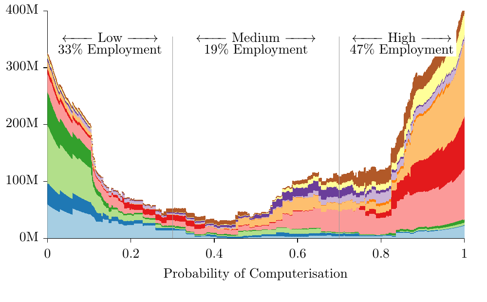{fig-alt="Frey and Osborne chart showing the share of United States employment at low, medium, and high probability of computerisation" .r-stretch}

::: {.notes}
Frey and Osborne estimated that 47 percent of US employment was in occupations with a high probability of computerisation. The paper became one of the most widely cited forecasts about automation.

Ask students what the figure appears to claim before explaining the study design on the next slide.

[Sources]
Carl Benedikt Frey and Michael A. Osborne, “The Future of Employment,” 2013, Figure 3.
:::

## What Did the 47% Estimate Measure?

:::: {.columns}

::: {.column width="48%"}
### The Study Did

- Classify 702 occupations
- Use O*NET task and skill data
- Estimate technical susceptibility to computerisation
:::

::: {.column width="48%"}
### The Study Did Not

- Observe firm adoption
- Forecast the timing of adoption
- Measure later employment losses
:::

::::

::: {.callout-important}
“At risk” did not mean that 47% of jobs would disappear.
:::

::: {.notes}
The researchers asked machine-learning experts to label a small group of occupations and used those labels to estimate probabilities for 702 occupations. They also assumed that engineering barriers could eventually be overcome.

The result was a capability forecast. Economic adoption, regulation, worker adjustment, prices, and demand were outside the model.

[Sources]
Carl Benedikt Frey and Michael A. Osborne, “The Future of Employment,” 2013.
:::

# Observed Employment Effects {background-color="#041e42"}

## Canaries Links Exposure to Payroll Records

:::: {.columns}

::: {.column width="33%"}
::: {.metric}
3.5–5M
:::

::: {.metric-label}
workers observed each month
:::
:::

::: {.column width="33%"}
::: {.metric .secondary}
2021–25
:::

::: {.metric-label}
employment changes over time
:::
:::

::: {.column width="33%"}
::: {.metric .muted}
22–25
:::

::: {.metric-label}
youngest worker group
:::
:::

::::

The study compares age groups and occupations with different levels of AI exposure.

::: {.callout-note}
The July 2026 dashboard update reports that the early-career pattern persists, but it does not claim that AI caused it.
:::

::: {.notes}
The Canaries study uses payroll records from ADP. The data cover millions of workers per month at thousands of firms. The researchers compare employment changes across age groups and across occupations with different AI exposure.

The design is much closer to observed labor-market outcomes than an exposure forecast. However, occupational exposure is still a proxy for actual AI use.

[Sources]
Erik Brynjolfsson, Bharat Chandar, and Ruyu Chen, “Canaries in the Coal Mine? Six Facts about the Recent Employment Effects of Artificial Intelligence,” November 2025.
Stanford Digital Economy Lab, “Canaries Dashboard,” updated July 22, 2026.
:::

## Young Workers Showed the Largest Declines in Two Exposed Occupations

:::: {.columns}

::: {.column width="50%"}
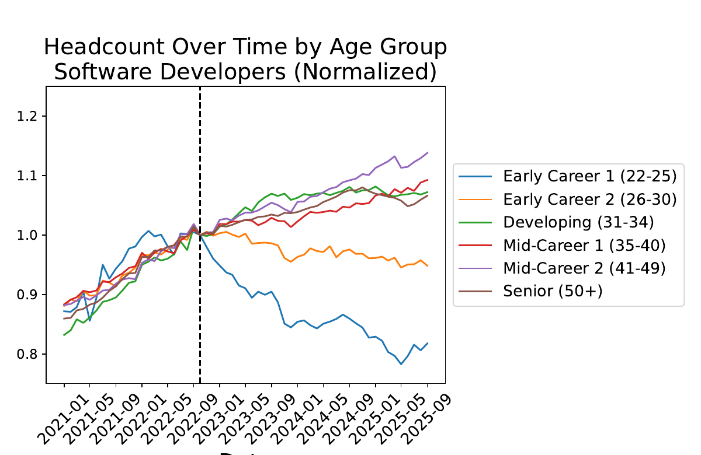{fig-alt="Employment trends by age for software developers" width="100%"}
:::

::: {.column width="50%"}
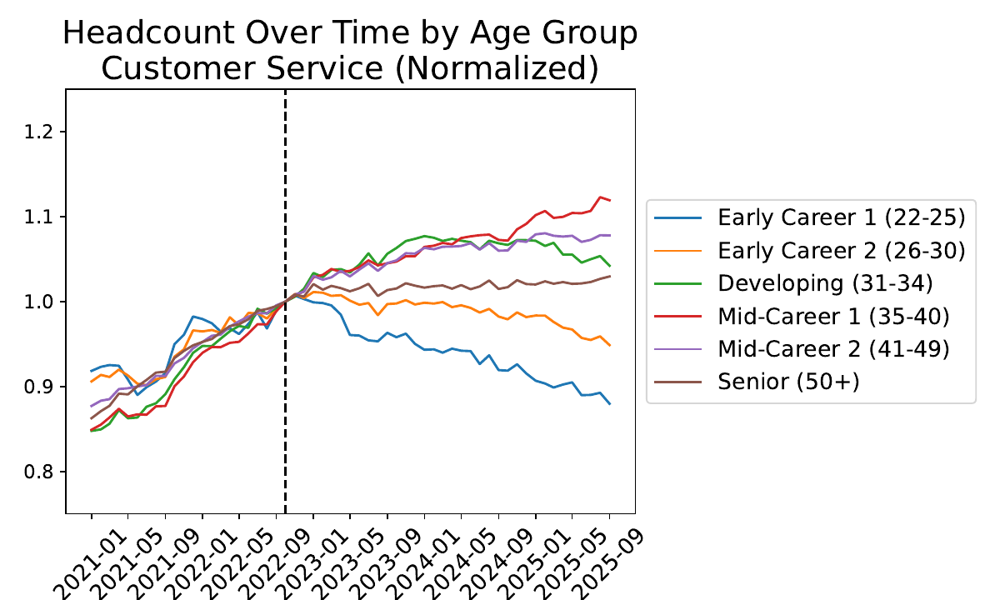{fig-alt="Employment trends by age for customer service workers" width="100%"}
:::

::::

::: {.notes}
Employment for workers ages 22 to 25 fell sharply relative to older workers among software developers and customer-service representatives. The vertical line marks the period around the public release of ChatGPT.

These are striking descriptive patterns. They do not yet tell us whether AI caused the declines.

[Sources]
Brynjolfsson, Chandar, and Chen, “Canaries in the Coal Mine?” November 2025, Figure 1.
:::

## The Exposure Pattern Is Strongest for Workers Ages 22 to 25

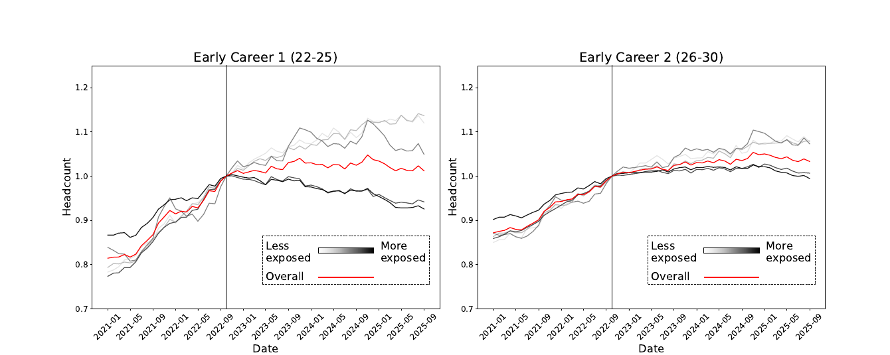{fig-alt="Employment trends by AI exposure for workers ages 22 to 25 and ages 26 to 30" .r-stretch}

::: {.notes}
Within the youngest group, employment declined more in occupations with greater AI exposure. The pattern is weaker for workers ages 26 to 30 and is not visible in the same way for older workers.

The study’s preferred models report a sizable relative decline for young workers in highly exposed occupations after controlling for firm-level changes.

[Sources]
Brynjolfsson, Chandar, and Chen, “Canaries in the Coal Mine?” November 2025, Figure 2.
:::

<!-- ## Automation and Assistance Show Different Patterns -->

<!-- :::: {.columns} -->

<!-- ::: {.column width="50%"} -->
<!-- 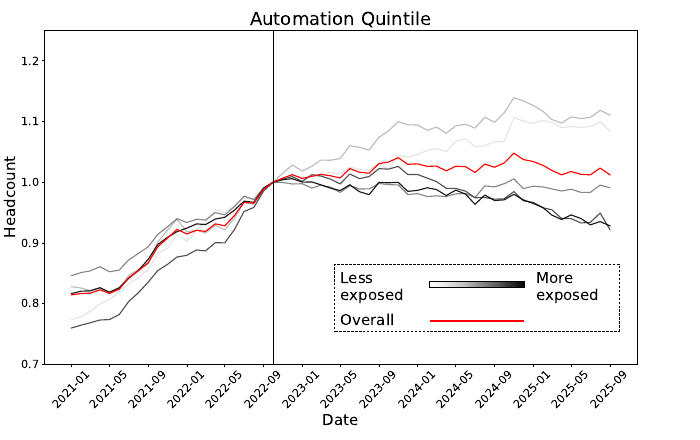{fig-alt="Employment trends in occupations where AI is used for automation" width="100%"} -->
<!-- ::: -->

<!-- ::: {.column width="50%"} -->
<!-- 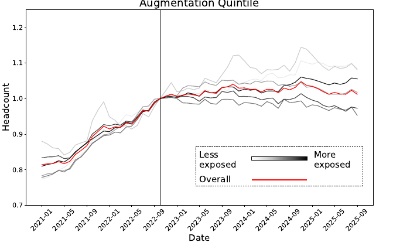{fig-alt="Employment trends in occupations where AI is used to assist workers" width="100%"} -->
<!-- ::: -->

<!-- :::: -->

<!-- ::: {.notes} -->
<!-- The authors separate occupations where generative AI is more likely to automate tasks from occupations where it is more likely to assist workers. Employment declines are concentrated in the automation group. -->

<!-- This distinction supports an AI interpretation because it connects the type of use to the employment pattern. It still relies on occupation-level classifications rather than direct observation of each firm’s AI use. -->

<!-- [Sources] -->
<!-- Brynjolfsson, Chandar, and Chen, “Canaries in the Coal Mine?” November 2025, Figure 3. -->
<!-- ::: -->

# Activity: AI and Entry-Level Hiring {background-color="#041e42"}

## From Evidence to Decision

In your team:

1. Decide the strongest claim the current evidence supports.
2. Recommend whether the company should **cut graduate hiring**, **maintain current hiring**, or **run a limited pilot**.
3. Choose one person to orally summarize your discussion for **90 seconds**.

Open the **AI and Entry-Level Hiring** PDF under **Activities** on the
[course website](https://sjweymouth.github.io/course-ai-economy-slides/).

**You have 20 minutes.**

## Activity Debrief

- The strongest claim the evidence currently supports.
- The combination of evidence that led your team to that conclusion.
- The main reason not to make a stronger claim.
- What the company should do and what assumption matters most to that recommendation.

::: {.notes}
Press teams to distinguish between occupational exposure and observed AI use. If a team selects “plausible but unproven,” ask what would move the claim into the “supported” category.

Good answers may propose firm-level adoption dates, task-level usage records, comparisons between early and late adopters, or changes within the same firm before and after adoption.
:::

## The Pattern Does Not Prove That AI Was the Cause

:::: {.columns}

::: {.column width="48%"}
### Evidence Consistent with AI

- Declines are concentrated among young workers
- Greater declines appear in more exposed occupations
- Automation differs from assistance
:::

::: {.column width="48%"}
### Other Possible Causes

- Technology-sector downturn
- Higher interest rates
- Hiring freezes and cohort aging
- Outsourcing or remote work
:::

::::

::: {.callout-important}
The main problem is measuring actual AI adoption.
:::

::: {.notes}
Explain the difference between a pattern that is consistent with a cause and evidence that identifies the cause. The study controls for many factors, but it does not observe exactly when each firm began using AI or how intensively it used it.

[Sources]
Brynjolfsson, Chandar, and Chen, “Canaries in the Coal Mine?” November 2025.
Economic Innovation Group, “Looking for the Ladder,” January 2026.
:::

## Hiring Declined Before ChatGPT

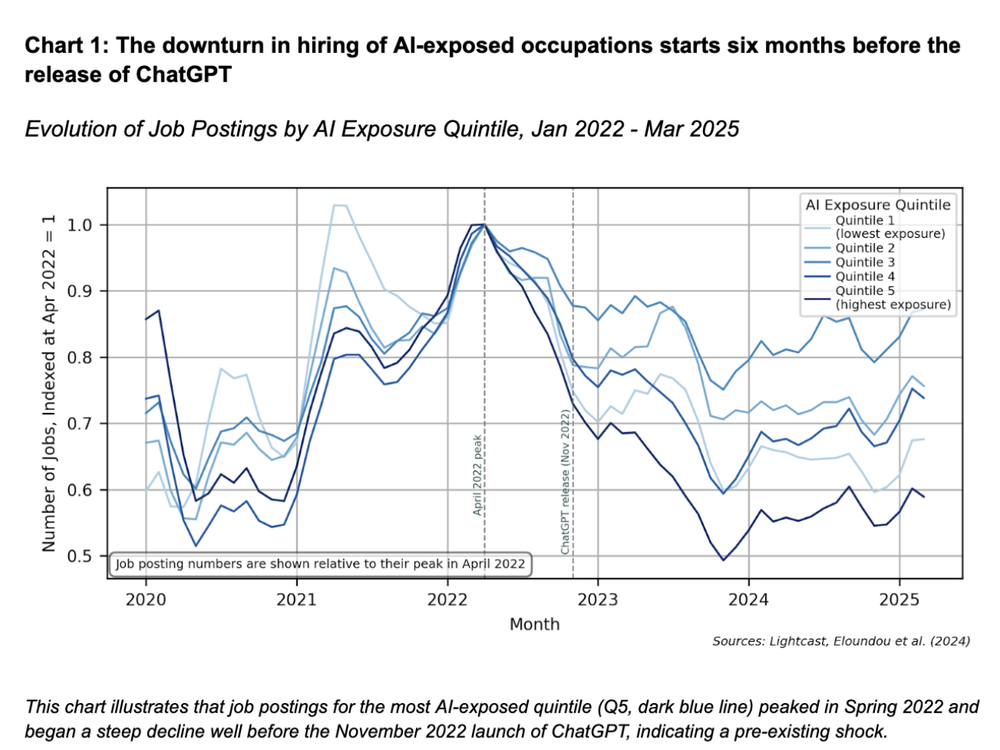{fig-alt="EIG chart showing that job postings in highly exposed occupations peaked before ChatGPT" .r-stretch}

::: {.notes}
EIG argues that job postings in highly exposed occupations began falling in early 2022, before the public release of ChatGPT. This timing fits a broader economic slowdown after interest rates began rising.

Job postings are not the same as employment, and the figure does not disprove a later AI effect. It shows why the starting date matters for causal claims.

[Sources]
Economic Innovation Group, “Looking for the Ladder,” January 2026, Chart 1.
:::

## Junior and Senior Job Postings Declined Together

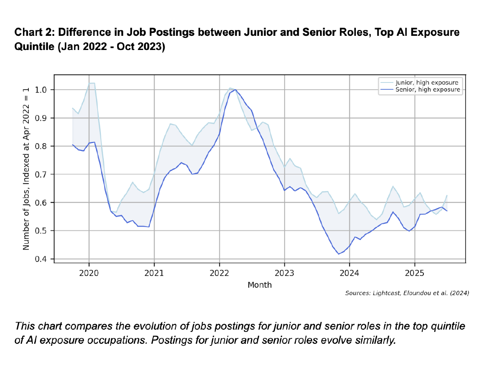{fig-alt="EIG chart comparing junior and senior job postings in highly AI-exposed occupations" .r-stretch}

::: {.notes}
EIG finds that junior and senior postings in highly exposed occupations move similarly. This challenges a simple story in which AI uniquely removed entry-level opportunities.

The chart also demonstrates why evidence sources matter. Job postings measure employer demand for new hires, while payroll records measure current employment.

[Sources]
Economic Innovation Group, “Looking for the Ladder,” January 2026, Chart 2.
:::

## The Stanford Reply

:::: {.columns}

::: {.column width="48%"}
### EIG’s Argument

- The decline begins in 2022
- Higher interest rates fit the timing
- Junior and senior postings move together
:::

::: {.column width="48%"}
### Stanford’s Reply

- Interest-rate exposure does not match AI exposure
- Payroll patterns remain after firm controls
- The controlled decline becomes significant in 2024
:::

:::

::: {.notes}
The Stanford authors agree that raw employment for young workers began weakening earlier. Their controlled results become statistically significant in 2024. They argue that exposure to interest rates does not explain why the decline is concentrated in occupations with high AI exposure.

The disagreement is productive: EIG emphasizes macroeconomic timing and job postings; Stanford emphasizes within-firm payroll comparisons and exposure patterns.

[Sources]
Brynjolfsson, Chandar, and Chen, “Canaries, Interest Rates, and Timing,” Stanford Digital Economy Lab, February 2026.
Economic Innovation Group, “Looking for the Ladder,” January 2026.
:::

## The Studies Observe Different Parts of the Chain

| Study | Observes directly | Main limit |
|---|---|---|
| **ILO** | Tasks and occupational exposure | No adoption or employment outcomes |
| **Canaries** | US payroll employment and exposure | Actual AI use is not observed |
| **EIG** | US job postings and economic timing | Postings are not employment |

::: {.notes}
Ask students which study is best for each question. The ILO is strongest for global exposure. Canaries is strongest for age-specific employment patterns in US payroll data. EIG is useful for timing and alternative explanations. The Danish study directly measures use and links it to administrative outcomes.

No single study answers the entire causal chain.

[Sources]
ILO, “Generative AI and Jobs,” 2025.
Brynjolfsson, Chandar, and Chen, “Canaries in the Coal Mine?” 2025.
Economic Innovation Group, “Looking for the Ladder,” 2026.
Humlum and Vestergaard, “Large Language Models, Small Labor Market Effects,” 2026.
:::

## What the Evidence Supports Today

:::: {.columns}

::: {.column width="48%"}
### Supported

- Job exposure to AI is widespread
- Some highly exposed US occupations show weaker early-career employment
- AI is already changing tasks and work practices
:::

::: {.column width="48%"}
### Not Yet Established

- The size of economy-wide job losses
- AI as the sole cause of recent hiring declines
- Long-run effects on wages and inequality
:::

::::

::: {.notes}
This is the best current conclusion from the assigned readings. It leaves room for the evidence to change. The goal is not to end with “we know nothing,” but to separate the claims supported by current evidence from claims that remain uncertain.

[Sources]
Synthesis of the assigned Day 3 readings.
:::

<!-- ## Guest Discussion -->

<!-- :::: {.columns} -->

<!-- ::: {.column width="38%"} -->
<!-- ### Larissa Zutter -->

<!-- AI Growth and Success Manager\ -->
<!-- Peak Privacy -->

<!-- Board Member\ -->
<!-- Center for AI and Digital Policy -->
<!-- ::: -->

<!-- ::: {.column width="58%"} -->
<!-- ### Some Possible Questions for Discussion -->

<!-- - How is AI changing early-career work? -->
<!-- - Which skills are becoming more valuable? -->
<!-- - Who is responsible when AI-supported work causes harm? -->
<!-- ::: -->

<!-- :::: -->

<!-- ::: {.notes} -->
<!-- Introduce Larissa Zutter and connect the discussion to the day’s evidence. Invite students to ask about the practical difference between AI capability and adoption, how privacy and governance affect workplace use, and what early-career workers can do to build complementary skills. -->
<!-- ::: -->

## Day 3 Takeaways

1. Occupations are groups of tasks.
2. Exposure is not the same as adoption or job loss.
3. Recent US evidence shows concerning early-career patterns, but causality remains disputed.
4. Work can change before wages, hours, or total employment.

::: {.notes}
Return to the evidence chain from the beginning. The strongest conclusion is that AI is already changing tasks and may be affecting entry-level employment in some exposed occupations. The size, causes, and long-run distributional effects remain uncertain.
:::
