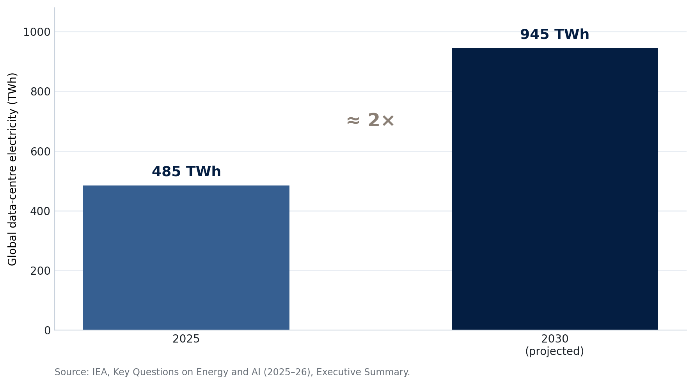
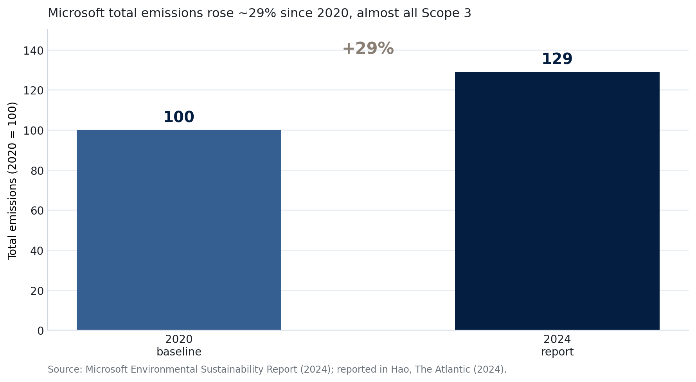

## Today's Questions {.center}

:::: {.columns}

::: {.column width="33%"}
::: {.metric}
1
:::

::: {.metric-label}
How much energy does AI use?
:::
:::

::: {.column width="33%"}
::: {.metric .secondary}
2
:::

::: {.metric-label}
Do corporate climate promises hold up?
:::
:::

::: {.column width="33%"}
::: {.metric .muted}
3
:::

::: {.metric-label}
Who pays the environmental costs?
:::
:::

::::

::: {.notes}
Set up the day in one line: we move from the global energy picture, to one company's promises, to a single town making a real decision.

[Sources]
IEA, Key Questions on Energy and AI, 2025–26; Karen Hao, "Microsoft's Hypocrisy on AI," The Atlantic, 2024.
:::

## AI Consumes Energy. Can It Save More Than It Uses? {.center .question-slide}

::: {.notes}
Open with the tension that organizes the day. AI infrastructure has a direct environmental footprint. AI applications may also reduce energy use and emissions elsewhere. We cannot answer the question by looking at only one side, and we should not assume that potential benefits will automatically materialize.

[Sources]
IEA, Key Questions on Energy and AI, Executive Summary, 2026; course materials, Day 3–4, 2025.
:::

# AI's Energy Demand {background-color="#041e42"}

## Inside a Data center {.photo-title background-image="../../assets/data_hall.jpg" background-size="cover" background-position="center"}

::: {.photo-caption}
Rows of servers run and are cooled around the clock.
:::

::: {.notes}
Use this to make "a data center" concrete before the numbers. Each rack holds many servers that run continuously and must be cooled continuously. Ask students what they think uses more power: training a model once, or running it for millions of users every day. (Increasingly, it is the running.)

[Sources]
Photograph from the course image library (instructor-provided). Confirm final credit before publishing.
:::

## Power to Train AI Is Rising Fast {.visual-stage}

{fig-alt="Total power draw required to train frontier AI models from 2011 to 2025, rising on a log scale from hundreds of watts to over 100 million watts" .r-stretch}

::: {.notes}
Each dot is a frontier model. The vertical axis is the power needed to train it, on a log scale. Training power has risen by orders of magnitude, from hundreds of watts to over 100 million watts for the largest recent models.

Clarify: this is training power, not the total electricity a data center uses. It shows the direction of travel, not the full footprint.

[Sources]
Epoch AI, 2026; chart from the 2026 AI Index Report (Stanford HAI).
:::

## Data-center Electricity Roughly Doubles by 2030 {.visual-stage}

{fig-alt="Bar chart showing global data-center electricity rising from about 485 terawatt-hours in 2025 to about 945 terawatt-hours in 2030" .r-stretch}

::: {.notes}
The IEA projects global data-center electricity roughly doubling by 2030, to about 3 percent of world electricity. AI is the main driver of the increase.

Qualification: 3 percent of world demand is large but not the whole story. The strain is concentrated in specific places and on specific grids, which is what the activity is about.

This is a chart I built from the IEA's numbers because I could not extract the published figure directly. It can be swapped for the IEA's own figure.

[Sources]
IEA, Key Questions on Energy and AI, Executive Summary, 2025–26.
:::

## One Rack Can Use as Much Power as 65 Homes

:::: {.columns}

::: {.column width="33%"}
::: {.metric}
65
:::

::: {.metric-label}
homes' worth of power in one 2027 server rack
:::
:::

::: {.column width="33%"}
::: {.metric .secondary}
11×
:::

::: {.metric-label}
rise in rack power density, 2020 to 2025
:::
:::

::: {.column width="33%"}
::: {.metric .muted}
&gt;50%
:::

::: {.metric-label}
change in a rack's load within one second
:::
:::

::::

::: {.notes}
Concrete image: by 2027 a single rack, about the size of a refrigerator, can draw the power of dozens of homes, and its load can swing by more than half in a second. Grids were not built for demand this concentrated and this variable.

[Sources]
IEA, Key Questions on Energy and AI, Executive Summary, 2025–26.
:::

## How Much Carbon Does a ChatGPT Session Emit?

```{=html}
<div class="session-calculator" id="session-calculator">
  <div class="calculator-controls">
    <div class="calculator-intro">Try a <strong>10-message text session</strong>, then change the assumptions.</div>
    <label for="session-messages">Messages in the session <output id="session-messages-value">10</output></label>
    <input id="session-messages" type="range" min="1" max="50" step="1" value="10">
    <label for="session-grid">Grid carbon intensity <output id="session-grid-value">385 g CO₂/kWh</output></label>
    <input id="session-grid" type="range" min="25" max="900" step="1" value="385">
    <div class="grid-reference-scale" aria-label="Annual national reference values">
      <span class="grid-reference grid-reference-switzerland">Switzerland ≈ 40</span>
      <span class="grid-reference grid-reference-us">U.S. ≈ 385</span>
    </div>
    <div class="calculator-formula">
      messages × <strong>0.3 Wh</strong> per text query × grid intensity ÷ 1,000
    </div>
  </div>
  <div class="calculator-result" aria-live="polite">
    <div class="calculator-result-label">Estimated session emissions</div>
    <div><span id="session-carbon">1.2</span> <span class="calculator-unit">g CO₂</span></div>
    <div class="calculator-comparison">
      A fixed U.S. benchmark: one average home's annual electricity emits <strong>≈ 4.0 t CO₂</strong>.<br>
      That equals about <strong id="session-home-equivalent">3.5 million</strong> sessions at the selected grid intensity.
    </div>
  </div>
</div>

<div class="calculator-takeaway">One text session is small. At global scale—and for long inputs or reasoning—the total can become large.</div>

<script>
(() => {
  const messages = document.getElementById('session-messages');
  const grid = document.getElementById('session-grid');
  if (!messages || !grid) return;
  const update = () => {
    const messageCount = Number(messages.value);
    const gridIntensity = Number(grid.value);
    const sessionKWh = messageCount * 0.3 / 1000;
    const carbonGrams = sessionKWh * gridIntensity;
    const fixedHomeCarbonGrams = 10500 * 385;
    const equivalentSessions = fixedHomeCarbonGrams / carbonGrams;
    document.getElementById('session-messages-value').textContent = messageCount.toLocaleString();
    document.getElementById('session-grid-value').textContent = `${gridIntensity.toLocaleString()} g CO₂/kWh`;
    document.getElementById('session-carbon').textContent = carbonGrams < 10 ? carbonGrams.toFixed(1) : Math.round(carbonGrams).toLocaleString();
    const millions = equivalentSessions / 1000000;
    document.getElementById('session-home-equivalent').textContent = millions >= 1
      ? `${millions.toFixed(1)} million`
      : Math.round(equivalentSessions).toLocaleString();
  };
  messages.addEventListener('input', update);
  grid.addEventListener('input', update);
  update();
})();
</script>
```

::: {.notes}
Ask students how many messages were in their most recent ChatGPT conversation, then move the first slider. The default is an illustrative 10-message session, not a published average: OpenAI does not publish a universal session length.

The calculation is:

10 messages × 0.3 Wh per typical text query = 3 Wh = 0.003 kWh.

0.003 kWh × 385 g CO₂/kWh = about 1.2 g CO₂.

The household benchmark is now fixed rather than moving with the slider. It uses 10,500 kWh per year and a U.S. annual grid intensity of about 385 g CO₂/kWh, producing roughly 4.0 metric tonnes of CO₂. At the default setting, that equals about 3.5 million ten-message sessions. On a cleaner grid, session emissions fall and more sessions are required to reach the fixed benchmark; on a dirtier grid, fewer are required. This comparison covers electricity-related emissions only; household heating, transport, food, and other emissions are excluded.

The country labels are rounded 2025 annual national averages from Ember's Yearly Electricity Data, processed by Our World in Data: Switzerland 39.2 g CO₂/kWh and the United States 384.4 g CO₂/kWh. They are reference points, not claims about the electricity serving a particular data center. Carbon intensity varies within countries and across hours, and accounting methods can differ.

Stress the uncertainty. The 0.3 Wh figure is a modeled estimate for a typical GPT-4o text query, not a direct OpenAI measurement. Epoch AI estimates that a query with a 10,000-token input could use about 2.5 Wh and a 100,000-token input almost 40 Wh. Reasoning, image, video, voice, tool use, and upstream training or hardware emissions are not included here.

The teaching point is not that individual use is irrelevant. It is that the marginal footprint of a short text exchange is small, while aggregate demand depends on billions of queries, heavier tasks, and the carbon intensity of the electricity supply.

[Sources]
OpenAI Academy, "Environmental Impact of AI," updated June 2026; Epoch AI, "How Much Energy Does ChatGPT Use?" February 2025; U.S. Energy Information Administration, "Electricity Use in Homes," 2023; Our World in Data, "Lifecycle Carbon Intensity of Electricity," based on Ember Yearly Electricity Data, 2026; IEA, Key Questions on Energy and AI, Executive Summary, 2026.
:::

## The Bottleneck Is Now the Power Grid {.photo-title background-image="../../assets/electrical_substation.jpg" background-size="cover" background-position="center"}

::: {.photo-caption}
New data centers wait years to connect to substations like this one.
:::

::: {.notes}
Money is not the binding constraint; the grid is. Connection queues are long. Some developers respond by building their own gas generation to start faster, which pushes emissions and costs onto the local area. This is exactly the tension the town-hall activity puts on the table.

[Sources]
IEA, Key Questions on Energy and AI, Executive Summary, 2025–26. Photograph from the course image library (instructor-provided).
:::

## Connecting to the Grid Is Slow and Costly

:::: {.columns}

::: {.column width="33%"}
::: {.metric}
4–6 yrs
:::

::: {.metric-label}
to connect a large new load to the grid
:::
:::

::: {.column width="33%"}
::: {.metric .secondary}
+70%
:::

::: {.metric-label}
rise in gas-turbine orders in 2025
:::
:::

::: {.column width="33%"}
::: {.metric .muted}
15–27 GW
:::

::: {.metric-label}
on-site gas at data centers by 2030
:::
:::

::::

::: {.notes}
The numbers behind the previous photo. Long queues and equipment shortages push developers toward on-site gas. That choice is what a town then has to react to.

[Sources]
IEA, Key Questions on Energy and AI, Executive Summary, 2025–26.
:::

## Emissions Rise, but AI Can Also Cut Energy Use

:::: {.columns}

::: {.column width="48%"}
::: {.metric}
350 Mt
:::

::: {.metric-label}
data-center emissions by 2035, about 2% of the power sector
:::
:::

::: {.column width="48%"}
::: {.metric .secondary}
13 EJ
:::

::: {.metric-label}
energy AI could help save by 2035, about 3% of final energy
:::
:::

::::

::: {.notes}
Return to the ledger. Data-center emissions roughly double by 2035. At the same time, AI applied to industry, transport, and grids could save several times the energy data centers use, if those savings are actually realized. The honest conclusion is that the net sign is not settled.

[Sources]
IEA, Key Questions on Energy and AI, Executive Summary, 2025–26.
:::

## AI's Net Environmental Impact Is Not Fixed

:::: {.columns .impact-ledger}

::: {.column width="48%"}
### Direct footprint {.observed-impact}

- Training and inference electricity
- Construction, chips, minerals, water, and land
- Heat, noise, backup generation, pollution, and e-waste
:::

::: {.column width="48%"}
### Potential avoided impacts {.conditional-impact}

- More efficient grids and industrial processes
- Environmental monitoring and mitigation
- Clean-energy and climate innovation
:::

::::

::: {.impact-callout}
Direct costs occur when infrastructure is built and operated. Benefits depend on adoption, additionality, and whether efficiency increases total use.
:::

::: {.impact-factors}
**Net outcome depends on:** scale · power mix · location · application · rebound effects · who pays
:::

::: {.notes}
This is the synthesis slide. The previous slides established the direct footprint and the possible energy savings. Now distinguish certainty and timing: the infrastructure footprint occurs as systems are built and used, while many downstream environmental benefits remain conditional.

Do not treat this as a literal arithmetic equation. Electricity, carbon, water, land, noise, and ecosystem effects have different units and different locations. A credible net assessment requires a defined outcome, place, time period, and counterfactual.

Connect the final factor—who pays—to the next two parts of the day. Microsoft's corporate claims raise the question of whether company-level accounting captures enabled fossil-fuel emissions. The town hall raises the local distributional question: who receives the benefits, and who bears grid, water, noise, and reliability costs?

The earlier T-I-R-W and O-M-S notation is omitted from both the visible slide and the activity handout. The direct-footprint/potential-benefit distinction preserves the idea without adding a second vocabulary for students to decode.

[Sources]
IEA, Key Questions on Energy and AI, Executive Summary, 2026; Karen Hao, "Microsoft's Hypocrisy on AI," The Atlantic, 2024; Day 4 activity, "Town Hall: Siting a 100 MW AI Data Center"; course materials, Day 3–4, 2025.
:::

# Corporate Promises and Local Costs {background-color="#041e42"}

## Microsoft Promised to Be Carbon Negative by 2030

:::: {.columns}

::: {.column width="33%"}
### Carbon negative

Remove more carbon than it emits
:::

::: {.column width="33%"}
### Water positive

Replenish more water than it uses
:::

::: {.column width="33%"}
### Zero waste

Send no waste to landfill
:::

::::

::: {.notes}
Microsoft made one of the most ambitious corporate climate pledges in technology, all by 2030, and promotes AI as a climate tool. Hold this promise next to the emissions data on the next slide.

[Sources]
Karen Hao, "Microsoft's Hypocrisy on AI," The Atlantic, 2024; Microsoft, Environmental Sustainability Report, 2024.
:::

## Microsoft's Emissions Rose About 29% Since 2020 {.visual-stage}

{fig-alt="Bar chart showing Microsoft total emissions rising about 29 percent from a 2020 baseline of 100 to 129 in the 2024 report, almost entirely Scope 3" .r-stretch}

::: {.notes}
Emissions went up, not down. Almost all of the increase is Scope 3: the steel, concrete, and chips used to build data centers. Building the AI infrastructure is why the line bends the wrong way.

Scope 1 is direct emissions, Scope 2 is purchased energy, and Scope 3 is the supply chain. Most of AI's footprint sits in Scope 3, which is easiest to leave out.

Chart built from Microsoft's reported figures; can be replaced with the company's own published chart.

[Sources]
Microsoft, Environmental Sustainability Report, 2024; Karen Hao, "Microsoft's Hypocrisy on AI," The Atlantic, 2024.
:::

## Microsoft Also Sells AI to Oil and Gas Companies

:::: {.columns}

::: {.column width="55%"}
- Sells AI to majors such as ExxonMobil and Chevron
- The tools help find and extract oil and gas
- Internal estimate: a large energy-industry market
:::

::: {.column width="40%"}
::: {.metric}
\$35–75B
:::

::: {.metric-label}
estimated energy-industry market for its AI
:::
:::

::::

::: {.notes}
Here is the tension. The same company that pledges to be carbon negative sells AI that helps produce more oil and gas. The conflict is not only in the emissions math; it is in the customer list.

[Sources]
Karen Hao, "Microsoft's Hypocrisy on AI," The Atlantic, 2024.
:::

## Is This Greenwashing?

:::: {.columns}

::: {.column width="48%"}
### Microsoft's case

- AI makes production more efficient
- Serving all customers funds clean-tech work
:::

::: {.column width="48%"}
### The criticism

- "Less harmful" extraction is unproven
- More efficient extraction can mean more supply
:::

::::

::: {.notes}
Keep this even-handed, in the spirit of the course. Present the company's reasoning, then the criticism. The key question is empirical: does AI-enabled efficiency lower net emissions, or does it lower cost and expand output? Ask students which claims are measured and which are asserted.

[Sources]
Karen Hao, "Microsoft's Hypocrisy on AI," The Atlantic, 2024.
:::

# Activity: A Town Hall on a Data center {background-color="#041e42"}

## A Data center Next to a Neighborhood {.photo-title background-image="../../assets/data_center.png" background-size="cover" background-position="center"}

::: {.photo-caption}
Riverton: a proposed 100 MW data center, next to homes and a lake.
:::

::: {.notes}
This is the scenario in one image: a large data center going up beside a residential area. The project is economically attractive but arrives faster than new power and grid upgrades. The council must choose to approve, approve with conditions, delay, or reject.

[Sources]
Day 4 activity, "Town Hall: A 100 MW AI Data Center." Photograph from the course image library (instructor-provided).
:::

## Today's Activity Is a Public Hearing {.photo-title background-image="../../assets/town_hall.jpg" background-size="cover" background-position="center"}

::: {.photo-caption}
Should Riverton approve the project, and on what conditions?
:::

::: {.notes}
Purpose: give students the experience of a real infrastructure decision with competing interests, and a working model of the simulation they must design themselves. A public hearing is one of the formats available for the final project, and the proposal is due today.

Do not read the handout aloud. Students have the common factsheet and five role cards: the developer; the utility and grid operator; the city council; a neighborhood, ratepayer, and environmental coalition; and a jobs, business, and local-institutions coalition.

Conditions the council can attach include developer-funded grid upgrades, hourly clean-power matching instead of annual, water limits, and public disclosure. These are the same levers from the IEA reading this morning. The council may select no more than three major conditions, forcing it to prioritize.

Timing: 10 minutes to prepare, then 25 minutes for the hearing: four one-minute stakeholder openings; 10 minutes of council questioning and public negotiation; five minutes of private coalition-building; two minutes of revised offers; and four minutes for the council's decision and explanation. The council listens rather than giving an opening statement.

[Sources]
Day 4 activity, "Town Hall: A 100 MW AI Data Center"; course final-project brief. Photograph from the course image library (instructor-provided).
:::

## Riverton Must Make One Decision

:::: {.columns}

::: {.column width="46%"}
### Four possible outcomes

1. **Approve**
2. **Approve with conditions**
3. **Delay**
4. **Reject**
:::

::: {.column width="50%"}
### If approval is conditional

- Choose **no more than three** major conditions
- State **who pays**
- Set a **measurable requirement**
- Name the **monitor and consequence**
:::

::::

::: {.callout-important}
The developer may accept the final package—or withdraw the project.
:::

::: {.notes}
Leave this slide projected during preparation and the hearing. Scarcity is deliberate: without a limit, the council could demand every attractive safeguard and avoid making trade-offs.

The council has final authority. A conditional approval is not complete unless each condition identifies the payer, the performance standard, the monitor, and the consequence for noncompliance. After the council announces its package, the developer must say whether it accepts or withdraws.

[Sources]
Day 4 activity, "Town Hall: A 100 MW AI Data Center"; course final-project brief.
:::

## Debrief

1. Who receives the benefits, and who bears the risks?
2. Which conditions made the project acceptable?
3. What made this work as a simulation?

::: {.notes}
Run two debriefs at once. The first two questions draw out the substance: benefits are concentrated (tax base, a few jobs), while costs are shared (rates, water, reliability). The third question is about design, and feeds directly into the final project: a hard decision, distinct interests, and time pressure are what made it work.

[Sources]
Day 4 activity; course final-project brief.
:::

## What Makes a Good Simulation

:::: {.columns}

::: {.column width="48%"}
- A single, hard decision
- Clear roles with real conflict
- A short, timed structure
:::

::: {.column width="48%"}
- Focus on trade-offs, not ideal outcomes
- Institutions have limits; stakeholders have power
:::

::::

::: {.notes}
Close the loop to the final project. Students just experienced each of these elements. Point them to the proposal due today: what is the decision, and why is it urgent now?

[Sources]
Course final-project brief.
:::

## Day 4 Takeaways

1. AI's energy demand is large, fast-growing, and concentrated on local grids.
2. A short text exchange has a small footprint, but scale, task intensity, and the power mix determine the total.
3. Corporate accounting can hide the footprint, especially Scope 3.
4. The hardest choices are local: power, water, cost, and consent.

::: {.notes}
Return to the ledger and the day's arc: global numbers resolve into concrete local decisions about who pays and who consents.

[Sources]
IEA, Key Questions on Energy and AI, 2025–26; Karen Hao, The Atlantic, 2024.
:::
