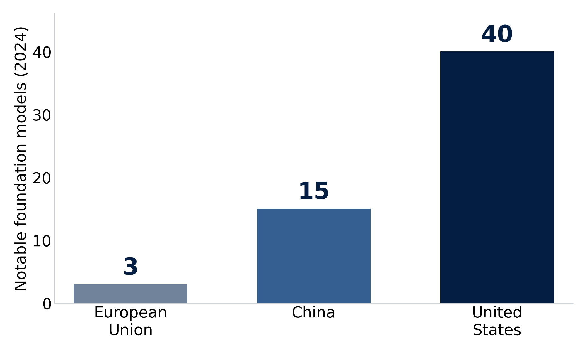
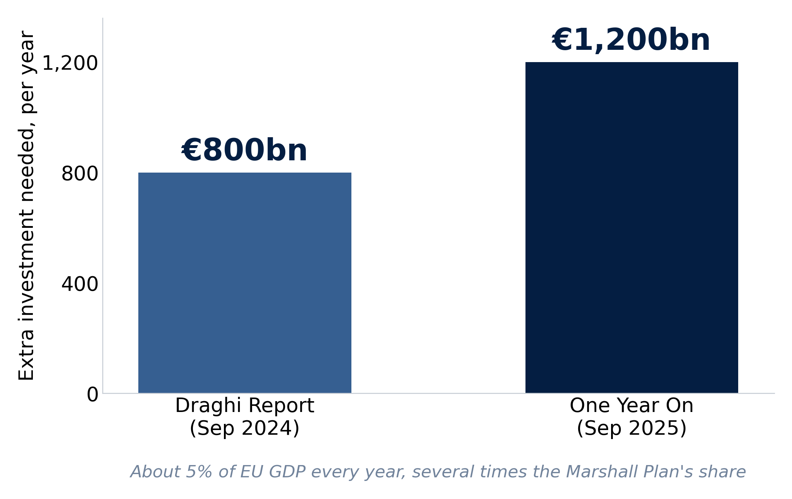
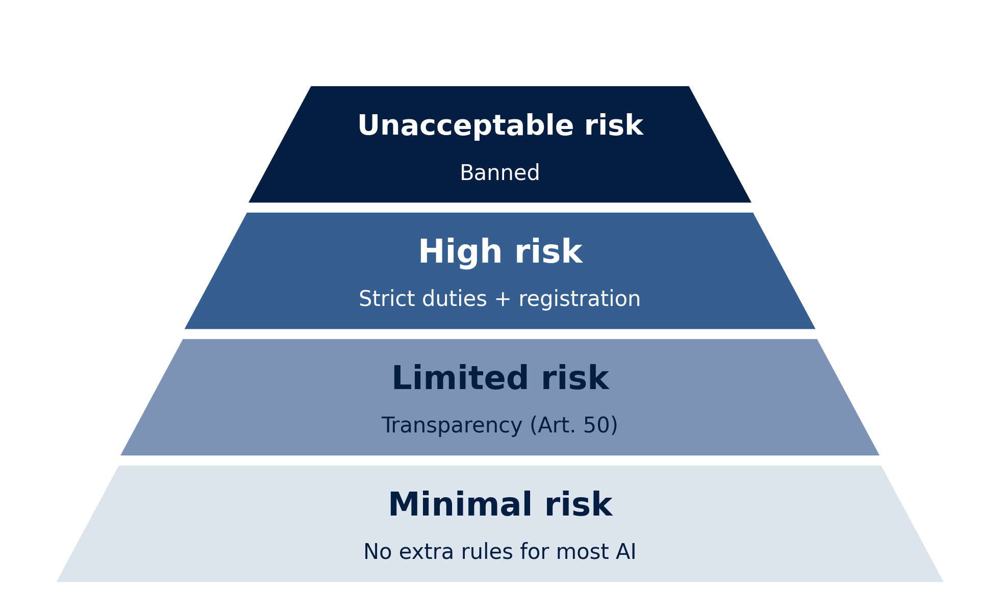
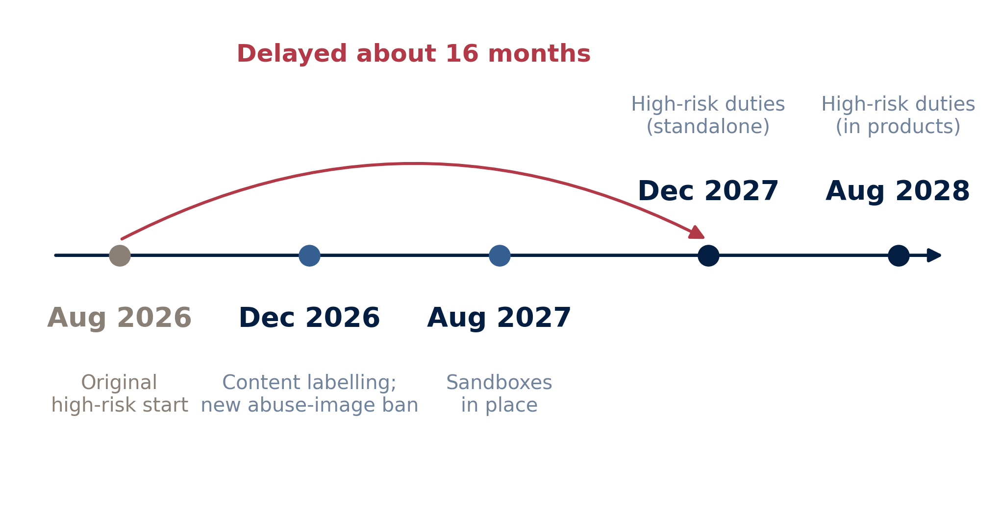

## Today: Quiz, Then Two Questions {.center}

:::: {.columns}

::: {.column width="48%"}
::: {.metric}
1
:::

::: {.metric-label}
Why is Europe falling behind in AI?
:::
:::

::: {.column width="48%"}
::: {.metric .secondary}
2
:::

::: {.metric-label}
How should AI be governed, and who decides?
:::
:::

::::

::: {.callout-note}
We begin with a short quiz covering Days 1 to 4.
:::

::: {.notes}
Frame the day in one line. First we ask why Europe trails the United States and China in AI, using the Draghi Report. Then we turn to regulation: the EU has just paused and simplified its own AI Act, while the US is trying to stop its states from regulating AI at all.

Logistics: the quiz on Days 1 to 4 comes first, then Session A (competitiveness), then Session B (regulation). The day ends with a negotiation simulation.

[Sources]
Course syllabus, Day 5, 2026; Draghi, The Future of European Competitiveness, 2024.
:::

# Can Europe Compete in AI? {background-color="#041e42"}

## Europe Builds Almost No Frontier AI {.visual-stage}

{fig-alt="Bar chart of notable foundation AI models developed in 2024: European Union 3, China 15, United States 40" .r-stretch}

::: {.notes}
Start with the single most striking number. In 2024 the United States produced far more notable foundation models than China, and both were far ahead of the European Union, which built only a handful. About 70 percent of the world's foundational models since 2017 have come from the US.

Ask: why does the place where models are built matter for the place where AI is used? (Talent, computing power, standards, and profits all gather there.)

Chart built from the figures Draghi cites; it can be swapped for the published version.

[Sources]
Mario Draghi, "One Year On," Brussels, 16 Sep 2025; Draghi Report, 2024.
:::

## Three US Firms Control the Cloud

:::: {.columns}

::: {.column width="33%"}
::: {.metric}
&gt;65%
:::

::: {.metric-label}
of the global cloud market held by three US firms
:::
:::

::: {.column width="33%"}
::: {.metric .secondary}
~2%
:::

::: {.metric-label}
share of Europe's own cloud market held by its largest EU provider
:::
:::

::: {.column width="33%"}
::: {.metric .muted}
4 of 50
:::

::: {.metric-label}
of the world's top tech firms are European
:::
:::

::::

::: {.notes}
AI runs on cloud computing, and Europe does not own the cloud. Three large American providers hold most of the global market; Europe's biggest provider has only a small share of its own home market. Without computing power, it is hard to build or grow frontier AI.

Connect back to Day 4: the same data centers that raise energy questions are also the strategic infrastructure Europe lacks.

[Sources]
Draghi Report, 2024, Part B.
:::

## Europe Has No New Big Tech Firms

:::: {.columns}

::: {.column width="33%"}
::: {.metric}
0
:::

::: {.metric-label}
EU firms worth over €100bn built from scratch in the last 50 years
:::
:::

::: {.column width="33%"}
::: {.metric .secondary}
6
:::

::: {.metric-label}
US firms worth over €1 trillion, all created in that time
:::
:::

::: {.column width="33%"}
::: {.metric .muted}
~30%
:::

::: {.metric-label}
of EU "unicorns" moved abroad, mostly to the US
:::
:::

::::

::: {.notes}
This is Draghi's most quoted point, and it is about growing, not inventing. Europe produces good research and promising start-ups, but they do not grow into giants at home, and many leave. (A "unicorn" is a start-up worth more than one billion dollars.) The result is a lasting gap at the technology frontier.

The exact quote: "There is no EU company with a market capitalisation over EUR 100 billion that has been set up from scratch in the last fifty years, while all six US companies with a valuation above EUR 1 trillion have been created in this period." (Draghi Report)

[Sources]
Draghi Report, 2024.
:::

## The Gap Is a Productivity Gap

:::: {.columns}

::: {.column width="48%"}
### What explains the gap

- About **70%** of the income gap between the EU and US is **lower productivity**
- Almost all of it is in **technology industries**; outside tech, Europe keeps pace
:::

::: {.column width="48%"}
### A second problem

- EU **electricity** costs 2 to 3 times US levels
- EU **gas** costs 4 to 5 times US levels
- High energy prices raise costs for industry and data centers
:::

::::

::: {.notes}
Diagnose before prescribing. The gap with the US is not mainly about working fewer hours or a different welfare model. It is about productivity, and the productivity shortfall sits in digital and information technology. On top of that sits a lasting energy-cost disadvantage, which matters directly for AI, because AI uses a lot of power.

[Sources]
Draghi Report, 2024, Part A and Part B.
:::

## Draghi Calls This an Existential Challenge

> "This is an existential challenge."

- In plain terms: Europe's future prosperity is at stake
- Europe is stuck in a **"middle-technology trap"**: strong in older industries, but missing from new ones like AI
- Without change, Draghi warns of a slow decline

::: {.notes}
Give students the framing device. Draghi's language is deliberately strong: this is existential, meaning Europe's basic future is at risk, and standing still means slow decline. The "middle-technology trap" is the core idea. Europe is competitive in yesterday's and today's industries, but missing from the new technologies, especially AI, that will drive tomorrow's growth. His original phrase for the risk of inaction was a "slow agony".

[Sources]
Mario Draghi, The Future of European Competitiveness, 2024.
:::

## Draghi's Three Fixes

:::: {.columns}

::: {.column width="33%"}
### Close the innovation gap

Help firms grow and sell new tech: AI, chips, biotech
:::

::: {.column width="33%"}
### Lower energy costs

Cut high energy prices while building clean-tech industries
:::

::: {.column width="33%"}
### Reduce dependencies

Secure key materials and supply chains; work together on security
:::

::::

::: {.notes}
The report is long, but its action plan has three parts. Keep them concrete. First, close the innovation gap by helping companies grow, not just invent. Second, turn cheaper, cleaner energy into an advantage rather than a cost. Third, depend less on others for critical materials, chips, and defense.

These three parts are what the take-home matrix asks students to turn into an action plan.

[Sources]
Draghi Report, 2024, Part A.
:::

## Europe Needs About 800 Billion Euros a Year {.visual-stage}

{fig-alt="Bar chart: extra annual investment Draghi says Europe needs, about 800 billion euros in the 2024 report rising to about 1,200 billion euros in the 2025 update, roughly 5 percent of EU GDP" .r-stretch}

::: {.notes}
Here is the cost. The 2024 report put Europe's extra investment need at around €800 billion a year, roughly 5 percent of GDP, several times the size of the Marshall Plan. One year later, Draghi raised the figure to nearly €1,200 billion, and said more of it must now come from public money.

The point is not the exact number. It is the scale, and the fact that it grew rather than shrank.

Chart built from the figures Draghi reports.

[Sources]
Draghi Report, 2024; Draghi, "One Year On," 16 Sep 2025.
:::

## One Year Later, Every Challenge Is Worse

> "Sometimes inertia is even presented as respect for the rule of law. That is not governance, it is complacency."

> "To carry on as usual is to resign ourselves to falling behind."

::: {.notes}
Draghi returned to Brussels in September 2025 with a blunt verdict: little was fixed, and every challenge had grown worse. His sharpest line reframes Europe's slowness. What looks like caution or respect for process, he argues, is really complacency, meaning being too comfortable. The investment need had risen, and time was running out.

Keep this fair: Draghi is one voice, and member states would say caution protects rights and stability. That tension is exactly the next slide.

[Sources]
Mario Draghi, remarks in Brussels, 16 Sep 2025.
:::

## The EU Says It Has Acted

:::: {.columns}

::: {.column width="48%"}
### The Commission's case

- **€1 trillion+** committed to competitiveness
- **~€200bn** for AI, including **€20bn** for AI gigafactories
- Says **90%** of its main plan follows Draghi
:::

::: {.column width="48%"}
### Draghi's reply

- The economy is getting weaker, not stronger
- The money needed rose, it did not fall
- Change is still measured in years, not months
:::

::::

::: {.callout-important}
Two very different views in the same year. Who is right, and how would you know?
:::

::: {.notes}
Set up a real debate rather than a settled answer. The Commission points to its Competitiveness Compass, a Savings and Investments Union, AI gigafactories, and over a trillion euros committed. Draghi says the basics still got worse. Both can be partly true: money announced is not money spent, and plans launched are not results delivered.

Discussion prompt: what evidence would tell us whether Europe is actually closing the gap? (Private investment, start-ups that stay, computing power built, productivity growth.) This leads straight into the discussion.

[Sources]
European Commission, "The Draghi Report: One Year On," 2025; Draghi, 16 Sep 2025.
:::

## Discussion: Does the EU's Response Fit the Problem?

:::: {.columns}

::: {.column width="46%"}
### Seven constraints

capital · compute · energy · market size · talent · commercialization · regulation
:::

::: {.column width="50%"}
### Ten minutes, together

- Which one or two matter **most**?
- Is the EU's money aimed there, or somewhere else?
- If you could fund only **three** fixes, which three?
:::

::::

::: {.callout-note}
A quick class version of the take-home worksheet.
:::

::: {.notes}
Run this as a ten-minute full-class discussion, not a team activity. It is a short version of the take-home worksheet, "Can Europe Close the AI Competitiveness Gap?", which students complete on their own.

Steps: put the seven constraints on the board. Ask which one or two matter most, the ones that, if left unfixed, make the others not matter (computing power and capital are strong candidates). Then hold the answer against the previous slide: is the €200bn for AI and the gigafactory money actually aimed at the most important problem, or spread too thin? Close with the forcing question: with a fixed budget, name only three fixes. Choosing three is the whole point.

Keep it moving; this sets up the afternoon, where students stop describing the problem and start deciding.

[Sources]
Day 5A activity (take-home), "Can Europe Close the AI Competitiveness Gap?"; European Commission, "The Draghi Report: One Year On," 2025.
:::

# How Should AI Be Governed? {background-color="#041e42"}

## Europe's Answer Is a Rulebook

- Broad, **binding** rules: the **AI Act**, **GDPR**, the **Digital Services Act**
- A **cautious** approach: control risks before harm happens
- Rules based on **how risky** the AI is
- Puts **basic rights** first: privacy, fairness, safety
- One central body enforces it: the new **EU AI Office**

::: {.notes}
This is the baseline the rest of the day changes. Europe's instinct is to write one broad, binding rulebook and enforce it from the center, putting rights and safety first, and acting before harm happens. This is the model students met earlier in the course, and it is the model both the Omnibus and the US are now reacting against.

[Sources]
EU AI Act Explorer, artificialintelligenceact.eu; course materials, Day 5 (2025).
:::

## The AI Act Sorts AI by Risk {.visual-stage}

{fig-alt="Pyramid of the EU AI Act's four risk levels: unacceptable risk is banned, high risk carries strict duties and registration, limited risk requires transparency under Article 50, and minimal risk has no extra rules" .r-stretch}

::: {.notes}
The heart of the AI Act is this pyramid. A few uses are banned outright, such as social scoring and untargeted face scraping. High-risk uses, like hiring or credit scoring, carry strict duties: risk checks, human oversight, documentation, and registration. Limited-risk systems such as chatbots must simply tell people they are AI. Everything else is mostly free.

Most of the rules fall on the narrow top of the pyramid, not on ordinary software.

[Sources]
EU AI Act Explorer, high-level summary, artificialintelligenceact.eu.
:::

## Breaking the Rules Is Expensive

:::: {.columns}

::: {.column width="48%"}
::: {.metric}
€35M / 7%
:::

::: {.metric-label}
top fine for banned uses: €35m, or 7% of a firm's global sales, whichever is higher
:::
:::

::: {.column width="48%"}
::: {.metric .secondary}
€15M / 3%
:::

::: {.metric-label}
fine for most other breaches: €15m, or 3% of global sales
:::
:::

::::

::: {.notes}
The rules have real force. Fines rise with global sales, like GDPR, so they reach the largest firms. This is why the AI Act has a "Brussels effect": global companies often follow the rules everywhere rather than build a separate EU version. For start-ups and small firms, the lower fine applies.

[Sources]
EU AI Act, Article 99; AI Act Explorer.
:::

## Then the EU Slowed Its Own Rules

- **29 June 2026:** the Council approves the **Digital Omnibus** on AI
- Presented as **simplification** and **competitiveness**, citing Draghi
- **Delays** the hardest high-risk duties by one to two years
- **Reduces** paperwork and reporting, especially for small firms
- The risk-based core stays; the timeline and paperwork shrink

::: {.notes}
Here is the turning point of the day. Having built the world's most complete AI law, the EU chose to slow it down before the toughest parts took effect. The stated reason comes straight from Draghi: cut paperwork and reporting so European firms can compete. The Act is not cancelled; it is delayed and made lighter.

Ask students to hold this next to the morning session: is this the Draghi medicine being applied to Europe's own rulebook?

[Sources]
Council of the EU, press release, 29 Jun 2026.
:::

## The Rules Now Start Later {.visual-stage}

{fig-alt="Timeline showing the EU AI Act high-risk obligations moved from August 2026 to December 2027 for standalone systems and August 2028 for systems built into products, with content labelling and a new abuse-image ban due December 2026 and sandboxes by August 2027" .r-stretch}

::: {.notes}
Make the delay concrete. The high-risk duties that were due in August 2026 now start in December 2027 for standalone systems, and August 2028 for AI built into regulated products like medical devices and machinery. That is about a sixteen-month delay for the core duties. Testing spaces and content-labelling rules also move.

The direction is clear: less to follow, and later.

[Sources]
Council of the EU, 29 Jun 2026; Freshfields and Gibson Dunn analyses, 2026.
:::

## Simpler Rules, or Weaker Rules?

:::: {.columns}

::: {.column width="48%"}
### The Commission's view

- Cuts duplication and paperwork
- Gives firms clearer, steadier rules
- Helps small and growing firms
:::

::: {.column width="48%"}
### The critics' view

- "Delays safeguards before they can take effect"
- "Weakens transparency obligations, and creates loopholes"
- Rushed through without full review
:::

::::

::: {.notes}
Keep this even-handed, in the spirit of the course. The Commission calls it simplification that gives certainty and helps small firms. Critics from civil society, like Diego Naranjo of Liberties, call it deregulation dressed up as simplification, arguing it delays protections before they ever work and thins out transparency duties.

His line: "We deserve digital rules protecting our rights to be enforced, not dismantled." (Diego Naranjo, Liberties)

The honest framing: "simpler" and "weaker" can describe the same change. Which one it is depends on the detail, and on what you value.

[Sources]
Diego Naranjo, "The AI Omnibus," Liberties, 17 Jun 2026; Council of the EU, 29 Jun 2026.
:::

## The EU Also Added a New Ban

- The Omnibus is **not** only about cutting rules
- It **adds** a ban on AI that makes child sexual abuse images, or fake nude images of real people without their consent
- Protections required by **December 2026**

::: {.notes}
A useful complication for students who want a simple "the EU is deregulating" story. Even while cutting some burdens, the same law adds a new, strict ban on some of the most harmful AI uses. Cutting some rules and adding others can happen together. Regulation is a dial with many settings, not a single on-off switch.

[Sources]
Council of the EU, press release, 29 Jun 2026.
:::

## The United States Goes the Other Way

> "State-by-State regulation … creates a patchwork of 50 different regulatory regimes."

- **Executive Order 14365** (11 Dec 2025): a national plan to override state AI laws
- The goal: US **"global AI dominance"** with very few rules

::: {.notes}
Now the contrast. Where Europe keeps a central rulebook but softens it, the US has no single federal AI law, and the current administration wants to stop its own states from filling the gap. It calls the state rules a "patchwork"; its answer is to override them from the federal level, in the name of winning the AI race.

The exact quote: "It is the policy of the United States to sustain and enhance the United States' global AI dominance through a minimally burdensome national policy framework for AI." (Executive Order 14365)

[Sources]
Executive Order 14365, "Ensuring a National Policy Framework for Artificial Intelligence," 11 Dec 2025.
:::

## How the US Fights State Laws

:::: {.columns}

::: {.column width="48%"}
### The Executive Order's tools

- A legal task force to **sue states**
- Threatens to cut **federal internet funding** to states that do not follow
- Tells federal agencies (FTC, FCC) to **override** state rules
:::

::: {.column width="48%"}
### The proposed law (Mar 2026)

- Asks **Congress** to make the override permanent
- **Light rules:** no new AI agency; use existing ones
- Says training AI on data is **allowed**; leaves hard cases to courts
:::

::::

::: {.notes}
Two moves, one direction. The executive order uses tools the president already controls: lawsuits against state laws, the threat of cutting federal internet money, and federal agencies overriding state rules. The March 2026 National AI Legislative Framework then asks Congress to make the override permanent, with deliberately light federal rules and existing agencies rather than a new one.

Note the exceptions on both sides: even this framework keeps state power over child safety and fraud.

[Sources]
Executive Order 14365, 11 Dec 2025; White House, National AI Legislative Framework, 20 Mar 2026.
:::

## The EU and the US Choose Opposite Paths

:::: {.columns}

::: {.column width="48%"}
### European Union

- Keeps a central rulebook, then **simplifies** it
- Still controls AI directly, protects rights first
- "Simplify to compete"
:::

::: {.column width="48%"}
### United States

- **Overrides** state rules; one light national standard
- Regulates AI as little as possible
- "Deregulate to dominate"
:::

::::

::: {.callout-important}
Both sides give the same reason: competitiveness.
:::

::: {.notes}
Pull the two halves of the day together. A year ago the contrast was "the EU regulates, the US has a patchwork." Now both are moving, and both point to competitiveness. But they move in opposite directions: the EU loosens a broad system it already built, while the US tries to stop anyone from building one. The deep question for the simulation: whose bet on competitiveness is more likely to pay off, and at what cost to rights?

[Sources]
Course synthesis; Draghi Report, 2024; Council of the EU, 2026; Executive Order 14365, 2025.
:::

## Simulation: Implementing the Omnibus {background-color="#041e42"}

### The law is adopted. The dates are fixed.

Now the Competitiveness Council must agree how it is enforced.

**A necessary fix, or a step backward?**

::: {.notes}
Motivate the main event of the day. The Omnibus has passed and its deadlines are set. The fight now moves from what the law says to how it is actually applied. A special EU Competitiveness Council, chaired by the Commission, must agree an implementation compact before the new high-risk dates take effect. Students shape that compact.

This is the same public-negotiation format as the final group project, and the proposal is due soon, so treat it as a working model, not just an exercise: one hard decision, different interests, real time pressure.

[Sources]
Day 5B simulation, "EU Digital Omnibus Implementation Compact"; course final-project brief.
:::

## Your Role and the Decision

:::: {.columns}

::: {.column width="52%"}
### Five groups at the table

- European Commission (chair)
- Pro-innovation member states
- Tech industry (AI firms and business users)
- Civil society (workers and digital-rights groups)
- National regulators (the enforcers)
:::

::: {.column width="44%"}
### The compact must decide

- What paperwork is **cut**
- What protections stay **in force**
- Who **pays** for support
- How enforcement stays **consistent**
- One measurable **test for 2028**
:::

::::

::: {.notes}
The mechanics in brief; the handout has the full detail. Five groups take part, each with a different motive. The tech-industry group speaks for large AI providers, business users, start-ups, and US firms operating in the EU. Civil society covers labour unions and digital-rights groups, who speak for the people affected. National regulators are the authorities that must actually enforce the rules, so their concern is whether enforcement is workable and consistent, not rights as such. Each group prepares two priorities it will not give up, two points it can trade, and one fact from the readings. Flow: the Commission opens with a draft compact, each group gives a one-minute statement, then open negotiation, then the Commission puts a revised four-to-six-point package to the room, which adopts, amends, or rejects it.

Point students to the split: the pro-innovation states and the tech industry push for lighter, faster rules; civil society pushes to keep protections in force; the regulators judge what can actually be enforced. The Commission has to build a majority.

Debrief on the central question: did the compact cut needless costs, weaken real protections, or both, and who turned a competitiveness claim into an advantage?

[Sources]
Day 5B simulation, "EU Digital Omnibus Implementation Compact"; course final-project brief.
:::

## What to Remember from Day 5

1. Europe leads in rules but trails in frontier AI, computing power, and scale.
2. Draghi's answer is more investment and lighter rules; one year later, the gap grew.
3. The EU is now simplifying its own AI Act; critics call it quiet deregulation.
4. The US goes further, trying to override its states to win the AI race.

::: {.notes}
Close on the day's arc. The morning showed why Europe is behind and what the fix would cost. The afternoon showed both the EU and the US turning toward lighter regulation, each pointing to competitiveness, but by very different routes. The open question, and the one the simulation puts on the table: can you cut rules for competitiveness without giving up the protections that made the rules worth having?

[Sources]
Draghi Report, 2024; Council of the EU, 2026; Executive Order 14365, 2025; Naranjo, Liberties, 2026.
:::
