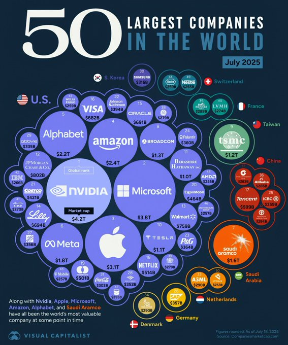
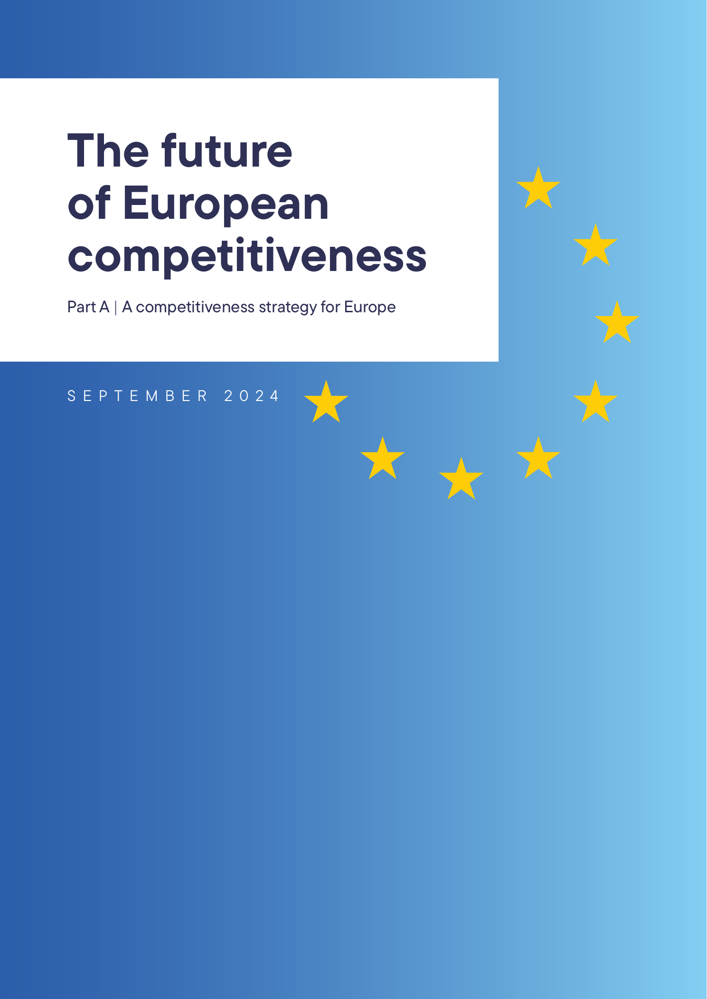

## Today: Two Questions {.center}

:::: {.columns}

::: {.column width="48%"}
::: {.metric}
1
:::

::: {.metric-label}
Why is Europe falling behind in AI?
:::
:::

::: {.column width="48%"}
::: {.metric .secondary}
2
:::

::: {.metric-label}
How should AI be governed, and who decides?
:::
:::

::::

::: {.notes}
Frame the day in one line. First we ask why Europe trails the United States and China in AI, using the Draghi Report. Then we turn to regulation: the EU has just paused and simplified its own AI Act, while the US is trying to stop its states from regulating AI at all.

Logistics: the quiz on Days 1 to 4 comes first, then Session A (competitiveness), then Session B (regulation). The day ends with a negotiation simulation.

[Sources]
Course syllabus, Day 5, 2026; Draghi, The Future of European Competitiveness, 2024.
:::

# Can Europe Compete in AI? {background-color="#041e42"}

## Europe Builds Almost No Frontier AI {.visual-stage}

{fig-alt="Bar chart of notable foundation AI models developed in 2024: European Union 3, China 15, United States 40" .r-stretch}

::: {.model-key}
**The EU's three:** Mistral Large, Mistral Large 2, and Pixtral Large --- all from Mistral AI in France.
:::

::: {.notes}
Start with the single most striking number. In 2024 the United States produced far more notable foundation models than China, and both were far ahead of the European Union. The EU's three were Mistral Large, Mistral Large 2, and Pixtral Large, all produced by the French company Mistral AI. About 70 percent of the world's foundational models since 2017 have come from the US.

Ask: why does the place where models are built matter for the place where AI is used? (Talent, computing power, standards, and profits all gather there.)

[Sources]
Stanford HAI, AI Index Report 2025, Chapter 1, Figure 1.3.2 (data from Epoch AI); European Parliamentary Research Service, "Making Europe an AI Continent," 2025, p. 2; Mario Draghi, "One Year On," Brussels, 16 Sep 2025.
:::

## Three US Firms Control the Cloud

:::: {.columns}

::: {.column width="33%"}
::: {.metric}
&gt;65%
:::

::: {.metric-label}
of Europe's cloud market
:::

::: {.metric-entities}
Amazon Web Services · Microsoft Azure · Google Cloud
:::
:::

::: {.column width="33%"}
::: {.metric .secondary}
~2%
:::

::: {.metric-label}
held by the largest EU operator
:::

::: {.metric-entities}
Deutsche Telekom
:::
:::

::: {.column width="33%"}
::: {.metric .muted}
4 of 50
:::

::: {.metric-label}
largest tech firms by market capitalization are EU companies
:::

::: {.metric-entities}
ASML · SAP · Siemens · Schneider Electric
:::
:::

::::

::: {.notes}
AI runs on cloud computing, and Europe does not own the cloud. Amazon Web Services, Microsoft Azure, and Google Cloud hold more than 65 percent of the European market. The largest EU operator in the Draghi data, Deutsche Telekom, holds only 2 percent. Without computing power, it is hard to build or grow frontier AI.

The four EU companies among the 50 largest technology providers by market capitalization in May 2024 were ASML, SAP, Siemens, and Schneider Electric. This is a market-cap ranking, not a ranking of cloud providers.

Connect back to Day 4: the same data centers that raise energy questions are also the strategic infrastructure Europe lacks.

[Sources]
Draghi Report, 2024, Part B, pp. 73 and 77; S&P Capital IQ and Companiesmarketcap data retrieved 7 May 2024, as cited by Draghi.
:::

## Market Value Is Concentrated in the United States

:::: {.columns}

::: {.column width="48%"}
{fig-alt="Bubble chart of the 50 largest public companies by market capitalization in July 2025, grouped by country, with the largest cluster and the largest individual companies in the United States" height="650"}
:::

::: {.column width="48%"}
### Look at Europe's cluster

- **ASML and SAP** appear, but far from the center
- Europe's largest firms remain concentrated in **industrials, pharmaceuticals, and luxury goods**
- The scale gap extends beyond **AI and cloud infrastructure**
:::

::::

::: {.notes}
Use this as a bridge, not as a second version of the prior statistic. The prior slide uses Draghi's May 2024 ranking of technology providers. This graphic covers the 50 largest public companies across all sectors in July 2025. The methodologies differ, but the same concentration is visible: the largest US firms dominate the center of the market-cap map, while Europe's companies form smaller sector-specific clusters.

Do not treat market capitalization as a direct measure of productivity, innovation, or social value. It measures the market value of listed equity and is useful here because it captures the scale investors expect firms to achieve.

[Sources]
Visual Capitalist, "Ranked: The 50 Most Valuable Companies in the World in 2025," July 2025; data from Companiesmarketcap.com, figures as of 18 July 2025.
:::

## Europe Has No New Big Tech Firms

:::: {.columns}

::: {.column width="33%"}
::: {.metric}
0
:::

::: {.metric-label}
EU firms worth over €100bn built from scratch in the last 50 years
:::
:::

::: {.column width="33%"}
::: {.metric .secondary}
6
:::

::: {.metric-label}
US firms worth over €1 trillion, all created in that time
:::
:::

::: {.column width="33%"}
::: {.metric .muted}
~30%
:::

::: {.metric-label}
of EU "unicorns" moved abroad, mostly to the US
:::
:::

::::

::: {.notes}
This is Draghi's most quoted point, and it is about growing, not inventing. Europe produces good research and promising start-ups, but they do not grow into giants at home, and many leave. (A "unicorn" is a start-up worth more than one billion dollars.) The result is a lasting gap at the technology frontier.

The exact quote: "There is no EU company with a market capitalisation over EUR 100 billion that has been set up from scratch in the last fifty years, while all six US companies with a valuation above EUR 1 trillion have been created in this period." (Draghi Report)

[Sources]
Draghi Report, 2024.
:::

## The Gap Is a Productivity Gap

:::: {.columns}

::: {.column width="48%"}
### What explains the gap

- About **70%** of the income gap between the EU and US is **lower productivity**
- Almost all of it is in **technology industries**; outside tech, Europe keeps pace
:::

::: {.column width="48%"}
### A second problem

- EU **electricity** costs 2 to 3 times US levels
- EU **gas** costs 4 to 5 times US levels
- High energy prices raise costs for industry and data centers
:::

::::

::: {.notes}
Diagnose before prescribing. The gap with the US is not mainly about working fewer hours or a different welfare model. It is about productivity, and the productivity shortfall sits in digital and information technology. On top of that sits a lasting energy-cost disadvantage, which matters directly for AI, because AI uses a lot of power.

[Sources]
Draghi Report, 2024, Part A and Part B.
:::

## Mario Draghi is Concerned

:::: {.columns .draghi-slide}

::: {.column width="42%"}
{fig-alt="Mario Draghi standing beside European Commission President Ursula von der Leyen at the European Commission in September 2025" height="430"}

::: {.draghi-caption}
Mario Draghi with Ursula von der Leyen, September 2025
:::
:::

::: {.column width="33%"}
> "This is an existential challenge."

- Europe risks a **"middle-technology trap"**: strong in established industries, but missing from new ones such as AI
- Without change, Draghi warns of **"slow agony"**
:::

::: {.column width="19%"}
{fig-alt="Cover of Part A of Mario Draghi's September 2024 report, The future of European competitiveness" height="505"}
:::

::::

::: {.notes}
Give students the framing device. Draghi's language is deliberately strong: this is existential, meaning Europe's basic future is at risk, and standing still means slow decline. The "middle-technology trap" is the core idea. Europe is competitive in yesterday's and today's industries, but missing from the new technologies, especially AI, that will drive tomorrow's growth. His original phrase for the risk of inaction was a "slow agony".

The photograph shows Draghi with Commission President Ursula von der Leyen at the high-level conference marking one year since the report, held in Brussels on 16 September 2025. The report cover is the first page of Part A, published in September 2024.

[Sources]
Mario Draghi, The Future of European Competitiveness, Part A, Sep 2024; European Commission, "The Draghi Report: One Year On," 16 Sep 2025. Photograph: European Union, 2025, P-067836/00-02.
:::

## Draghi's Three Fixes

:::: {.columns}

::: {.column width="33%"}
### Close the innovation gap

Help firms grow and sell new tech: AI, chips, biotech
:::

::: {.column width="33%"}
### Lower energy costs

Cut high energy prices while building clean-tech industries
:::

::: {.column width="33%"}
### Reduce dependencies

Secure key materials and supply chains; work together on security
:::

::::

::: {.notes}
The report is long, but its action plan has three parts. Keep them concrete. First, close the innovation gap by helping companies grow, not just invent. Second, turn cheaper, cleaner energy into an advantage rather than a cost. Third, depend less on others for critical materials, chips, and defense.

These three parts are what the take-home matrix asks students to turn into an action plan.

[Sources]
Draghi Report, 2024, Part A.
:::

## Europe Needs More Investment {.visual-stage}

{fig-alt="Bar chart: extra annual investment Draghi says Europe needs, about 800 billion euros in the 2024 report rising to about 1,200 billion euros in the 2025 update, roughly 5 percent of EU GDP" .r-stretch}

::: {.notes}
Here is the cost. The 2024 report put Europe's extra investment need at around €800 billion a year, roughly 5 percent of GDP, several times the size of the Marshall Plan. One year later, Draghi raised the figure to nearly €1,200 billion, and said more of it must now come from public money.

The point is not the exact number. It is the scale, and the fact that it grew rather than shrank.

Chart built from the figures Draghi reports.

[Sources]
Draghi Report, 2024; Draghi, "One Year On," 16 Sep 2025.
:::

## The EU Spent More. Did the Gap Shrink?

:::: {.columns}

::: {.column width="48%"}
### The Commission

- **€1 trillion+** committed to competitiveness
- **~€200bn** for AI, including **€20bn** for up to seven large AI data centers; sites not yet selected
- Says **90%** of its plan follows Draghi
:::

::: {.column width="48%"}
### Draghi, one year later

- Investment need rose from **€800bn to €1.2tn**
- The economy weakened despite new plans
- Delivery is still measured in years, not months
:::

::::

::: {.notes}
Set up a genuine empirical dispute. The Commission points to the Competitiveness Compass, a Savings and Investments Union, AI gigafactories, and more than a trillion euros committed. Draghi says the underlying indicators worsened. Both can be partly right because money announced is not money spent, and plans launched are not results delivered. Ask what evidence would settle the argument: private investment, start-ups that stay, computing power built, energy prices, or productivity growth.

[Sources]
European Commission, "The Draghi Report: One Year On," 2025; Draghi, 16 Sep 2025.
:::

## Activity: Choose Europe's Priorities

# How Should AI Be Governed? {background-color="#041e42"}

## The AI Act Has Four Regulatory Categories

:::: {.columns .risk-overview}

::: {.column width="43%"}
{fig-alt="Pyramid showing four commonly described EU AI Act categories: unacceptable risk, high risk, limited risk associated with Article 50 transparency obligations, and minimal risk" height="650"}
:::

::: {.column width="53%"}

Prohibited Article 5

Social scoring; untargeted facial-image scraping

Banned: cannot be marketed or used in the EU

High risk Articles 6–49

Hiring; creditworthiness; safety components of regulated products

Required: manage risks and data; document and log; provide human oversight; pass conformity checks; register and monitor

“Limited risk” Article 50

Chatbots; deepfakes; certain synthetic content

Required: disclose AI interaction; machine-mark synthetic outputs; label deepfakes and covered public-interest text

Minimal or no risk

Spam filters; AI-enabled video games

No additional system-specific AI Act requirements

:::

::::

::: {.risk-clarifier}
**“Limited risk” is common shorthand.** The Act itself creates specific transparency obligations in **Article 50**.
:::

::: {.notes}
The Act regulates an AI system's intended use, not the technology in the abstract. The same underlying model can fall under different rules depending on what it does. A general customer-service chatbot may face Article 50 transparency requirements; a system that screens job candidates may be high-risk.

The familiar four-level pyramid is useful but legally imprecise. “Limited risk” is a policy shorthand used in many explainers. The operative legal category is a set of transparency obligations for specified AI systems in Article 50. Recent Commission materials sometimes call this “transparency risk.” It is not a lighter version of the high-risk compliance process.

Minimal-risk examples such as spam filters and AI-enabled video games receive no additional system-specific requirements under the AI Act. Other EU or national laws can still apply.

[Sources]
European Commission, "AI Act: A Risk-based Approach," updated July 2026; European Commission, "Guidelines on Transparency Obligations for Providers and Deployers of AI Systems," 20 Jul 2026; Regulation (EU) 2024/1689, Articles 5, 6, and 50 and Annex III.
:::

## High Risk: Controls. Article 50: Disclosure. {.no-visible-title}

:::: {.columns .duty-columns}

::: {.column width="52%"}
### High-risk systems

- Manage risks and data
- Document, log and register the system
- Provide human oversight and cybersecurity
- Pass conformity checks before release
- Monitor performance and report serious incidents
:::

::: {.column width="44%"}
### Article 50

- Disclose when people interact with AI
- Mark synthetic outputs as AI-generated
- Notify people about emotion or biometric analysis
- Label deepfakes and AI-generated public-interest content
:::

::::

::: {.duty-callout}
**Article 50 does not require approval.** It can apply even when a system is not high-risk.
:::

::: {.notes}
High-risk requirements form a lifecycle compliance regime. The core system requirements appear in Articles 8–15: risk management, data governance, technical documentation, record-keeping, information for deployers, human oversight, accuracy, robustness and cybersecurity. Providers must also meet requirements for quality management, conformity assessment, registration, post-market monitoring and incident reporting. Exact obligations vary by the provider's or deployer's role and by the type of high-risk system.

Article 50 is narrower. Providers of interactive systems generally must tell people that they are interacting with AI. Providers of systems that generate synthetic text, audio, images or video must make outputs machine-readable and detectable as AI-generated or manipulated. Deployers must inform people about emotion recognition or biometric categorisation and clearly disclose deepfakes and certain AI-generated public-interest text. The Article contains exceptions and role-specific details; the central idea is disclosure, marking and labelling.

[Sources]
Regulation (EU) 2024/1689, Articles 8–19, 43, 49, 50, 72 and 73; European Commission, "Guidelines on Transparency Obligations for Providers and Deployers of AI Systems," 20 Jul 2026.
:::

## The EU Kept the Rulebook—but Delayed Its Toughest Rules {.visual-stage}

{fig-alt="Timeline showing the EU AI Act high-risk obligations moved from August 2026 to December 2027 for standalone systems and August 2028 for systems built into products, with content labelling and a new abuse-image ban due December 2026 and sandboxes by August 2027" .r-stretch}

- **Sandboxes:** regulator-supervised environments where firms can develop and test AI before launch

::: {.notes}
The AI Act has real force—its top penalty is €35 million or 7 percent of global sales—but the EU delayed its most demanding requirements before they took effect. The high-risk rules formerly due in August 2026 now start in December 2027 for standalone systems and August 2028 for AI embedded in regulated products. The Digital Omnibus keeps the risk-based core while delaying the timetable and reducing paperwork, presented as a competitiveness measure inspired by Draghi.

The sandbox is not an exemption from the law. A company follows an agreed testing plan for a limited period while regulators provide guidance, supervision, and support. Testing may occur in real-world conditions, but safeguards still apply. The purpose is to identify risks and compliance problems before the system is widely marketed or deployed.

[Sources]
EU AI Act, Articles 57-59 and 99; European Commission, "AI Omnibus Enters into Force," July 2026; Council of the EU, 29 Jun 2026; Freshfields and Gibson Dunn analyses, 2026.
:::

## The Omnibus Cuts Some Rules—and Adds Another

:::: {.columns}

::: {.column width="48%"}
### What becomes lighter

- High-risk requirements start later
- Less duplication and reporting
- Simpler compliance for smaller firms
:::

::: {.column width="48%"}
### What becomes stricter

- New ban on AI-generated child-abuse material
- New ban on fake nude images of real people without consent
- Protections required by **December 2026**
:::

::::

::: {.notes}
Avoid a one-dimensional deregulation story. The Commission calls the package simplification that gives firms certainty and reduces fixed compliance costs. Critics argue that it delays safeguards and weakens transparency before the rules can be tested. Yet the same law adds strict prohibitions on especially harmful synthetic content. Regulation can become lighter in one place and stricter in another.

[Sources]
Diego Naranjo, "The AI Omnibus," Liberties, 17 Jun 2026; Council of the EU, 29 Jun 2026.
:::

## The US Wants One Light National Standard

> "State-by-State regulation … creates a patchwork of 50 different regulatory regimes."

:::: {.columns}

::: {.column width="48%"}
### Override the states

- A legal task force to **sue states**
- Threaten federal internet funding
- Use the FTC and FCC to preempt state rules
:::

::: {.column width="48%"}
### Keep federal rules light

- Ask Congress to make preemption permanent
- Use existing agencies; create no new AI regulator
- Preserve state powers over fraud and child safety
:::

::::

::: {.notes}
Where Europe keeps a central rulebook but softens it, the United States has no comprehensive federal AI law and wants to stop states from filling the gap. Executive Order 14365 uses lawsuits, funding leverage, and federal agencies to challenge state rules. The March 2026 legislative framework asks Congress to make preemption permanent while relying on existing agencies and preserving limited state powers over fraud and child safety. The stated objective is global AI dominance through a minimally burdensome national framework.

[Sources]
Executive Order 14365, 11 Dec 2025; White House, National AI Legislative Framework, 20 Mar 2026.
:::

## The EU and the US Choose Opposite Paths

:::: {.columns}

::: {.column width="48%"}
### European Union

- Keeps a central rulebook, then **simplifies** it
- Still controls AI directly, protects rights first
- "Simplify to compete"
:::

::: {.column width="48%"}
### United States

- **Overrides** state rules; one light national standard
- Regulates AI as little as possible
- "Deregulate to dominate"
:::

::::

::: {.callout-important}
Both sides give the same reason: competitiveness.
:::

::: {.notes}
Pull the two halves of the day together. A year ago the contrast was "the EU regulates, the US has a patchwork." Now both are moving, and both point to competitiveness. But they move in opposite directions: the EU loosens a broad system it already built, while the US tries to stop anyone from building one. The deep question for the simulation: whose bet on competitiveness is more likely to pay off, and at what cost to rights?

[Sources]
Course synthesis; Draghi Report, 2024; Council of the EU, 2026; Executive Order 14365, 2025.
:::

## Key Takeaways

1. Europe leads in rules but trails in frontier AI, computing power, and scale.
2. Draghi's answer is more investment and lighter rules; one year later, the gap grew.
3. The EU is now simplifying its own AI Act; critics call it quiet deregulation.
4. The US goes further, trying to override its states to win the AI race.

::: {.notes}
Close on the day's arc. The morning showed why Europe is behind and what the fix would cost. The afternoon showed both the EU and the US turning toward lighter regulation, each pointing to competitiveness, but by very different routes. The open question, and the one the simulation puts on the table: can you cut rules for competitiveness without giving up the protections that made the rules worth having?

[Sources]
Draghi Report, 2024; Council of the EU, 2026; Executive Order 14365, 2025; Naranjo, Liberties, 2026.
:::
