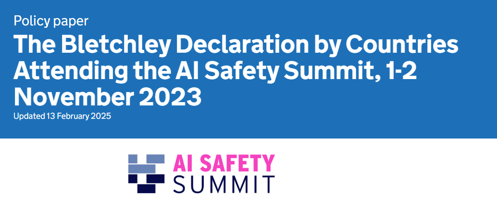
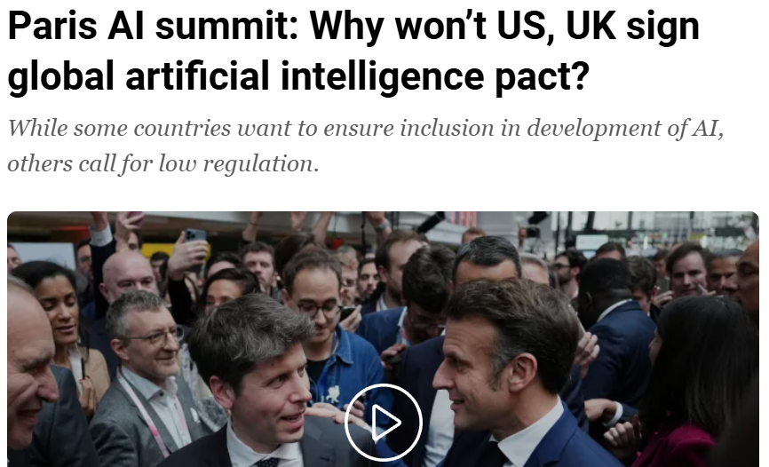
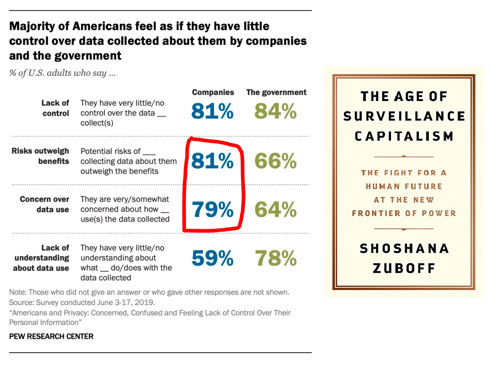
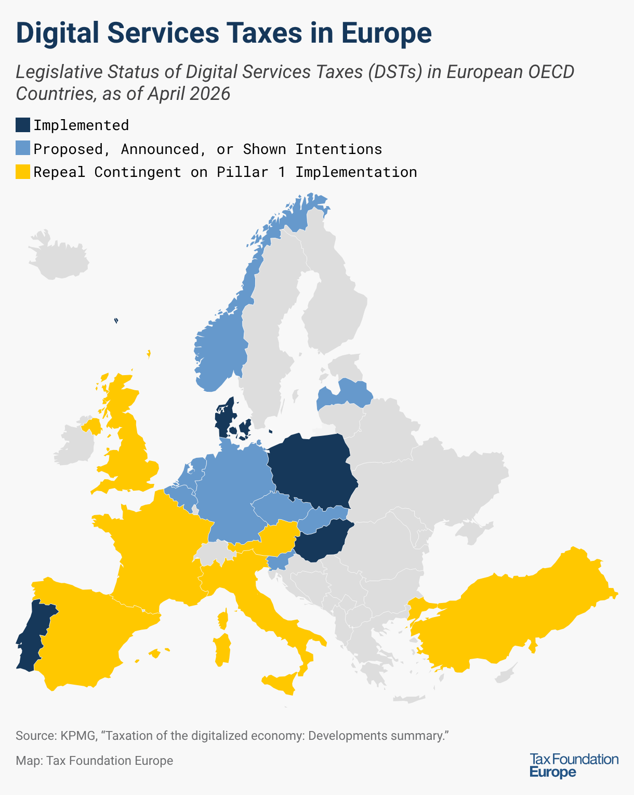
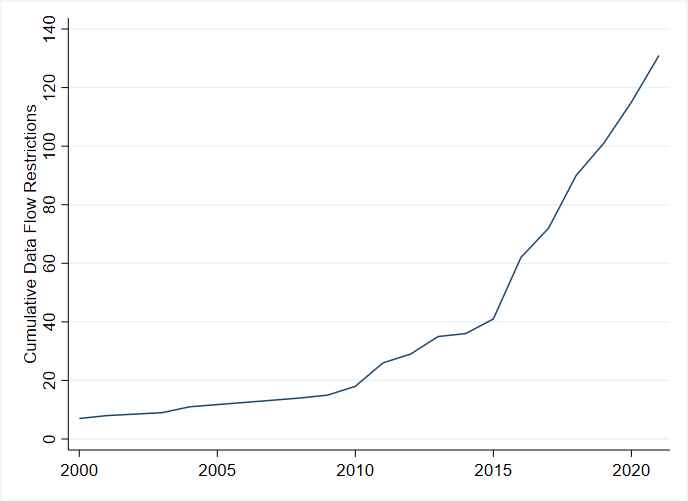

## Today: Two Questions {.center}

:::: {.columns}

::: {.column width="48%"}
::: {.metric}
1
:::

::: {.metric-label}
Why is international cooperation over digital technologies so difficult to achieve?
:::
:::

::: {.column width="48%"}
::: {.metric .secondary}
2
:::

::: {.metric-label}
Why are countries pursuing sovereignty over AI?
:::
:::

::::

::: {.notes}
Day 7 begins with a failure of international cooperation. AI summits produced declarations and voluntary initiatives, but no global rules. We then ask why cross-border digital integration produces demands for privacy, competition, and tax rules. Finally, we examine how dependence on privately controlled AI infrastructure changes the sovereignty problem.

[Sources]
Course syllabus, Day 7, 2026; Stephen Weymouth, *Digital Globalization*, chapters 1 and 5; Stephen Weymouth, “Digital Disintegration,” 2025.
:::

# AI Summits: Cooperation Without Enforcement {background-color="#041e42"}

## 2023: Global Risk Appeared to Produce Global Cooperation {.visual-stage}

{fig-alt="News headline reporting the promise of the 2023 UK AI Safety Summit" .r-stretch}

::: {.notes}
Bletchley looked like a breakthrough. Twenty-eight governments, including the United States and China, agreed that frontier-AI risks were international and required cooperation. The striking part was the shared diagnosis. The unresolved question was whether governments would accept rules that constrained national strategies or powerful firms.

[Sources]
UK Government, “The Bletchley Declaration by Countries Attending the AI Safety Summit,” 1–2 November 2023, https://www.gov.uk/government/publications/ai-safety-summit-2023-the-bletchley-declaration/the-bletchley-declaration-by-countries-attending-the-ai-safety-summit-1-2-november-2023. Image from the instructor’s 2025 Day 7 deck.
:::

## Bletchley Created a Process—not Global Rules {.visual-stage}

{fig-alt="The UK Government page for the Bletchley Declaration" .r-stretch}

::: {.figure-takeaway}
Voluntary testing. National policies. No common thresholds, verification, or enforcement.
:::

::: {.notes}
This is the central judgment from last year’s deck. Bletchley created a recurring summit process, national safety institutes, research cooperation, and voluntary testing commitments. It did not create international regulation. The declaration explicitly left policy to national circumstances and legal frameworks. Even the summit chair noted that voluntary commitments might eventually need a legal or regulatory basis. That next step never occurred.

[Sources]
UK Government, “Bletchley Declaration,” 2023; UK Government, “Chair’s Summary of the AI Safety Summit 2023,” 2 November 2023, https://assets.publishing.service.gov.uk/media/6543e0b61f1a60000d360d2b/aiss-chair-statement.pdf. Image from the instructor’s 2025 Day 7 deck.
:::

## 2025: Even a Non-Binding Statement Split the Coalition {.visual-stage}

{fig-alt="News headline asking why the United States and United Kingdom would not sign the Paris AI statement" .r-stretch}

::: {.figure-takeaway}
The United States and United Kingdom declined to sign.
:::

::: {.notes}
By Paris, the Bletchley coalition had fractured. The United Kingdom said the statement lacked practical clarity on global governance and did not sufficiently address national security. The United States opposed regulation that could slow domestic innovation and weaken its competitive position. Governments agreed on broad principles but not on whose firms, strategic advantages, or regulatory preferences should yield.

[Sources]
UK Parliament, written answer HL5002, 26 February 2025, https://questions-statements.parliament.uk/written-questions/detail/2025-02-12/HL5002; White House, *America’s AI Action Plan*, July 2025, p. 1, https://www.whitehouse.gov/wp-content/uploads/2025/07/Americas-AI-Action-Plan.pdf; image from the instructor’s 2025 Day 7 deck.
:::

## 2026: More Endorsers, Still No Obligations {.photo-title background-image="../../assets/day7_new_delhi_summit.jpg" background-size="cover" background-position="center"}

::: {.photo-caption}
Ninety-two endorsers; voluntary initiatives; no verification or enforcement.
:::

::: {.notes}
New Delhi broadened participation and gave much greater weight to access, development, skills, and the priorities of the Global South. That increased the process’s representativeness. It did not solve the cooperation problem. India’s own summary describes the summit initiatives as voluntary and collaborative. The declaration still did not create common thresholds, independent verification, or enforcement.

[Sources]
Government of India, “AI Impact Summit 2026 Concludes with Adoption of New Delhi Declaration,” 21 February 2026, https://www.pib.gov.in/PressReleasePage.aspx?PRID=2231208. Image by ANI, via *Financial Express*, February 2026.
:::

# The Summit Failure Is the Digital-Globalization Problem {background-color="#041e42"}

::: {.notes}
The summits failed by the standard that matters here: they did not produce rules capable of constraining states or firms. This is not mainly a technical failure. It reflects political conflict over three questions: who captures the gains from AI, whose firms and infrastructure will dominate, and whose values become global rules. The United States emphasizes innovation and strategic leadership; China protects state control and technological autonomy; developing economies emphasize access, capacity, and development. Consensus on the existence of a cross-border problem does not create agreement on how its costs and benefits should be distributed.

[Sources]
Stephen Weymouth, 2025 Day 7 deck; Stephen Weymouth, *Digital Globalization*, chapters 1 and 5; UK Government, “Bletchley Declaration,” 2023; UK Parliament, HL5002, 2025; Government of India, “New Delhi Declaration,” 2026.
:::

## Data Are an Economic Input—but Not a Conventional One {.data-input-slide}

:::: {.columns}
::: {.column width="43%"}
{fig-alt="Streams of digital data"}
:::
::: {.column width="53%"}
- **Intimate:** linked to identity, behavior, and relationships
- **Hard to own:** rights over collection, inference, and reuse are unsettled
- **Hard to price:** value appears after data are combined and analyzed
- **Nearly costless to transfer:** data can cross borders instantly
- **Non-rival but excludable:** data can be reused, while firms restrict access
:::
::::

::: {.notes}
Start with every phrase in the original figure. Calling data an input means firms use it to produce predictions, recommendations, advertising, and other services. But data differ from conventional inputs. They can be reused without being consumed, copied and transferred at very low cost, and withheld from rivals. Their value is hard to observe before analysis. Personal data are also intimately linked to the person who generated them, which makes the absence of clear property and control rights politically important.

[Sources]
Stephen Weymouth, *Digital Globalization*, chapter 2, sections 2.1–2.2; chapter 5, pp. 49–52. Image from the instructor’s prior digital-globalization decks.
:::

## A Data Value Chain Turns Behavior into a Service {.dvc-flow-slide}

<strong>Use</strong>searches, clicks, purchases, locations

<b>→</b>

<strong>Collect</strong>record activity as data

<b>→</b>

<strong>Combine</strong>link users, services, and countries

<b>→</b>

<strong>Analyze</strong>infer preferences and behavior

<b>→</b>

<strong>Monetize</strong>ads, platforms, cloud, digital services

The user is both a customer and a supplier of the central input.

::: {.notes}
A value chain is the sequence through which an input becomes a product or service. In a digital value chain, people generate data while using a service. Firms collect, combine, and analyze those data, often across borders, then monetize the resulting information through advertising, recommendations, marketplaces, cloud services, and other digital products. Unlike a conventional supply chain, the user may not receive a separate payment for supplying the input.

[Sources]
Stephen Weymouth, *Digital Globalization*, chapter 2, section 2.2; chapter 5, pp. 49–52.
:::

## The Same Data That Create Value Can Enable Surveillance {.visual-stage}

{fig-alt="Pew Research Center findings showing that majorities of Americans feel little control over data collected about them" .r-stretch}

::: {.figure-takeaway}
The privacy conflict begins with control: who may collect, infer, reuse, and transfer personal data?
:::

::: {.notes}
Data are valuable partly because they reveal intimate information and predict behavior. That same feature creates surveillance and manipulation risks. Chapter 5 argues that cross-border data markets cannot remain politically open if people believe that they lose control once their data leave the country. Governments therefore demand baseline protections before permitting unrestricted transfers.

[Sources]
Stephen Weymouth, *Digital Globalization*, chapter 5, pp. 49–51; Pew Research Center, “Americans and Privacy,” 2019. Figure from the instructor’s prior digital-globalization decks.
:::

## Data Value Chains Reward Scale and Early Dominance {.concentration-slide}

:::: {.columns}
::: {.column width="46%"}
{fig-alt="The fifty largest companies in the world by market value in July 2025"}
:::
::: {.column width="50%"}
### Network effects
More users make platforms more useful.

### Economies of scale and scope
The same data and infrastructure support many services.

### First-mover advantage
Early data improve services and attract still more users.
:::
::::

::: {.notes}
The second political conflict is concentration. Network effects make a service more valuable as more users join. Scale economies spread large fixed costs across a global user base. Scope economies allow the same data and infrastructure to improve several services. First movers can begin this feedback loop earlier. These mechanisms help explain why digital markets tend toward a small number of dominant firms and why economic power can become political power.

[Sources]
Stephen Weymouth, *Digital Globalization*, chapter 2, sections 2.2–2.4; chapter 5, pp. 49–52. Image: Visual Capitalist, “50 Largest Companies in the World,” July 2025, from the instructor’s public-event deck.
:::

## Corporate Tax Still Begins with a 1920s Assumption {.tax-history-slide}

:::: {.columns}
::: {.column width="46%"}

1920s

{fig-alt="A meeting of the League of Nations"}
:::
::: {.column width="50%"}
### The original bargain

- Divide taxing rights and prevent **double taxation**.
- Tax **profit**, not revenue.
- Give a country taxing rights when a firm has a **physical presence** there.

<strong>Permanent establishment</strong> factory · office · employees

:::
::::

::: {.notes}
The photograph carries the central historical point: the architecture predates digital business by a century. League of Nations work in the 1920s divided taxing rights between countries while trying to prevent the same profit from being taxed twice. Corporate income tax applies to net profit. A market country traditionally gains a right to tax a foreign firm’s business profit when the firm has sufficient local physical presence—a permanent establishment. The residence country may also tax worldwide profit, with treaties, credits, or exemptions addressing double taxation. VAT is separate; this discussion concerns corporate profit tax.

[Sources]
Stephen Weymouth, *Digital Globalization*, chapter 2, section 2.4.2; International Monetary Fund, *Corporate Taxation in the Global Economy*, 2019, Appendix II; OECD, *Tax Challenges Arising from Digitalisation—Interim Report 2018*, chapter 2. Image from the instructor’s 2025 Day 7 deck.
:::

## Digitalization Breaks Both Links between Market and Tax {.tax-breaks-slide}

<strong>1 · Sales without presence</strong>
<b>Market country</b> users · data · revenue
<em>remote service →</em>
<b>Foreign platform</b> no local factory or office
<small>The market may have no right to tax the platform’s profit.</small>

<strong>2 · Profit separated from sales</strong>
<b>Sales affiliate</b> Revenue 100 Costs −20 Royalty −70 <b>Profit 10</b>
<em>royalty 70 →</em>
<b>Low-tax IP affiliate</b> Royalty 70 Costs −5 <b>Profit 65</b>
<small>Mobile intangibles make the location of profit contestable.</small>

::: {.notes}
Digitalization creates two related but distinct problems. First, scale without mass allows a platform to earn substantial revenue and gather valuable user data in a market without the permanent establishment required by the old nexus. Second, data, algorithms, brands, patents, and software are intangibles whose internal price and ownership location are difficult to establish. The illustrative royalty moves reported profit from a high-tax sales affiliate to a low-tax intellectual-property affiliate. The multinational group still earns 75 in total; only the reported location changes. Related-party prices are legally supposed to follow the arm’s-length principle, and not every royalty is avoidance. The concern is artificial pricing or ownership that separates reported profit from real economic activity.

[Sources]
Stephen Weymouth, *Digital Globalization*, chapter 2, section 2.4.2 and chapter 3, section 3.3; OECD, *Tax Challenges Arising from Digitalisation—Interim Report 2018*; OECD, *Transfer Pricing Guidelines for Multinational Enterprises and Tax Administrations*, 2022; IMF, *Corporate Taxation in the Global Economy*, 2019. Numbers are illustrative.
:::

## The Tax Fixes Address Different Problems {.tax-fixes-slide}

:::: {.columns}
::: {.column width="44%"}
{fig-alt="Map of implemented and proposed digital services taxes in European OECD countries as of April 2026"}
:::
::: {.column width="52%"}
### Digital services taxes
Tax selected **local revenue** now—but trigger trade conflict.

### Pillar One
Would give market countries some **profit**. Not in force.

### Pillar Two
Sets a **15% minimum tax**. Does not reallocate market taxing rights.
:::
::::

Cooperation advanced on a minimum rate—not on who may tax digital-market profit.

::: {.notes}
The policy responses target different gaps. Digital services taxes are unilateral levies on selected gross revenue from local users or customers. They bypass the physical-presence rule but mainly affect large foreign firms and have provoked US trade retaliation. Pillar One would reallocate a share of the largest multinationals’ profit to market countries even without traditional presence, but Amount A has not entered into force. Pillar Two establishes a 15 percent country-by-country minimum for large multinational groups and is being implemented. It reduces the incentive to move profit to very low-tax jurisdictions, but it does not itself give market countries the new taxing right sought under Pillar One.

[Sources]
Stephen Weymouth, *Digital Globalization*, chapters 3 and 5; Tax Foundation Europe, “Digital Services Taxes in Europe, 2026,” 4 May 2026; USTR, “Section 301 Digital Services Taxes Investigations,” 2 June 2021; OECD, “Multilateral Convention to Implement Amount A of Pillar One”; OECD, “Global Minimum Tax.” Map by Tax Foundation Europe using KPMG data, April 2026.
:::

## From Data Economics to Political Conflict {.synthesis-slide}

| Economic mechanism | Political conflict | Institutional foundation |
|---|---|---|
| Personal data + unclear control rights | Surveillance and privacy | Compatible privacy rules |
| Network effects + scale and scope | Concentration and inequality | Competition policy |
| Physical-presence tax rules + mobile intangibles | Tax avoidance and interstate conflict | International tax cooperation |

These are not side effects. They arise from how data value chains create and allocate value.

::: {.notes}
Only now return to the complete argument. Each political conflict follows from a distinct economic mechanism. Unclear control rights over intimate personal data create privacy and surveillance concerns. Network effects and scale opportunities create concentration and inequality. Physical-presence tax rules and mobile intangibles create tax avoidance and interstate disputes. The corresponding institutional foundations are compatible privacy rules, competition policy, and international tax cooperation.

[Sources]
Stephen Weymouth, *Digital Globalization*, chapter 5, especially Figure 5.1 and sections 5.1–5.2.
:::

## When Politics Is Unresolved, Barriers Rise {.restrictions-slide}

:::: {.columns}
::: {.column width="62%"}
{fig-alt="Cumulative growth in restrictions affecting digital trade"}
:::
::: {.column width="34%"}
### Data localization

### Platform bans

### Digital-services taxes

### Local-content and licensing rules

Unilateral protection fragments the digital economy.

:::
::::

::: {.notes}
Domestic governments do not wait for a global settlement. They respond with localization requirements, transfer restrictions, digital taxes, platform bans, and licensing rules. Each policy may answer a real political demand, but incompatible national responses raise costs and fragment markets.

[Sources]
Stephen Weymouth, *Digital Globalization*, chapters 1 and 5; cumulative-restrictions figure from Stephen Weymouth, “Digital Disintegration,” 2025, and the instructor’s public-event deck.
:::

## The Digital Globalization Paradox {.paradox-contrast}

:::: {.columns}
::: {.column width="47%"}
### Manufacturing globalization

International cooperation mainly meant coordinated liberalization:

- lower tariffs
- fewer investment barriers
:::
::: {.column width="47%"}
### Digital globalization

Politically sustainable openness first requires coordinated regulation:

- privacy
- competition
- taxation
:::
::::

For digital globalization to remain open, some data-value-chain activities must first be constrained.

::: {.notes}
This is the core paradox in Chapter 5. Goods globalization was built mainly by coordinating liberalization. Digital globalization requires coordinated regulation first. Without protections for privacy, competition, and tax fairness, political support for openness erodes and governments impose unilateral barriers. Regulation can therefore enable—not merely restrict—cross-border digital integration.

[Sources]
Stephen Weymouth, *Digital Globalization*, chapters 1 and 5, especially the discussion of the digital globalization paradox and the institutional foundations of openness.
:::

# AI Raises the Stakes {background-color="#041e42"}

## AI Depends on a Transnational Infrastructure Stack {.visual-stage}

{fig-alt="The AI infrastructure stack from minerals and chips to cloud, models, and applications"}

::: {.figure-takeaway}
AI sovereignty is constrained by dependencies at every layer—from minerals and fabs to cloud, models, and applications.
:::

::: {.notes}
AI is not placeless software. It relies on a transnational stack: critical minerals, advanced semiconductor tools, fabrication, accelerators, data centers, cloud platforms, frontier models, and applications. Control is distributed, but key layers are highly concentrated.

[Sources]
Stephen Weymouth, “Digital Disintegration: Technoblocs and Strategic Sovereignty in the AI Era,” 2025; figure from the instructor’s 2026 public-event deck.
:::

## Critical Layers Are Controlled by a Few Firms {.visual-stage}

{fig-alt="Market shares of dominant firms in key AI infrastructure layers"}

::: {.figure-takeaway}
Nvidia, TSMC, and ASML are private firms—but their decisions shape national capabilities.
:::

::: {.notes}
The assigned article reports extreme concentration at several chokepoints: Nvidia in data-center GPUs, TSMC in leading foundry output, and ASML in advanced lithography. These are not ordinary suppliers. Their investment, allocation, and compliance choices affect the AI capacity of states.

[Sources]
Stephen Weymouth, “Digital Disintegration,” 2025, market-concentration discussion and cited industry estimates. Figure from the instructor’s public-event deck.
:::

## The “Digital Warlords” Problem {.warlords-slide .photo-title background-image="../../assets/pe_warlords_art.png" background-size="cover" background-position="center"}

::: {.photo-caption}
Private firms control critical AI inputs beyond effective sovereign or multilateral oversight.
:::

::: {.notes}
“Digital warlords” names a structural problem, not a moral label for individual executives. Private firms possess infrastructural power over essential AI inputs while international institutions were designed mainly to discipline states. Governments increasingly respond by bargaining with, subsidizing, or coercing those firms.

[Sources]
Stephen Weymouth, “Digital Disintegration,” 2025. Image from the instructor’s public-event deck.
:::

## Digital Sovereignty Can Take Several Forms {.sovereignty-modes}

Mercantilism<strong>BUILD</strong><b>domestic capacity</b><small>subsidies · procurement · localization</small>

+

Alignment<strong>ALIGN</strong><b>with trusted partners</b><small>chips · cloud · security ties</small>

+

Regulatory power<strong>REGULATE</strong><b>access and conduct</b><small>safety · competition · data governance</small>

Strategic sovereignty means managing dependencies—not eliminating them.

::: {.notes}
Strategic sovereignty is not autarky. States pursue it through combinations of domestic industrial policy, alignment with a technology bloc, and regulation of market access. The mix depends on domestic assets, external dependencies, and bargaining power.

[Sources]
Stephen Weymouth, “Digital Disintegration,” 2025, sections on strategic digital sovereignty and technoblocs.
:::

## Three Strategies Leading to Fragmenting Order {.bloc-slide}

<strong>United States</strong>
<small>Chokepoint control, export controls, subsidies, cloud alliances</small>

<strong>China</strong>
<small>Domestic control, national champions, Digital Silk Road</small>

<strong>European Union</strong>
<small>Regulatory sovereignty, trusted markets, strategic capacity</small>

::: {.notes}
The United States leverages corporate and technological chokepoints through controls, subsidies, and alliances. China combines domestic control with external infrastructure provision through the Digital Silk Road. The EU uses market size and regulation while trying to reduce cloud and compute dependence. These strategies create overlapping but increasingly distinct technoblocs.

[Sources]
Stephen Weymouth, “Digital Disintegration,” 2025. Images and figures from the instructor’s public-event deck.
:::

## Swiss Digital Sovereignty {.switzerland-slide}

:::: {.columns}
::: {.column width="38%"}
{fig-alt="The Swiss flag"}

### Strong assets
Research · specialized industry · capital · trusted governance
:::
::: {.column width="58%"}
### Binding dependencies

<strong>Compute</strong>foreign accelerators + hyperscale cloud

<strong>Models</strong>foreign frontier labs and open-weight ecosystems

<strong>Energy</strong>grid, land, and data-center constraints

<strong>Markets</strong>EU access + US technology ties

Which dependencies are acceptable—and which must Switzerland reduce?

:::
::::

::: {.notes}
Switzerland has excellent research, specialized industries, capital, and credible institutions. It lacks a frontier-model champion and hyperscale cloud, and depends on foreign chips, cloud providers, and models. The relevant goal is selective resilience: deciding where autonomy is essential and where alliances are more efficient.

[Sources]
Course activity, “Swiss AI Sovereignty Strategy,” Day 7 Session B, 2026; Stephen Weymouth, “Digital Disintegration,” 2025. Swiss flag image from the instructor’s 2025 Day 7 deck.
:::

<!--
## Activity: Swiss AI Sovereignty Strategy {.activity-intro-slide background-color="#041e42"}

CABINET SIMULATION

### How should Switzerland manage AI dependence without trying to become fully self-sufficient?

Use the handout to build and test a strategy.

<strong>10</strong> policy points≤ <strong>4</strong> instruments<strong>3</strong>-minute briefing

::: {.notes}
Distribute the standalone activity handout. Students work in groups to rank Switzerland’s dependencies, choose a primary strategy, allocate up to ten policy points, identify Switzerland’s bargaining assets, and describe the main result of their strategy. Each group delivers a three-minute recommendation to the Swiss cabinet.

[Sources]
Course activity handout, “Swiss AI Sovereignty Strategy,” Day 7B, 2026.
:::
-->

## Day 7 Key Takeaways

1. AI summits produced broad principles, but not enforceable global rules
2. Digital trade creates conflicts over privacy, market power, and where profits are taxed
3. Shared rules ("coordinated regulation") can keep digital markets open by reducing the harms that lead governments to close them-but cooperation is difficult to achieve
4. No country is fully independent in AI; strategic digital sovereignty means deciding what to build, whom to rely on, and what to regulate

::: {.notes}
Use this slide to close Day 7 before stepping back to the course as a whole. The summit process shows the limits of international cooperation. The deeper problem is that cross-border digital activity creates political conflicts over privacy, competition, and taxation. Regulation can help sustain openness when it addresses those conflicts. At the same time, AI infrastructure is concentrated across firms and countries, so sovereignty means managing dependencies rather than eliminating them.

[Sources]
Bletchley Declaration, 2023; New Delhi Declaration, 2026; Stephen Weymouth, *Digital Globalization*, chapters 1 and 5; Stephen Weymouth, “Digital Disintegration,” 2025.
:::

## Course Takeaways

1. AI can make many tasks faster and cheaper, but better results require changes in how work and organizations are designed
2. AI will affect workers, companies, and places unevenly-We must monitor and address the harmful effects before the backlash
3. AI brings real costs—for energy systems, communities, privacy, competition, and democracy
4. No country controls AI alone, but cooperation is difficult because governments and firms want different things and capabilities are unevenly distributed
5. The central question is: **Who decides how AI is used, who gains, who pays, and what rules keep it serving society?**

::: {.notes}
End by returning to the questions that ran through all seven days. AI can lower the cost of tasks, but company results depend on organizational change. Effects on jobs and productivity must be distinguished from forecasts. Energy, privacy, competition, and democratic control show that the gains and costs are unevenly distributed. Day 7 adds that neither states nor firms can govern a cross-border technology alone. The final question is therefore about choice, distribution, and responsibility: who sets the goals, who receives the benefits, who bears the costs, and what rules can keep AI serving society?

[Sources]
Course synthesis, Days 1–7; assigned course readings.
:::
