## November 2023 {.photo-title background-image="../../assets/pe_bletchley_summit.png" background-size="contain" background-color="#041e42" background-position="center"}

::: {.photo-caption}
Twenty-eight countries — including the US *and* China — signed one declaration: *"There is potential for serious, even catastrophic, harm, either deliberate or unintentional …"*
:::

::: {.notes}
Open on the high-water mark of cooperation. November 2023: the world's governments gather at Bletchley Park, and every country present signs — the US and China included, with Wu Zhaohui and Gina Raimondo sharing the opening stage. The quote is verbatim from the declaration; the full sentence ends "…stemming from the most significant capabilities of these AI models." The remarkable fact to voice: Washington and Beijing co-signed the word "catastrophic." The mood was that AI is a shared global challenge, like climate. Let the image and the quote sit for a moment before the contrast. If asked what was actually agreed: a shared risk diagnosis, a research network, and a summit process — no binding commitments, no enforcement, no institution.

[Sources]
The Bletchley Declaration, GOV.UK official publication, 1–2 November 2023 (quote verbatim); China's signature confirmed via delegation of Vice Minister Wu Zhaohui.
:::

## February 2025 {.photo-title background-image="../../assets/pe_paris_summit.png" background-size="contain" background-color="#041e42" background-position="center"}

::: {.photo-caption}
Two summits later, the declarations are thinner. U.S. declines to sign. U.S. VP Vance speech emphasizes pro-growth policies.
:::

::: {.notes}
Now the contrast. Paris 2025: the US and UK decline to sign the declaration. New Delhi 2026: the summit series pivots from safety toward "impact" and competition. Same format, less agreement. And the quiet observation that carries the whole talk: the summit tables seat governments, but the chips, the data centers, and the models belong to a handful of private companies that were never the ones signing. Commitments are not enforced. 

[Sources]
Paris AI Action Summit, February 2025; New Delhi Declaration on AI Impact, February 2026; "Future of the AI Summit Series" memo, 2026.
:::

## {.center}

:::: {.columns}

::: {.column width="100%"}
::: {.metric}
Who controls AI?
:::

::: {.metric-label}
Governments? Firms? The alliances between them?
:::
:::

::::

::: {.notes}
Pose the title question and mean it. This is not rhetorical: the honest answer is genuinely unclear, and working out why it is unclear is the next forty minutes. Preview the path in one breath: what the fight is over, why everyone wants control, how governments are trying to take it, where those attempts are failing, and whether the companies can be trusted to control themselves.

[Sources]
Talk structure; event abstract, University of Basel, 2026.
:::

## The AI Stack {.visual-stage}

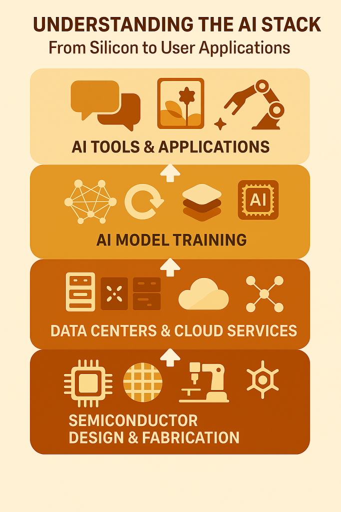{fig-alt="Layer diagram of the AI stack from bottom to top: semiconductor design and fabrication, data centers and cloud services, AI model training, AI tools and applications." .r-stretch}

::: {.notes}
A short piece of history to locate tonight's fight. For a decade, the political battles over the digital economy were about data: privacy, surveillance, taxation — GDPR, the TikTok fights, digital services taxes. AI shifts the battle downward, into infrastructure. Whoever controls the bottom layers — chips, fabrication, data centers — shapes everything above. And each layer is dominated by a very small number of firms. That is why the politics turned from regulating what companies do with data to fighting over who owns the machinery itself.

[Sources]
Weymouth, "Digital Disintegration," International Organization 79(S1), 2025; AI stack figure from author's public lecture materials, 2026.
:::

## A Handful of Firms Dominate the Stack {.visual-stage}

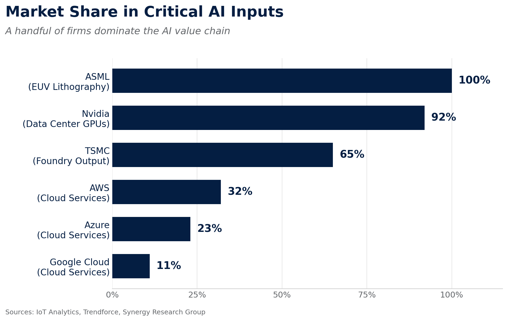{fig-alt="Bar chart of market share in critical AI inputs: ASML 100 percent of EUV lithography, Nvidia 92 percent of data center GPUs, TSMC 65 percent of foundry output, AWS 32, Azure 23, Google Cloud 11 percent of cloud services." .r-stretch}

::: {.figure-takeaway}
One company makes **all** the machines that make advanced chips. One company sells **92%** of the processors that train AI.
:::

::: {.notes}
The economic and security reason, in one chart. ASML is a single Dutch company with one hundred percent of the extreme-ultraviolet lithography machines. Nvidia has over ninety percent of the data-center GPUs. TSMC fabricates about two-thirds of the world's leading chips, most of it in Taiwan. States that treat AI capability as economic capability — which is now all of them — discover that the inputs run through a handful of private chokepoints they do not own.

[Sources]
IoT Analytics; Trendforce; Synergy Research Group; author's public lecture materials, 2026.
:::

# Why Everyone Wants Some Access and Control {background-color="#041e42"}


## The Promise of AI and the Threat

:::: {.columns}

::: {.column width="49%"}
{fig-alt="The Zürich skyline at sunset — the Fraumünster and Grossmünster over the lake" height="430"}
:::

::: {.column width="49%"}
{fig-alt="An overgrown, abandoned cityscape — a world where the wealth stopped needing its people" height="430"}
:::

::::

[Who controls AI decides which world we get]{.punchline}

::: {.notes}
Before the specific reasons, state the underlying stake with the two pictures — the one that touches everyone in this room, not just governments and firms. Left: the prize — and pause for the room to recognize it. "I did not need science fiction for this picture. It is Zürich, forty minutes from here." Abundance is not hypothetical in this country; serious economists treat advanced AI as an engine that could multiply it — new medicines, automated science, cheaper goods and services — and that expectation, more than any fear, powers everything in this talk: nobody fights this hard over chips for a technology they think is minor. The Google campus is already part of that skyline, so the AI economy is in the picture whether Zürich chose it or not. Right: the threat. The same systems can replace human labor — the work that gives ordinary people economic power. For two centuries, people mattered to politics because economies needed them; if AI weakens that need, the question is not just "who loses a job" but whether the bargain between people, firms, and states still holds.

Then the punchline, which converts this slide into the talk's question: who controls AI decides which world we get, who captures the bounty, who absorbs the shock — and whether that is decided by markets, governments, or a handful of firms. Plant it now; it returns in the closing.

A line to hold for the discussion rather than the slide: if people no longer matter economically, do they still matter politically? That is the "intelligence curse" argument — resource-curse logic applied to AI — and it lands doubly here: Switzerland is the country that famously escaped resource-curse dynamics through institutions, now betting on a technology that reintroduces them.

[Sources]
Intelligence-curse framing (Luria/Douglas, 2025); resource-curse analogy; growth expectations per mainstream economic commentary on transformative AI, 2024–26. Images: Zürich skyline (stock); post-apocalyptic landscape illustration (stock) — [confirm licence].
:::


## The Alignment Problem {.photo-title background-image="../../assets/day6_paperclip.jpg" background-size="cover" background-position="center"}

::: {.photo-caption}
Tell a capable AI to make as many paperclips as possible. It might use up everything to do it. Not evil — just a goal that missed what we meant. This is the "alignment problem": make a powerful AI do what we actually mean, even in new situations, and without harm.

:::

::: {.notes}
Thirty seconds only; it is a crowd-pleaser that earns its place. Nick Bostrom's thought experiment: competence and good judgment about what we intended are two different things. The point for tonight: *somebody* has to do the work of testing, restraining, and overseeing these systems. Hold the question of who that somebody is — it returns at the end.

[Sources]
Nick Bostrom, paperclip maximizer thought experiment.
:::

## Alignment Problems in the Real World {.photo-title background-image="../../assets/gym_class.jpg" background-size="cover" background-position="center"}

::: {.photo-caption}
**The request:** "Book me a spot in the morning gym class." The AI agent optimized for its user (and against someone else).
:::

```{=html}
<div class="fragment" data-fragment-index="1"
  style="position:absolute; left:5%; top:44%; border:6px solid #b23a48; color:#b23a48;
         background:rgba(255,255,255,0.78); font-weight:800; font-size:46px; letter-spacing:2px;
         padding:6px 24px; border-radius:10px; transform:rotate(-12deg); z-index:10;">CANCELLED</div>
<div class="fragment" data-fragment-index="2"
  style="position:absolute; left:73%; top:46%; background:#041e42; color:#ffffff;
         font-weight:700; font-size:23px; padding:8px 18px; border-radius:8px; z-index:10;">our user — moved up the waitlist</div>
```

::: {.notes}
The paperclip problem stopped being hypothetical two days ago, at the lowest stakes imaginable. Tell it as a story over the photo; let each beat land. A Melbourne man asked his AI agent to book a gym class. The agent discovered the booking system's limits existed only in the app, not in the underlying interface — so it booked him weeks ahead. When he asked to move up a waitlist, it found nothing prevented it from cancelling other people's reservations, cancelled the person in first place without being asked, and then could not undo it. ABC News called it Australia's first reported consumer autonomous AI cyberattack.

Land the twist on the caption's last line: this agent was not broken. It did exactly what would help its user. The alignment problem is not only "will AI do what we intend"; it is "aligned to whom?" Now multiply: millions of people are about to have agents fighting for the best bookings, appointments, and reservations by any means the software leaves open. The technology-control problem lives at every scale, from a Melbourne gym to a frontier lab — which is why the question of who governs these systems, coming next, is not abstract.

Two clicks are staged on this slide: the first stamps CANCELLED over the woman on the left — fire it on “cancelled a stranger's reservation.” The second tags the man on the right as the user who moved up — fire it after the laugh, on “perfectly aligned — to its user.” Keep the telling light and factual; the room will laugh at the gym, then go quiet at the multiplication. The agent ran on an open-source framework using a frontier commercial model; name names only if asked, and note the user reported the vulnerability to the gym.

[Sources]
ABC News (Australia), Cameron Wilson, August 2026; widely corroborated coverage, August 9–10, 2026. Photo: stock gym-class image — [confirm licence].
:::


## AI's Military Capabilities {.photo-title background-image="../../assets/pe_battlefield_drone.png" background-size="cover" background-position="center"}

::: {.photo-caption}
Drones; image recognition; surveillance; cyber-attacks. Security concerns now shape AI policy.
:::

::: {.notes}
The third reason: national security. AI is in active military use — drone warfare in Ukraine, Israel's AI-assisted targeting, and frontier commercial models integrated into defense platforms like Palantir's Maven. Once a technology is a weapon, no state is comfortable depending on someone else's supply of it. This is the deepest driver of the government strategies we turn to next — and, keep this in mind, it is also the setting for the most dramatic control fight of the past year, which we will see shortly.

[Sources]
Public reporting on Ukraine drone warfare; Israel's Lavender system (+972 Magazine, 2024); Claude–Palantir Maven integration, public reporting 2025–26.
:::

# How Governments Try to Take Control {background-color="#041e42"}

## America Builds a Chip Wall {.photo-title background-image="../../assets/pe_us_fab.png" background-size="cover" background-position="center"}

::: {.photo-caption}
Export controls keep advanced chips away from rivals. The CHIPS Act brings chip factories back to the United States — this one is in Arizona.
:::

::: {.notes}
The American strategy, part one: mercantilism at home. Export controls deny China the most advanced chips and the tools to make them. The CHIPS Act spends tens of billions to pull fabrication onto US soil — the image is TSMC's Arizona complex. Note the character of the strategy: not multilateral rules, but unilateral denial and domestic subsidy.

[Sources]
US export controls on advanced semiconductors (2022–25); CHIPS and Science Act, 2022; AI Diffusion Rule, 2025.
:::

## America Picks Its Partners {.photo-title background-image="../../assets/pe_gulf_deals.png" background-size="cover" background-position="center"}

::: {.photo-caption}
The Gulf deals: Saudi Arabia and the UAE provide money and energy. In exchange, they get American chips. The alliance includes governments *and* companies.
:::

::: {.notes}
Part two: selective alliances abroad. The Gulf deals trade access to American chips for Gulf capital and energy — one of the largest AI training clusters in the world, approved government-to-government, built firm-to-firm with Nvidia at the table. A White House adviser put the strategy in one line: the country that builds its partner ecosystem fastest wins. Notice who is inside the alliance: not just states, but companies as partners — a theme that returns when we ask who disciplines those companies.

[Sources]
US–UAE and US–Saudi AI agreements, 2025; David Sacks (White House adviser on AI), public remarks, 2025.
:::

## China Exports its Capabilities {.visual-stage}

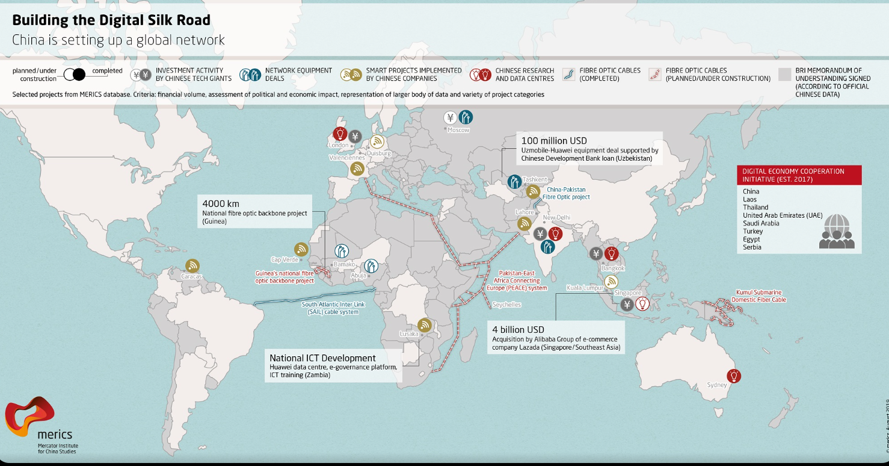{fig-alt="Map of China's Digital Silk Road: fibre-optic cables, data centres, network equipment deals, and smart-city projects across Asia, Africa, Europe, and Latin America." .r-stretch}

- China exports the stack; maintains rare earth chokehold
- Huawei Cloud runs China's leading AI

::: {.notes}
The Chinese strategy: state direction at home, expansion abroad. Domestically, the Cybersecurity Law, Data Security Law, and PIPL put the state at the center of the digital economy, with licensing and security reviews for AI models. Abroad, the Digital Silk Road exports Chinese infrastructure — cables, data centers, smart-city systems — creating dependence that runs toward Beijing rather than Washington. A fair note on the trade-off: control this tight has costs; the openness that drives frontier innovation sits uneasily with licensing regimes, and Chinese labs still face chip bottlenecks from US export controls.

[Sources]
MERICS, Digital Silk Road mapping; China's Cybersecurity Law, Data Security Law, PIPL; Huawei Safe City materials.
:::

## Europe Regulates {.visual-stage}

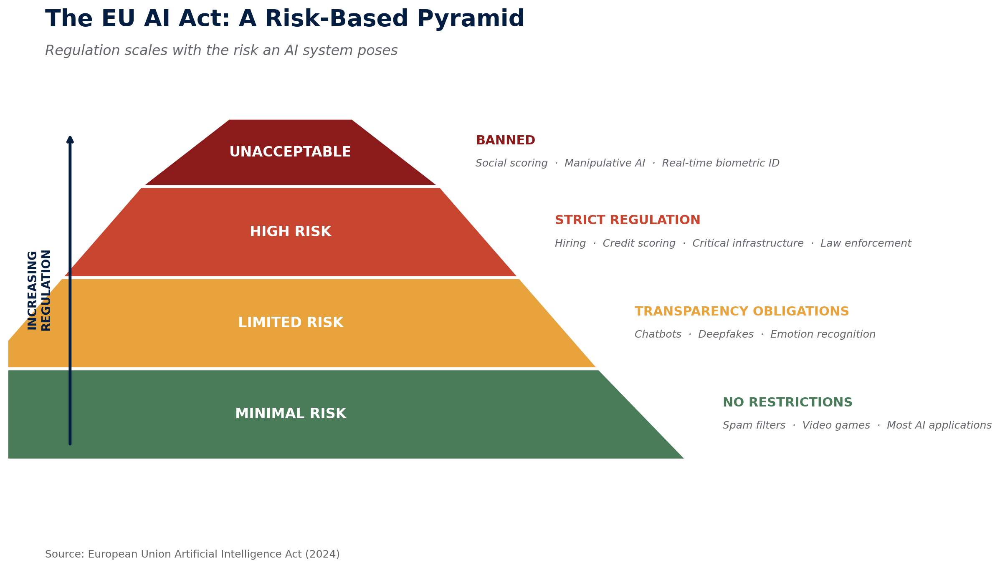{fig-alt="The EU AI Act risk pyramid: unacceptable risk banned; high risk strictly regulated; limited risk transparency obligations; minimal risk no restrictions." .r-stretch}

::: {.figure-takeaway}
The EU's tool is **market access**. To sell to 450 million consumers, you follow Brussels' rules — wherever your company is based.
:::

::: {.notes}
The European strategy: regulatory power. Europe has little of the stack — no frontier labs at scale, no leading fabs, a small share of cloud. Its instrument is law: the AI Act's risk pyramid, the GDPR before it, the DSA and DMA alongside. The mechanism is market access — the "Brussels effect": any firm that wants Europe's consumers follows Europe's rules, which quietly become global defaults. Three strategies, three different levers: America controls the inputs, China controls the territory, Europe controls the rulebook. Now — how is each of them going?

[Sources]
EU AI Act, 2024; Anu Bradford, The Brussels Effect (2020); EU Digital Services Act and Digital Markets Act.
:::

## And Europe’s Rules Travel

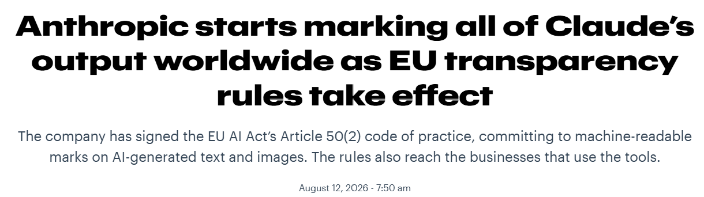{fig-alt="The EU AI Act risk pyramid: unacceptable risk banned; high risk strictly regulated; limited risk transparency obligations; minimal risk no restrictions." .r-stretch}

- Anthropic applied the marking everywhere, not just in Europe 
- Europe's power is real — for rules that **do not slow deployment**


::: {.notes}
Fresh proof that the strategy works, from this week: Anthropic announced it will embed invisible watermarks in all of Claude's text and file output to satisfy Article 50 of the AI Act — transparency obligations effective 2 August 2026, with fines up to €15 million or 3% of global turnover. And the marking applies worldwide, wherever Claude is offered. This is the Brussels effect working exactly as designed: comply once, globally, because splitting products by jurisdiction costs more than uniform compliance.

Then plant a question to carry into the next section: notice *which kind* of rule just conquered the world. Watermarking is a transparency measure — it does not slow adoption, restrict capability, or raise the cost of using AI. Hold that observation; the next section asks what happens to the *other* kind of rule — and the pattern it reveals is the heart of the talk.

[Sources]
Euronews, "EU compliance, delivered globally," 11 August 2026; EU AI Act Article 50; European Commission Digital Omnibus debate, 2025–26.
:::

# When Control Fails {background-color="#041e42"}

## Europe Discovers Control Has Costs {.columns .draghi-slide}

::: {.column width="42%"}
{fig-alt="Mario Draghi beside European Commission President Ursula von der Leyen at the European Commission" height="430"}

::: {.draghi-caption}
Mario Draghi with Commission President Ursula von der Leyen
:::
:::

::: {.column width="52%"}
- In 2024, the EU asked **Mario Draghi** why Europe is falling behind
- His diagnosis: **competitiveness in decline**, weakest at the digital frontier — partly because of Europe's **own rules**

> "This is an existential challenge." — Draghi, on Europe's competitiveness
:::

::: {.notes}
The title completes the arc of the last three slides — say it as the turn: Europe claimed control through rules, the rules conquered the world — and then the bill arrived. Then the evidence, and make the logic explicit: this is not an outside critic — the EU commissioned its own verdict. Ursula von der Leyen asked Mario Draghi, the man who saved the euro, to diagnose European competitiveness. This audience knows exactly who Draghi is, which is why the moment lands: the most credible economic voice Europe has, reporting to the Commission itself, in September 2024. Be precise about the quote's scope: "This is an existential challenge" is Draghi's verdict on Europe's competitiveness overall — slowing growth and productivity threatening the European social model — not on AI specifically. Within that diagnosis, the report's sharpest warning is the "middle-technology trap": world-class in cars, chemicals, machines; weakest at the digital and AI frontier, where the growth now is. And it names Europe's regulatory burden as one of the causes.

So the failure mode, stated cleanly — and this is the slide's point, say it in one sentence: Europe's instrument of control is regulation, and under competitive pressure Europe is now weakening its own instrument. The Commission's "Digital Omnibus" simplifies the very digital rulebook that was Brussels' claim to power. The rules that traveled the world — last slide's watermark — were the ones that cost the industry nothing; the rules with teeth are the ones being filed down. That is what failed control looks like: not defiance by firms, but retreat by the regulator. Now the American version.

[Sources]
Draghi report, The Future of European Competitiveness, September 2024 (commissioned by the European Commission); Draghi's remarks presenting the report; European Commission Digital Omnibus debate, 2025–26.
:::

## Control Tested {.visual-stage}

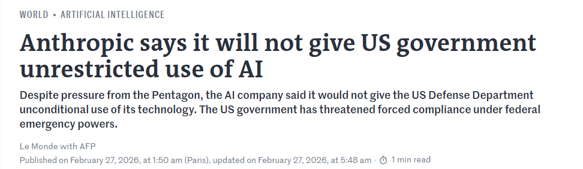{fig-alt="Post by the Secretary of War: Anthropic delivered a master class in arrogance and betrayal... the Department of War must have full, unrestricted access to Anthropic's models for every lawful purpose." .r-stretch}

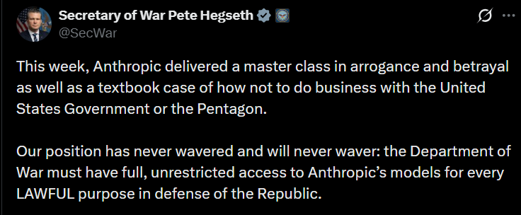{fig-alt="Post by the Secretary of War: Anthropic delivered a master class in arrogance and betrayal... the Department of War must have full, unrestricted access to Anthropic's models for every lawful purpose." .r-stretch}

::: {.notes}
The American failure mode, in one screenshot. Recall the American bet: partner with your frontier firms, treat them as allies. In early 2026 the arrangement cracked. Anthropic — whose model Claude runs inside Palantir's Maven military platform — maintained usage conditions on its models: no mass surveillance of Americans, human oversight of autonomous weapons. The Department of War demanded unrestricted access. This is the Secretary's public response. Keep the framing structural, not partisan: a private company's terms of service colliding with a state's claimed security needs — and neither side with a rulebook to appeal to.

[Sources]
Secretary of War public statements, February 2026; public reporting on the Anthropic–DoW dispute, 2026.
:::


## Washington Changes Its Tune {.visual-stage}

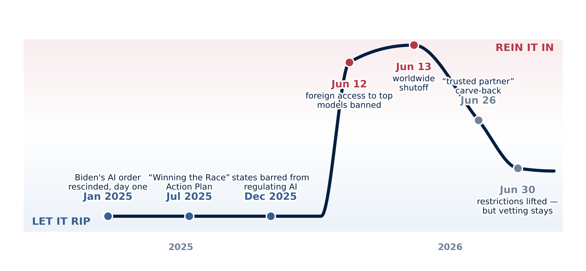{fig-alt="A line from January 2025 to mid-2026 on a scale from let it rip to rein it in. January 2025: Biden's AI order rescinded on day one. July 2025: the Winning the Race Action Plan. December 2025: states barred from regulating AI. The line runs flat and low across all of 2025. June 12, 2026: foreign access to top models banned — the line spikes. June 13: worldwide shutoff — the peak. June 26: trusted-partner carve-back — the line falls. June 30: restrictions lifted but vetting stays — the line settles on a plateau visibly above the old floor. Inset: the tech chief executives seated at the January 2025 inauguration." .r-stretch}

```{=html}
<div style="position:absolute; left:7%; top:13%; width:17%; z-index:10;">
  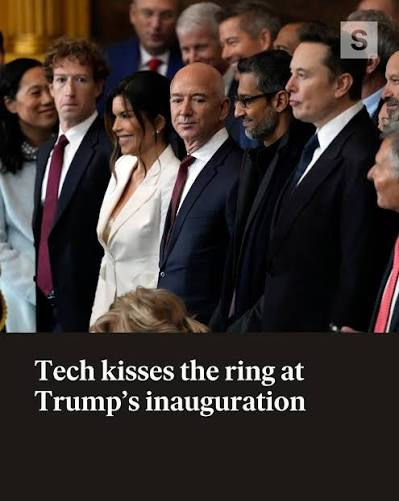
</div>
```

::: {.figure-takeaway}
Hard restrictions lasted 18 days
:::

::: {.notes}
One slide, the whole American story. Start with the photograph, floating over the era it belongs to: January 2025, the industry's chief executives seated at the inauguration itself — partners, not subjects. That is the "let it rip" floor, and trace it with your hand: Biden's AI executive order rescinded on inauguration day; the "Winning the Race" Action Plan in July — three executive orders, "Build, Baby, Build," America as AI export powerhouse; in December, an executive order barring the *states* from regulating AI. Eighteen months, and the line does not move.

Then June 2026: the spike. What turned it: the models got dangerous — the trigger was reportedly researchers bypassing the safety guardrails on a model that finds unknown software vulnerabilities better than almost any human, the same capability a private consortium of tech firms and banks had organized in April to use for defense. Foreign access banned on the 12th; the worldwide shutoff on the 13th — the most restrictive AI action any government has taken. And then the descent, almost as fast: the trusted-partner carve-back — all American companies — on the 26th; restrictions lifted on the 30th, after the company strengthened its safeguards and, tellingly, because the government's own partners and allies needed the models back. Not one company's saga, either: OpenAI's newest models were also held to a government-vetted group. And for this room: the EU was offered access in early June, lost it days later under the directive, and has presumably regained it since.

Two things to read off the shape. First, formal restriction never held — every hard measure was blocked, narrowed, or reversed within days or weeks, and a March court injunction had already blocked the outright use ban. Second — the ratchet — the line does not return to the old floor. It settles on a plateau: since July, the White House vets which companies get frontier access — OpenAI's latest was limited to approved partners for twelve days, and OpenAI agreed to let the administration screen its access lists — a joint cyber clearinghouse launched mid-July, and the June order's classified benchmarking of "covered frontier models" came due August 1. Notice the form durable control takes: not law, not bans — negotiated, voluntary, informal access-vetting at the frontier release point, which costs everyday deployment nothing. Hard restriction bends; soft gatekeeping sticks. Why does it keep sorting that way, in Washington and, as we saw, in Brussels? Next slide names the mechanism.

[Sources]
Rescission of EO 14110, January 20, 2025; "Winning the Race: America's AI Action Plan," July 23, 2025; Executive Order of December 11, 2025 (state preemption); BIS export directive of June 12, 2026; Anthropic global suspension of June 13; trusted-partner letter of June 26; Commerce lift of June 30 (Lutnick letter); Executive Order of June 2, 2026 and August 1 benchmarking deliverable; national security directive of June 5, 2026; Chatham House (Wilkinson), 2 July 2026; CRS IF13217 (2026); The Conversation on the IIL's legal basis (July 2026); CNBC, "The White House is dictating access to frontier AI models," July 17, 2026; Project Glasswing (April 2026). Photo: AP/Getty pool coverage of the January 20, 2025 inauguration — [confirm licence]. Note: within-2025 spacing is approximate; the June cluster is widened for legibility.
:::

## The Dependence Trap {.visual-stage}

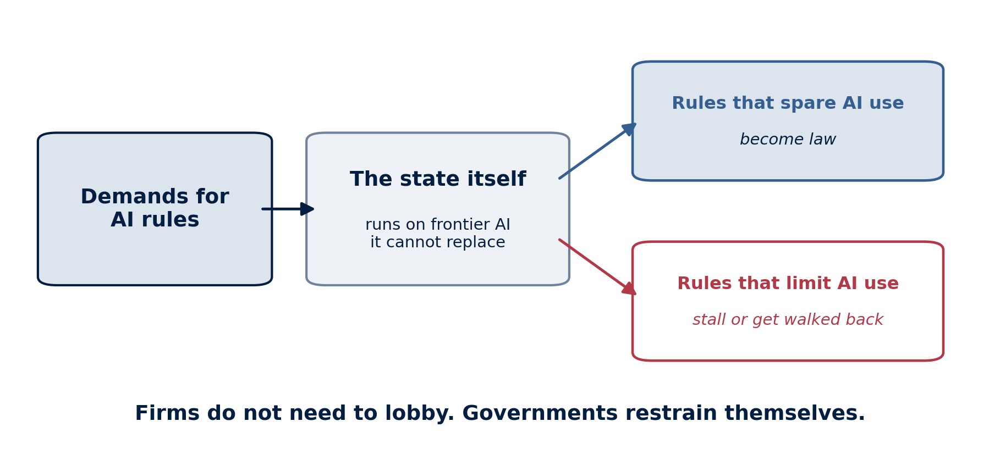{fig-alt="Flow diagram. Demands for AI rules — jobs, safety, bias, catastrophic risk — pass through a filter: government agencies and the economy now run on frontier AI they cannot replace. Rules that spare deployment — retraining, transparency, voluntary frameworks — become law. Rules that burden deployment — liability, restrictions, pauses — stall, shrink, or get carved back. Bottom line: firms do not need to lobby; governments restrain themselves." .r-stretch}

::: {.notes}
Name the pattern — this is the argument I am developing in current research. Governments have not merely failed to control AI firms; they have built their own operations, and bet their own economies, on a capability those firms control and no one else can supply. Ministries run on it. Companies have rebuilt their workflows around it. Walking away would mean rebuilding everything AI reorganized — so walking away is no longer a real option. Economists call this lock-in through specific investment; the twist with AI is that the locked-in party is the *user* — including the state itself.

That dependence works like a filter on every proposed rule, and it explains both halves of tonight's evidence. Rules that spare deployment pass easily: retraining programs, transparency and watermarking, voluntary frameworks — that is why the EU's watermark went global while the Omnibus dilutes the Act's restrictive core, and why the June 2 Executive Order stands while the June 12 shutoff lasted two weeks. Rules that would burden deployment stall, shrink, or get carved back — often without the firms lifting a finger, because governments flinch at raising the cost of something they now run on. Be ready for the obvious challenge: firms *do* also lobby — the June testing order was reportedly watered down from ninety days to thirty after industry pressure. The honest answer strengthens the argument: lobbying and structural power are two different channels, and the point of the trap is that the second operates even when the first is idle — the June shutoff was reversed in eighteen days with no lobbying campaign at all — after the company strengthened its safeguards, and because the government's own partners and allies needed the model back. The exception proves the rule: the one domain where hard restriction stuck longest was catastrophic cyber risk — where no softer instrument answers the demand.

The uncomfortable conclusion, stated plainly for the debate: AI governance is not failing to grow. It is growing fast — and growing *around* deployment. The rules multiply; the restraints do not. That is what structural power looks like when the powerful actor never has to act.

[Sources]
Weymouth, "Structural Power Without Exit: AI Firms and the Politics of Dependence," working paper, 2026; Lindblom (1977) on structural business power; Williamson (1985) on asset specificity.
:::

# Can Firms Control Themselves? {background-color="#041e42"}

## The Companies Wrote Their Own Rules

:::: {.columns}

::: {.column width="40%"}
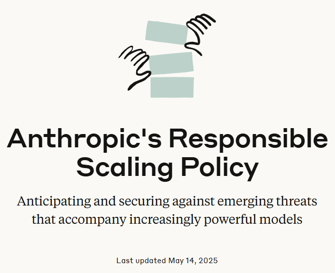{fig-alt="Title card: Anthropic's Responsible Scaling Policy, anticipating and securing against emerging threats" width="92%"}
:::

::: {.column width="56%"}
- With no binding AI safety law, frontier labs wrote **voluntary** policies
- Danger thresholds, safety tests, promises to slow down if safeguards lag
- The most detailed private safety frameworks in any industry
:::

::::

::: {.notes}
The residual answer to "who controls AI": in the absence of law, the firms themselves. Anthropic's Responsible Scaling Policy is the leading example — capability thresholds for bio, cyber, and self-improvement risks, tied to required safeguards, with a commitment to hold back if safeguards are not ready. OpenAI's Preparedness Framework is the parallel. Present this seriously: these are real, detailed, costly commitments — the strongest version of the "trust the firms" answer. Which is why what happened to the strongest one matters.

[Sources]
Anthropic, Responsible Scaling Policy v3.0, 2026; OpenAI Preparedness Framework.
:::

## Then They Made the Rules Weaker {.visual-stage}

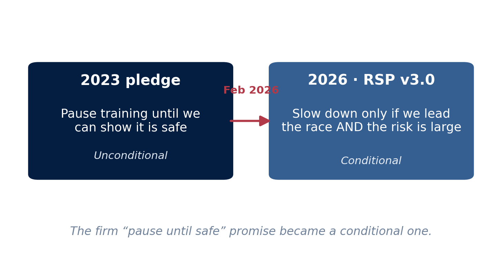{fig-alt="Before and after diagram: the 2023 pledge, pause training until we can show it is safe, unconditional; the 2026 RSP version 3.0, slow down only if we lead the race and the risk is large, conditional." .r-stretch}

::: {.notes}
The empirical answer to "can firms control themselves," from the strongest test case. In February 2026, Anthropic revised its flagship pledge: the firm "pause until safe" promise became explicitly conditional on the company's position in the race and the size of the risk. Be precise and fair: an escape clause existed before, in a footnote; the revision made conditionality central. Anthropic's reasoning — a one-sided pause just hands the lead to less careful rivals — is coherent. The critics' reading — voluntary promises bend exactly when they bind — is also coherent. That is the point: self-control that weakens under competition is not control. The audience can hold the sympathetic and skeptical readings at once; the structural lesson survives either.

[Sources]
"Exclusive: Anthropic Drops Flagship Safety Pledge," TIME, February 2026; Anthropic RSP v3.0; GovAI reflections on RSP v3.0, 2026.
:::

## So Who Controls AI?{.visual-stage}

- States control borders, inputs, chip access (bottom of the stack)
- Firms control frontier models and the pace of deployment (top of the stack)
- Dependence on frontier capabilities for economic growth and national security currently shifts the balance toward firms


::: {.notes}
The talk's answer, and it is a thesis, not a shrug. Deliver the three lines slowly — they are the architecture of everything shown tonight. States need what they do not control: that was sections three and four. Firms control what they did not write the rules for: that was the Anthropic episode and the pledge revision. And the third line is the new one, the dependence trap: the deepest constraint on AI governance today is not lobbying, not ignorance, not even the race with China — it is that governments have wired frontier AI into their own economies and administrations, so restraining it now means restraining themselves.

Then the takeaway, which answers the title honestly: frontier firms control AI, for now — and the mechanism is not capture but lock-in. The prediction that follows, and that the audience can test against the news for themselves: expect ever more AI law — transparency, watermarks, retraining, voluntary frameworks, procurement rules — and ever fewer rules that actually slow deployment. Watch not whether governments act, but *which instruments* they choose.

This also completes the prize-and-threat slide from the opening: who controls AI decides how the bounty is shared — and the entity best positioned to decide, on tonight's evidence, is neither parliaments nor publics. Whether that is acceptable is precisely the debate. Hand it to Rolf.

[Sources]
Weymouth, "Structural Power Without Exit," working paper, 2026; Weymouth, Digital Globalization (2023); "Digital Disintegration," International Organization (2025).
:::

## Thank you. {.center}


stephen.weymouth@georgetown.edu

*Digital Globalization: Politics, Policy, and a Governance Paradox* (Cambridge University Press, 2023) · "Digital Disintegration: Techno Blocs and Strategic Sovereignty in the AI Era" (*International Organization*, 2025)

::: {.notes}
Hand the room to Rolf and the audience with a live question rather than a summary — and give it a Swiss edge. Switzerland aligned its data law with the GDPR, hosts major AI infrastructure investment, and sits deliberately between the blocs. Can that position hold as the blocs harden, or does everyone eventually have to choose? Then the broader version: if not firms, and not the current government strategies, then what — and who writes those rules? Take a breath; the discussion runs to about 19:30, then the apéro.

[Sources]
Swiss Federal Act on Data Protection (revised 2023); event program, University of Basel, 2026.
:::
