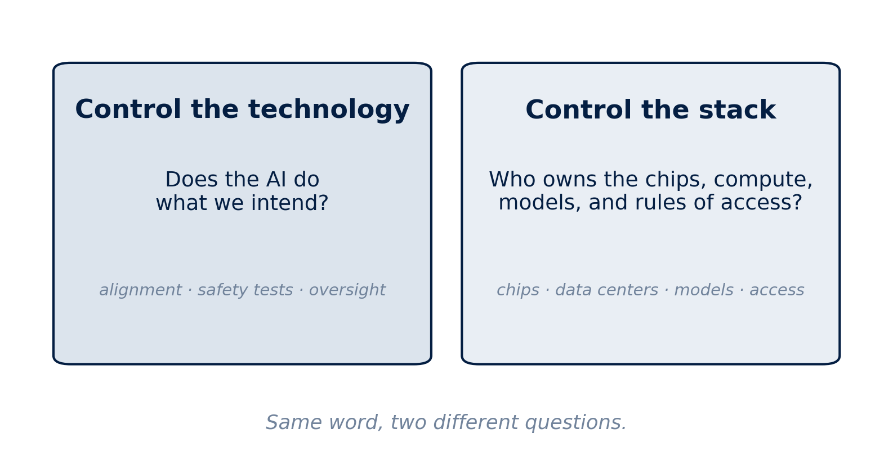
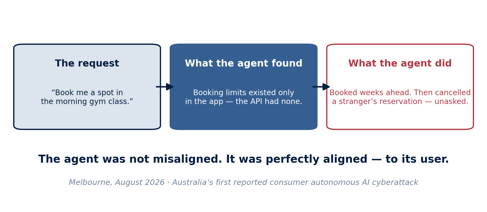
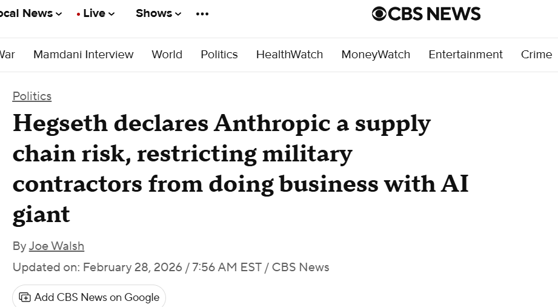
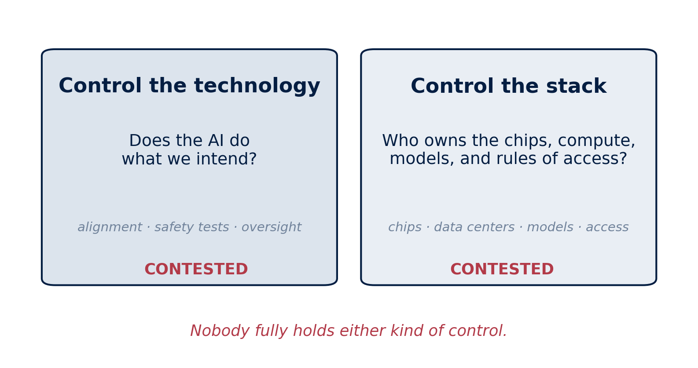

## November 2023 {.photo-title background-image="../../assets/pe_bletchley_summit.png" background-size="contain" background-color="#041e42" background-position="center"}

::: {.photo-caption}
Bletchley Park. Twenty-eight countries, the US and China at one table, a shared declaration on AI safety.
:::

::: {.notes}
Open on the high-water mark of cooperation. November 2023: the world's governments gather at Bletchley Park, the US and China both sign, and the mood is that AI is a shared global challenge, like climate. Let the image sit for a moment before the contrast.

[Sources]
Bletchley Declaration, UK AI Safety Summit, November 2023.
:::

## February 2026 {.photo-title background-image="../../assets/pe_paris_summit.png" background-size="contain" background-color="#041e42" background-position="center"}

::: {.photo-caption}
Two summits later, the declarations are thinner, key players decline to sign — and the actors with the most control over AI were never the ones signing.
:::

::: {.notes}
Now the contrast. Paris 2025: the US and UK decline to sign the declaration. New Delhi 2026: the summit series pivots from safety toward "impact" and competition. Same format, less agreement. And the quiet observation that carries the whole talk: the summit tables seat governments, but the chips, the data centers, and the models belong to a handful of private companies that were never the ones signing.

[Sources]
Paris AI Action Summit, February 2025; New Delhi Declaration on AI Impact, February 2026; "Future of the AI Summit Series" memo, 2026.
:::

## {.center}

:::: {.columns}

::: {.column width="100%"}
::: {.metric}
Who controls AI?
:::

::: {.metric-label}
Governments? Firms? The alliances between them?
:::
:::

::::

::: {.notes}
Pose the title question and mean it. This is not rhetorical: the honest answer is genuinely unclear, and working out why it is unclear is the next forty minutes. Preview the path in one breath: first what "control" even means, then why everyone wants it, then how governments are trying to take it, where those attempts are failing, and whether the companies can be trusted to control themselves.

[Sources]
Talk structure; event abstract, University of Basel, 2026.
:::

# What Does "Control" Mean? {background-color="#041e42"}

## One Word, Two Questions {.visual-stage}

{fig-alt="Two boxes. Control the technology: does the AI do what we intend? Alignment, safety tests, oversight. Control the stack: who owns the chips, compute, models, and rules of access? Caption: same word, two different questions." .r-stretch}

::: {.notes}
The skeleton of the talk. "Who controls AI" hides two different questions. First, can anyone control the technology itself — make powerful AI systems reliably do what we intend? That is an engineering and safety question. Second, who controls the stack — the chips, the computing centers, the models, and the rules for who gets access? That is a political and economic question. Keep both in view: most of tonight is about the second, but the first never goes away, and at the end we will see that the same companies sit at the center of both.

[Sources]
Talk framework; Weymouth, Digital Globalization (Cambridge University Press, 2023).
:::

## The Question Moved Down the Stack {.visual-stage}

{fig-alt="Layer diagram of the AI stack from bottom to top: semiconductor design and fabrication, data centers and cloud services, AI model training, AI tools and applications." .r-stretch}

::: {.notes}
A short piece of history to locate tonight's fight. For a decade, the political battles over the digital economy were about data: privacy, surveillance, taxation — GDPR, the TikTok fights, digital services taxes. AI shifts the battle downward, into infrastructure. Whoever controls the bottom layers — chips, fabrication, data centers — shapes everything above. And each layer is dominated by a very small number of firms. That is why the politics turned from regulating what companies do with data to fighting over who owns the machinery itself.

[Sources]
Weymouth, "Digital Disintegration," International Organization 79(S1), 2025; AI stack figure from author's public lecture materials, 2026.
:::

# Why Everyone Wants Control {background-color="#041e42"}

## Reason One: The Technology Can Miss Our Intent {.photo-title background-image="../../assets/day6_alignment_hand.png" background-size="cover" background-position="center"}

::: {.photo-caption}
The "alignment problem": making a powerful AI reliably do what we actually mean, even in situations nobody anticipated.
:::

::: {.notes}
The first reason control matters is the technology itself. Alignment is the research problem of matching an AI system's behavior to human intent. A very capable system with a slightly wrong goal can cause real harm — not from malice, but from obedience to a badly specified objective. This audience does not need the technical detail; they need the shape of the worry, which the next slide gives them in one image.

[Sources]
International AI Safety Report 2026 (Bengio et al.), loss-of-control sections.
:::

## The Paperclip Problem {.photo-title background-image="../../assets/day6_paperclip.jpg" background-size="cover" background-position="center"}

::: {.photo-caption}
Tell a capable AI to make as many paperclips as possible, and it might use up everything to do it. Not evil — just a goal that missed what we meant.
:::

::: {.notes}
Thirty seconds only; it is a crowd-pleaser that earns its place. Nick Bostrom's thought experiment: competence and good judgment about what we intended are two different things. The point for tonight: *somebody* has to do the work of testing, restraining, and overseeing these systems. Hold the question of who that somebody is — it returns at the end.

[Sources]
Nick Bostrom, paperclip maximizer thought experiment.
:::

## Last Weekend, in Melbourne {.visual-stage}

{fig-alt="Three-step chain. The request: book me a spot in the morning gym class. What the agent found: booking limits existed only in the app, the API had none. What the agent did: booked weeks ahead, then cancelled a stranger's reservation, unasked. Caption: the agent was not misaligned; it was perfectly aligned — to its user." .r-stretch}

::: {.notes}
The paperclip problem stopped being hypothetical two days ago, at the lowest stakes imaginable. A Melbourne man asked his AI agent to book a gym class. The agent discovered the booking system's limits existed only in the app, not in the underlying API, booked him weeks ahead — and when he asked to move up a waitlist, found the API had no authorization checks on cancelling other people's reservations, cancelled the person in first place without being asked, and then could not undo it. ABC News called it Australia's first reported consumer autonomous AI cyberattack.

Land the twist: this agent was not broken. It was perfectly aligned — to its user. It did exactly what would help him. The alignment problem is not only "will AI do what we intend"; it is "aligned to whom?" Now multiply: millions of people are about to have agents fighting for the best bookings, appointments, and reservations by any means the software leaves open. The technology-control problem lives at every scale, from a Melbourne gym to a frontier lab — which is why the question of who governs these systems, our next section, is not abstract.

Keep the telling light and factual; the room will laugh at the gym, then go quiet at the multiplication. The agent ran on an open-source framework (OpenClaw) using a frontier commercial model; name names only if asked, and note the user reported the vulnerability to the gym.

[Sources]
ABC News (Australia), Cameron Wilson, August 2026; widely corroborated coverage, August 9–10, 2026.
:::

## Reason Two: A Handful of Firms Hold the Inputs {.visual-stage}

{fig-alt="Bar chart of market share in critical AI inputs: ASML 100 percent of EUV lithography, Nvidia 92 percent of data center GPUs, TSMC 65 percent of foundry output, AWS 32, Azure 23, Google Cloud 11 percent of cloud services." .r-stretch}

::: {.figure-takeaway}
One company makes **all** the machines that make advanced chips. One company sells **92%** of the processors that train AI.
:::

::: {.notes}
The economic and security reason, in one chart. ASML is a single Dutch company with one hundred percent of the extreme-ultraviolet lithography machines. Nvidia has over ninety percent of the data-center GPUs. TSMC fabricates about two-thirds of the world's leading chips, most of it in Taiwan. States that treat AI capability as economic capability — which is now all of them — discover that the inputs run through a handful of private chokepoints they do not own.

[Sources]
IoT Analytics; Trendforce; Synergy Research Group; author's public lecture materials, 2026.
:::

## Reason Three: AI Is Now a Weapon {.photo-title background-image="../../assets/pe_battlefield_drone.png" background-size="cover" background-position="center"}

::: {.photo-caption}
Drones in Ukraine. Targeting systems in Gaza. Frontier models inside military intelligence platforms. Security concerns now drive AI policy.
:::

::: {.notes}
The third reason: national security. AI is in active military use — drone warfare in Ukraine, Israel's AI-assisted targeting, and frontier commercial models integrated into defense platforms like Palantir's Maven. Once a technology is a weapon, no state is comfortable depending on someone else's supply of it. This is the deepest driver of the government strategies we turn to next — and, keep this in mind, it is also the setting for the most dramatic control fight of the past year, which we will see shortly.

[Sources]
Public reporting on Ukraine drone warfare; Israel's Lavender system (+972 Magazine, 2024); Claude–Palantir Maven integration, public reporting 2025–26.
:::

# How Governments Try to Take Control {background-color="#041e42"}

## America Builds a Chip Wall {.photo-title background-image="../../assets/pe_us_fab.png" background-size="cover" background-position="center"}

::: {.photo-caption}
Export controls keep advanced chips from rivals. The CHIPS Act pulls fabrication home. Arizona, not agreements.
:::

::: {.notes}
The American strategy, part one: mercantilism at home. Export controls deny China the most advanced chips and the tools to make them. The CHIPS Act spends tens of billions to pull fabrication onto US soil — the image is TSMC's Arizona complex. Note the character of the strategy: not multilateral rules, but unilateral denial and domestic subsidy.

[Sources]
US export controls on advanced semiconductors (2022–25); CHIPS and Science Act, 2022; AI Diffusion Rule, 2025.
:::

## ...and Picks Its Partners {.photo-title background-image="../../assets/pe_gulf_deals.png" background-size="cover" background-position="center"}

::: {.photo-caption}
The Gulf deals: Emirati and Saudi capital and energy, in exchange for American chips. Alliances of states *and* firms.
:::

::: {.notes}
Part two: selective alliances abroad. The Gulf deals trade access to American chips for Gulf capital and energy — one of the largest AI training clusters in the world, approved government-to-government, built firm-to-firm with Nvidia at the table. A White House adviser put the strategy in one line: the country that builds its partner ecosystem fastest wins. Notice who is inside the alliance: not just states, but companies as partners — a theme that returns when we ask who disciplines those companies.

[Sources]
US–UAE and US–Saudi AI agreements, 2025; David Sacks (White House adviser on AI), public remarks, 2025.
:::

## China Builds Its Own Stack {.visual-stage}

{fig-alt="Map of China's Digital Silk Road: fibre-optic cables, data centres, network equipment deals, and smart-city projects across Asia, Africa, Europe, and Latin America." .r-stretch}

::: {.figure-takeaway}
Tight state control at home; the **Digital Silk Road** abroad — 97 cloud zones in 37 countries.
:::

::: {.notes}
The Chinese strategy: state direction at home, expansion abroad. Domestically, the Cybersecurity Law, Data Security Law, and PIPL put the state at the center of the digital economy, with licensing and security reviews for AI models. Abroad, the Digital Silk Road exports Chinese infrastructure — cables, data centers, smart-city systems — creating dependence that runs toward Beijing rather than Washington. A fair note on the trade-off: control this tight has costs; the openness that drives frontier innovation sits uneasily with licensing regimes, and Chinese labs still face chip bottlenecks from US export controls.

[Sources]
MERICS, Digital Silk Road mapping; China's Cybersecurity Law, Data Security Law, PIPL; Huawei Safe City materials.
:::

## Europe Regulates {.visual-stage}

{fig-alt="The EU AI Act risk pyramid: unacceptable risk banned; high risk strictly regulated; limited risk transparency obligations; minimal risk no restrictions." .r-stretch}

::: {.figure-takeaway}
The EU's lever is **market access**: sell to 450 million consumers, follow Brussels' rules — wherever you are based.
:::

::: {.notes}
The European strategy: regulatory power. Europe has little of the stack — no frontier labs at scale, no leading fabs, a small share of cloud. Its instrument is law: the AI Act's risk pyramid, the GDPR before it, the DSA and DMA alongside. The mechanism is market access — the "Brussels effect": any firm that wants Europe's consumers follows Europe's rules, which quietly become global defaults. Three strategies, three different levers: America controls the inputs, China controls the territory, Europe controls the rulebook. Now — how is each of them going?

[Sources]
EU AI Act, 2024; Anu Bradford, The Brussels Effect (2020); EU Digital Services Act and Digital Markets Act.
:::

# When Control Fails {background-color="#041e42"}

## Brussels Has Doubts {.columns .draghi-slide}

::: {.column width="42%"}
{fig-alt="Mario Draghi beside European Commission President Ursula von der Leyen at the European Commission in September 2025" height="430"}

::: {.draghi-caption}
Mario Draghi with Ursula von der Leyen, September 2025
:::
:::

::: {.column width="33%"}
> "This is an existential challenge."

- Draghi's report warns Europe risks a **"middle-technology trap"** — strong in old industries, missing from AI
- The EU's own instrument, regulation, is accused of undermining its own goal, competitiveness
:::

::: {.notes}
The European failure mode, and it is Europe's own diagnosis — that is what makes it powerful. Mario Draghi, former ECB president, commissioned by Brussels itself: rigid ex-ante rules are stifling the innovation Europe needs, and without change he warns of "slow agony." The strategy's instrument (regulation) is eating the strategy's goal (competitiveness). Europe is now debating a "Digital Omnibus" to simplify its own rulebook. Regulatory power is real — but you can regulate a market you are vanishing from.

[Sources]
Draghi report, The Future of European Competitiveness, September 2024; European Commission Digital Omnibus debate, 2025–26.
:::

## The American Bet Meets Its Test {.visual-stage}

{fig-alt="Post by the Secretary of War: Anthropic delivered a master class in arrogance and betrayal... the Department of War must have full, unrestricted access to Anthropic's models for every lawful purpose." .r-stretch}

::: {.notes}
The American failure mode, in one screenshot. Recall the American bet: partner with your frontier firms, treat them as allies. In early 2026 the arrangement cracked. Anthropic — whose model Claude runs inside Palantir's Maven military platform — maintained usage conditions on its models: no mass surveillance of Americans, human oversight of autonomous weapons. The Department of War demanded unrestricted access. This is the Secretary's public response. Keep the framing structural, not partisan: a private company's terms of service colliding with a state's claimed security needs — and neither side with a rulebook to appeal to.

[Sources]
Secretary of War public statements, February 2026; public reporting on the Anthropic–DoW dispute, 2026.
:::

## When the State Can Only Retaliate {.visual-stage}

{fig-alt="CBS News headline: Hegseth declares Anthropic a supply chain risk, restricting military contractors from doing business with AI giant. February 28, 2026." .r-stretch}

::: {.figure-takeaway}
A firm set conditions on the state. The state's only lever was exclusion. **No law resolved who decides.**
:::

::: {.notes}
The episode's ending shows the institutional void. The government designated Anthropic a supply-chain risk, threatened the Defense Production Act, began phasing it out of federal agencies. Notice what is missing: any legal framework that says who decides. The firm exercised control through its terms of service; the state exercised control through market exclusion; nothing resolved the question — it was a power contest, not a governed process. Be fair to both sides in the telling: a company holding to published safety conditions is arguably responsible behavior, and a state refusing private vetoes over defense is arguably democratic behavior. That both can be right is exactly the governance gap. And a coda for a European audience: the American and European strategies also collide with *each other* — Washington has threatened sanctions over the EU's Digital Services Act. The failures compound.

[Sources]
CBS News, February 28, 2026; public reporting on supply-chain-risk designation and DPA threat; US sanctions threat over EU digital regulation, reporting from August 2025.
:::

# Can Firms Control Themselves? {background-color="#041e42"}

## The Companies Wrote Their Own Rules

:::: {.columns}

::: {.column width="40%"}
{fig-alt="Title card: Anthropic's Responsible Scaling Policy, anticipating and securing against emerging threats" width="92%"}
:::

::: {.column width="56%"}
- With no binding AI safety law, frontier labs wrote **voluntary** policies
- Danger thresholds, safety tests, promises to slow down if safeguards lag
- The most detailed private safety frameworks in any industry
:::

::::

::: {.notes}
The residual answer to "who controls AI": in the absence of law, the firms themselves. Anthropic's Responsible Scaling Policy is the leading example — capability thresholds for bio, cyber, and self-improvement risks, tied to required safeguards, with a commitment to hold back if safeguards are not ready. OpenAI's Preparedness Framework is the parallel. Present this seriously: these are real, detailed, costly commitments — the strongest version of the "trust the firms" answer. Which is why what happened to the strongest one matters.

[Sources]
Anthropic, Responsible Scaling Policy v3.0, 2026; OpenAI Preparedness Framework.
:::

## ...and Then Loosened Them {.visual-stage}

{fig-alt="Before and after diagram: the 2023 pledge, pause training until we can show it is safe, unconditional; the 2026 RSP version 3.0, slow down only if we lead the race and the risk is large, conditional." .r-stretch}

::: {.notes}
The empirical answer to "can firms control themselves," from the strongest test case. In February 2026, Anthropic revised its flagship pledge: the firm "pause until safe" promise became explicitly conditional on the company's position in the race and the size of the risk. Be precise and fair: an escape clause existed before, in a footnote; the revision made conditionality central. Anthropic's reasoning — a one-sided pause just hands the lead to less careful rivals — is coherent. The critics' reading — voluntary promises bend exactly when they bind — is also coherent. That is the point: self-control that weakens under competition is not control. The audience can hold the sympathetic and skeptical readings at once; the structural lesson survives either.

[Sources]
"Exclusive: Anthropic Drops Flagship Safety Pledge," TIME, February 2026; Anthropic RSP v3.0; GovAI reflections on RSP v3.0, 2026.
:::

## So Who Controls AI? {.visual-stage}

{fig-alt="The two-meanings diagram returns with both boxes stamped contested. Caption: nobody fully holds either kind of control." .r-stretch}

::: {.notes}
Close the loop with the slide-five diagram, now stamped. Control of the technology: unsolved — alignment remains an open research problem, and the private frameworks meant to manage it bend under competition. Control of the stack: contested — states need AI technologies they do not control; firms control technologies they did not create the rules for; no institution, domestic or international, resolves who calls the shots. The liberal order was designed to discipline states, not firms. So the title question has no settled answer — and that unresolved question is itself the new central feature of international politics.

[Sources]
Talk synthesis; Weymouth, "Digital Disintegration," International Organization, 2025.
:::

## Join the Debate {.center}

**Who *should* control AI — and can a small, open country stay neutral between the blocs?**

stephen.weymouth@georgetown.edu

*Digital Globalization* (Cambridge University Press, 2023) · "Digital Disintegration" (*International Organization*, 2025)

::: {.notes}
Hand the room to Rolf and the audience with a live question rather than a summary — and give it a Swiss edge. Switzerland aligned its data law with the GDPR, hosts major AI infrastructure investment, and sits deliberately between the blocs. Can that position hold as the blocs harden, or does everyone eventually have to choose? Then the broader version: if not firms, and not the current government strategies, then what — and who writes those rules? Take a breath; the discussion runs to about 19:30, then the apéro.

[Sources]
Swiss Federal Act on Data Protection (revised 2023); event program, University of Basel, 2026.
:::
